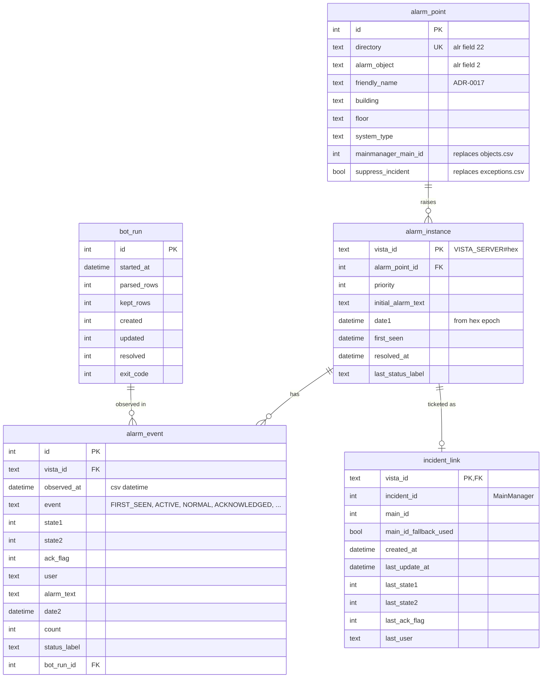

# ADR-0015: SQL storage for alarm history

- **Status:** Accepted — 2026-09-29: the history database is the digibuild `cts-alarms` worker's own **SQLite (WAL)** on the VPS, fed by the shipper ([ADR-0020](0020-hmac-ingest-to-digibuild.md)); schema carried over from `server/app/models.py`. The PostgreSQL-in-production plan is dropped. Details are maintained in the digibuild repo ([ADR-0022](0022-cts-side-only-repo-web-app-in-digibuild.md)). The CTS side keeps CSV + JSON state (dual write, TODO T-046).
- **Date:** 2026-09-28 (proposed) · 2026-09-29 (accepted, provisional) · 2026-09-29 (accepted: SQLite in digibuild)
- **Deciders:** Georgi (owner)

> **2026-09-29:** the options below were evaluated before the VPS side was placed in digibuild. The outcome is SQLite on the VPS (single writer: the worker; readers: the worker's read API), which the table rates "possible but single-host" — exactly the situation, since only the worker touches the file.

## Context

Today's storage is three things ([ADR-0011](0011-per-directory-csv-audit-log.md),
[ADR-0012](0012-json-state-files-atomic-writes.md)): 431 per-directory CSVs (history, ~21k rows),
`alarms_state.json` (incident links, pruned after 30 days) and `csv_state.json` (last signature).
None of it answers "how many alarms per building last month", "which points alarm every day",
"which incidents are still open" without ad-hoc scripting. The owner wants a web application that
shows all alarms, recurrence analysis and reports, and has said "the database should change from
CSV to SQL".

Where the database runs depends on [ADR-0016](0016-cts-server-vs-vps-responsibility-split.md).

## Options

| | Keep CSV/JSON | SQLite | PostgreSQL |
|---|---|---|---|
| Setup | none | none (file) | service to install/manage (VPS) |
| Concurrent writers | n/a (single bot) | one writer at a time; fine for bot + read-mostly web app on the same host | many; needed if bot and web app write from different hosts |
| Cross-host access | file copy / sync | file copy / sync (`litestream`-style replication possible) | native over TCP/TLS |
| Analytics queries | script per question | full SQL, window functions | full SQL, better for large aggregates |
| Backup | copy folder | copy one file | `pg_dump` / managed backups |
| Fits option C in ADR-0016 (DB on CTS, synced to VPS) | yes | **yes** (single file to sync) | awkward (would need a Postgres on the Windows CTS server or a replica) |
| Fits options A/B in ADR-0016 (DB on VPS) | no | possible but single-host | **yes** |
| Python dependency | none | stdlib `sqlite3` | `psycopg` |
| Data today | ~20.6k CSV rows + 122/180 state entries | trivial | trivial |

Volume is small (≈ 20.6k events in ~5 months, ~130/day); either database handles a decade of it.
The deciding factors are therefore *where writers live* and *ops burden*, not performance.

## Candidate schema (maps 1:1 from existing data so history can be imported)

Import mapping:

| Source | Target |
|--------|--------|
| CSV row (all 17 columns) | one `alarm_event`; `vista_id`/`alarm_object`/`directory`/`priority` create `alarm_instance` + `alarm_point` on first sight; `date1_hex` -> `alarm_instance.date1`; `date2_hex` -> `alarm_event.date2` |
| `alarms_state.json` entry | `incident_link` (`incident_id`, `main_id`, `main_id_fallback_used`, `first_seen_iso`, `last_update_iso`, `last_state_sig` -> four `last_*` columns); `resolved_iso` -> `alarm_instance.resolved_at` |
| `csv_state.json` | redundant once `alarm_event` exists (last event per `vista_id`) |
| `logs/*.log` "Run complete: created=…" + "Alarm bot started" | `bot_run` rows (one per run, ~45,600) |
| `objects.csv`, `exceptions.csv` | `alarm_point.mainmanager_main_id`, `alarm_point.suppress_incident` |
| `alarm_snapshot.alr` | seed for current `alarm_instance` rows not yet in CSV (system events excluded) |

Note the CSV `datetime` is local time without offset; store as local and record the assumption
(`Europe/Copenhagen`), or convert on import.

## Questions to answer before deciding

1. Where do the writers live (ADR-0016)? One host -> SQLite is enough; two hosts -> PostgreSQL on the VPS.
2. Does the bot itself write to SQL, or does it keep writing CSV and a separate importer loads it?
   (Keeping CSV as the on-CTS format keeps `main.py` changes minimal and preserves the audit file.)
3. Must the 45,600 `bot_run` rows be imported, or only aggregated (runs/day, failures)?
4. Should operator names be stored as-is, hashed, or mapped to an `operator` table with consent
   (personal data, see [ADR-0014](0014-commit-runtime-data-for-migration.md))?
5. Retention: keep everything forever (small) or prune events older than N years?

## Consequences (of any SQL option)

### Positive
- Recurrence, per-building and per-text analytics become single queries; incident links stop being
  pruned after 30 days.
- The friendly-name registry ([ADR-0017](0017-friendly-alarm-naming-registry.md)) and the web app
  ([ADR-0018](0018-alarm-web-application-on-vps.md)) have one source of truth.

### Negative
- A schema to migrate and back up; the bot gains a dependency (or a second component gains one).
- Two copies of the truth during transition (CSV on CTS, SQL elsewhere); import must be idempotent
  (`vista_id` + `observed_at` + `event` as a natural unique key on `alarm_event`).

## Evidence

- `main.py:309-313` CSV columns; `main.py:717-732` state entry fields; `main.py:992-993` run summary line
- `csv/` 431 files, ~21k rows; `alarms_state.json` 122 entries; `logs/` 45,612 runs
- Owner's request: "the database should change from CSV to SQL, and it should be there on this website as well"
