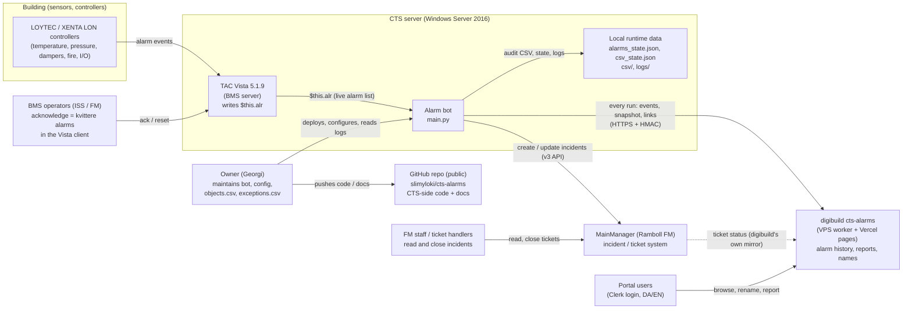
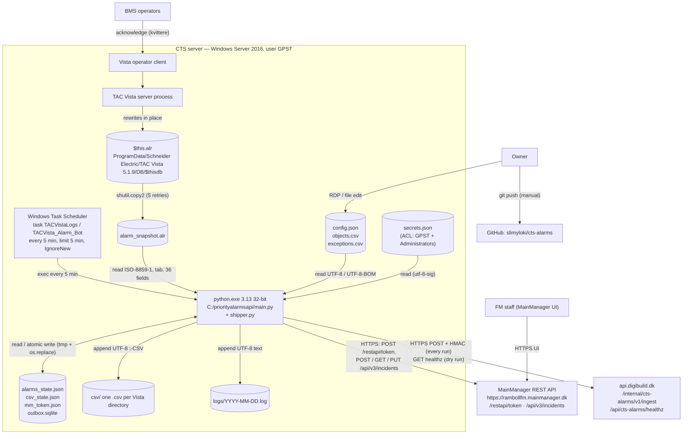

# 3. Context and Scope

Part of the [arc42 documentation](../README.md).
Previous: [2. Constraints](02-constraints.md) · Next: [4. Solution Strategy](04-solution-strategy.md) · See also [C4 System Context](../c4/01-system-context.md)

## 3.1 Business context

The alarm bot sits between two systems that do not talk to each other: the **building-management system (CTS / TAC Vista)**, where technical alarms originate and operators acknowledge them, and **MainManager**, where facility-management work is tracked as incidents. Its job is to make every sufficiently urgent alarm visible as a ticket and to keep that ticket's description in step with what happens to the alarm in Vista — without ever taking a decision that belongs to a human (acknowledging in Vista or closing in MainManager). Since v2.1.0 it also hands every run to **digibuild** (`cts-alarms` sub-project), the owner's portal, which keeps the full alarm history and shows it on web pages. Line references are to `main.py` v2.1.0.

### Business-level interfaces

| Partner | Direction | What is exchanged | Business meaning |
|---------|-----------|-------------------|------------------|
| TAC Vista (BMS) | Vista → bot | The current alarm list: one row per alarm instance with condition (ACTIVE/NORMAL), acknowledgement (ack flag + operator name), priority 1–9, Danish alarm text, re-trigger count, full object path. | "What is alarming right now, and has anyone looked at it?" |
| BMS operators | Operators → Vista (observed by bot) | Acknowledgement (kvittering) of alarms; Vista removes a row once it is NORMAL **and** acknowledged. | Operator acknowledgement and eventual disappearance are the signals the bot translates into incident updates and "RESOLVED". |
| MainManager | Bot → MainManager | Incidents of type `IncidentTypeID 277` ("CTS API"), `GradeID 10`, `StatusID 5` ("Awaits handling"), location 6, reporter 748, attached to a `MainID` (fallback 14228), with a running dated log in the description. | One ticket per alarm instance for priority 1–2 alarms (threshold configurable). |
| FM staff | FM → MainManager | Reading the description, assigning work, closing the ticket. | Ticket lifecycle end is a human decision; the bot never sets a closing status. |
| Owner | Owner → bot | `config.json` (thresholds, paths, MainManager defaults), `secrets.json` (credentials, ingest secret — on the server only), `objects.csv` (alarm object → MainID), `exceptions.csv` (directories to ignore). | Tuning what becomes a ticket and where it lands. |
| digibuild `cts-alarms` | Bot → digibuild | Every run: run summary, the CSV audit events of the run, the full current alarm list (all priorities), the alarm→ticket links. | "See all the alarms ever, follow them, analyse recurrence, give them names" — the owner's web application ([ADR-0022](../adr/0022-cts-side-only-repo-web-app-in-digibuild.md)). |
| GitHub | Owner → repo | CTS-side code, scheduler task XML, tests, docs. **No runtime data, no secrets** (since 2026-09-29). | Version history of what is deployed. Not read by the bot. |

**Out of scope for the bot:** any UI (digibuild), any reading of MainManager beyond its own tickets, any write to Vista, the Indeklima bot, and alarms with priority > 2 as tickets (they are audited to CSV and shipped, but never become tickets).

## 3.2 Technical context

### Interface table

| # | Interface | Counterpart | Direction | Protocol / transport | Format | Details / code |
|---|-----------|-------------|-----------|----------------------|--------|----------------|
| I1 | Live alarm list | TAC Vista 5.1.9 | in | Local NTFS file read (`shutil.copy2`; the copy can fail with `PermissionError` while Vista rewrites the file, hence the retries), up to 5 attempts 0.5 s apart | Tab-delimited text, ISO-8859-1, 36 fields, no header (CRLF on the server per the build reference, LF in the committed snapshot; parser accepts both); fields used: 1 vista_id, 2 alarm_object, 3 date1 (hex epoch), 4 state1, 5 state2, 6 date2, 7 priority, 10 user, 11 ack_flag, 13 alarm_text, 18 count, 22 directory | `snapshot_alarm_file()` `main.py:205`, `parse_alarm_file()` `main.py:219`; [ALR format](../reference/alr-file-format.md) |
| I2 | Scheduling | Windows Task Scheduler | in (trigger) | Process launch, working dir `C:\priorityalarmsapi`, exit code 0/1/2 | `TACVista_Alarm_Bot.xml` (Task v1.2 schema; the committed copy is UTF-8 even though its declaration says `encoding="UTF-16"` — re-save as UTF-16 or fix the declaration before importing) | `PT5M` repetition, `PT5M` execution limit, restart 3×/1 min |
| I3 | Configuration | Owner | in | Local files | `config.json` (UTF-8 JSON, BOM tolerated); `objects.csv` / `exceptions.csv` (UTF-8 with optional BOM, `,` or `;`, `#` comments) | `load_config()` `main.py:55`, `load_objects_csv()` `main.py:257`, `load_exceptions_csv()` `main.py:283`; [Config reference](../reference/config-reference.md) |
| I3a | Secrets | Owner | in | Local file `C:\priorityalarmsapi\secrets.json` (git-ignored, ACL-restricted) or environment variables | `{"mainmanager":{username,password},"vps":{ingest_secret}}`; env `MM_USERNAME`/`MM_PASSWORD`, `CTS_ALARMS_INGEST_SECRET` win | `load_secrets()` `main.py:61`, `shipper.read_ingest_secret()`; [ADR-0021](../adr/0021-secrets-in-secrets-json.md) |
| I4 | Authentication | MainManager | out | HTTPS `POST /restapi/token`, form-encoded password grant, timeout 30 s | JSON `access_token`, `expires_in`; used as `Authorization: Bearer` | `MMClient._get_token()` `main.py:665`; token cached in `mm_token.json` until 300 s before expiry |
| I5 | Create incident | MainManager | out | HTTPS `POST /api/v3/incidents` (+ `GET`, and `PUT` if `StatusID` did not stick), timeout 60 s | `{"items":[{MainID, Name, Remarks, IncidentTypeID, GradeID, StatusID, LocationID, ReportedByID, ReportedByOrganisationID}]}` → `items[0].success`, `items[0].id` | `MMClient.create_incident()` `main.py:756`; [MainManager API](../reference/mainmanager-api.md) |
| I6 | Read incident | MainManager | out | HTTPS `GET /api/v3/incidents/{id}`, timeout 60 s | `items[0]`: `Description` (full text) and the write-model fields to echo | `MMClient.get_incident()` `main.py:749`; a 404 raises `MMNotFound` and is classified with a probe (`GET /api/v3/incidents?pageSize=1`, `main.py:738`) |
| I7 | Update incident text | MainManager | out | HTTPS `PUT /api/v3/incidents`, JSON, timeout 60 s; verified by a second GET | `{"items":[{…echoed write model…, ID, Remarks: <new line>\n<Description>}]}` | `prepend_description_line()` `main.py:807`; [ADR-0019](../adr/0019-mainmanager-v3-incident-api.md) |
| I8 | Tracking state | local disk | in/out | Read at start; atomic write (`.tmp` + `os.replace`) after every change; never in `--dry-run`/`--parse-only` | `alarms_state.json` `{meta:{bootstrapped,last_run_iso}, alarms:{<vista_id>:{…}}}`; `csv_state.json` `{<vista_id>:{sig,directory,alarm_object,initial_alarm_text,priority,vista_id}}` | `load_state()`/`save_state()` `main.py:312-329`, `load_csv_state()`/`save_csv_state()` `main.py:478-491`; [State files](../reference/state-files.md) |
| I9 | CSV audit trail | local disk | out | Append-only, one file per sanitized Vista directory (max 150 chars) | `;`-delimited UTF-8, 17 columns: `datetime;event;vista_id;alarm_object;directory;alarm_text;priority;user;ack_flag;state1;state2;date1_hex;date1_human;date2_hex;date2_human;count;status_label` | `append_csv_event()` `main.py:429`, `csv_row()` `main.py:385`; [CSV audit format](../reference/csv-audit-format.md) |
| I10 | Run log | local disk + stdout | out | Append, one file per day, never rotated | `YYYY-MM-DD HH:MM:SS [LEVEL] message`, UTF-8 | `setup_logging()` `main.py:92`; [Log format](../reference/log-format.md) |
| I11 | Operator acknowledgement | BMS operators via Vista client | indirect in | Observed through I1 only (fields 10 `user` and 11 `ack_flag`) | `ack_flag` 0/1, `user` = `"No user"` or `"<LOGIN> (<Name>)"` | `classify_alarm_status()` `main.py:156` |
| I12 | Ticket handling | FM staff via MainManager UI | indirect | Not observed by the bot (it reads `StatusID` only right after create); a ticket that disappears surfaces as a 404 → `incident_missing` | — | digibuild shows live ticket status from its own MainManager mirror |
| I13 | Source repository | GitHub `slimyloki/cts-alarms` (public) | out (manual) | `git push` by the owner; the bot has no Git integration | CTS-side code, docs, tests — no runtime data, no secrets | [ADR-0022](../adr/0022-cts-side-only-repo-web-app-in-digibuild.md) |
| I14 | Vista ID ↔ IncidentID link | local disk + digibuild | out | In `alarms_state.json` (`incident_id`, pruned 30 days after RESOLVED) and in every shipped batch (`incidents[]`); historical links (469 `CREATED` log lines) were imported into digibuild | The CSV audit trail (I9) has no incident id, and the incident itself carries no Vista ID | digibuild keeps the links permanently |
| I15 | Run shipping | digibuild `cts-alarms` worker via `api.digibuild.dk` | out | HTTPS `POST /internal/cts-alarms/v1/ingest`, HMAC-signed (`X-Signature`, `X-Timestamp`, `X-Nonce`), timeout 20 s; local SQLite outbox for retries; only with a `"vps"` section | IngestBatch `schema_version` 1: `run`, `events`, `snapshot`, `incidents` (JSON, UTF-8) | `shipper.py`; [shipper reference](../reference/shipper.md), [ADR-0020](../adr/0020-hmac-ingest-to-digibuild.md) |
| I16 | Reachability probe | same | out (dry run only) | Anonymous HTTPS `GET /api/cts-alarms/healthz` | status code only | `shipper.probe()` |

### Volumes (observed, Apr 17 – Sep 28 2026, from the data archived privately on the VPS)

| Metric | Value | Source |
|--------|-------|--------|
| Runs | 45,612 (≈ 288/day) | `logs/` |
| Rows in `$this.alr` per run | ~180 (snapshot: pri 1: 18, pri 2: 53, pri 3: 60, pri 9: 49) | `alarm_snapshot.alr` |
| Alarms passing the filter per run | ~68 (`priority<=2` + 1 exception) | `logs/2026-09-28.log` |
| Incidents created / updated / resolved (lifetime) | 469 / 7,377 / 459 | `logs/` run summaries |
| CSV audit files / rows | 431 files / ~21k rows | `csv/` |
| CSV events | NORMAL 9,455 · ACTIVE 8,644 · FIRST_SEEN 1,258 · RESOLVED 1,078 · ACKNOWLEDGED 148 · UNACKNOWLEDGED 1 | `csv/` |
| Log volume | ~2–4 MB/day, ~356 MiB total, 163 files | `logs/` |
| Vista ID ↔ IncidentID links | 469 `CREATED incident … for VISTA_SERVER#…` log lines; `alarms_state.json` holds only the last ~30 days (I14) | `logs/`, `alarms_state.json` |
| MainManager token requests | 8,258 (one per run that touches the API, incl. runs that only retry failed updates) | `logs/` |
