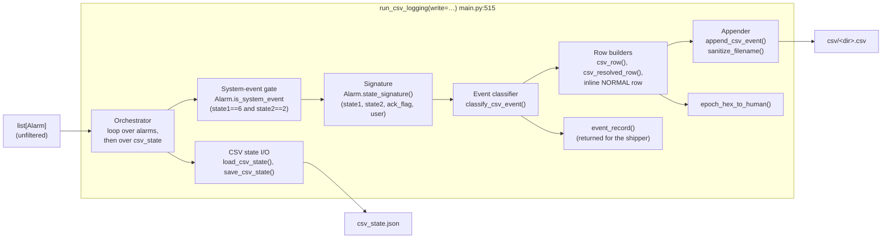
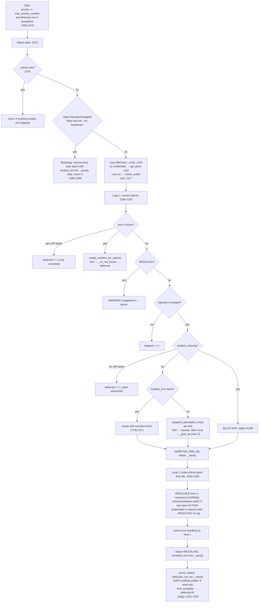
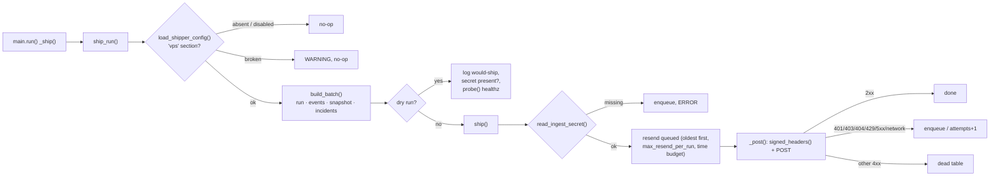

# 5. Building Block View

Static decomposition of the alarm bot on the CTS server: `main.py` (v2.1.0, ~1380 lines) and the optional
module `shipper.py` (~470 lines); only third-party dependency `requests`. The "blocks" are the `# ----` sections
of those files; there is no package structure. Line numbers refer to `main.py` v2.1.0 unless a file is named.
The receiving side (digibuild `cts-alarms`) is a black box here; its building blocks are documented in the
digibuild repo.

Related: [3. Context and Scope](03-context-and-scope.md) (what surrounds the bot), [6. Runtime View](06-runtime-view.md) (how these blocks interact per run), [7. Deployment View](07-deployment-view.md) (where the files live), [C4 component view](../c4/03-component.md) (same decomposition, C4 notation).

## 5.1 Level 1 — the bot as a whitebox

```mermaid
flowchart TB
    subgraph EXT["External (not part of the bot)"]
        VISTA["TAC Vista 5.1.9<br/>$this.alr (live alarm list)"]
        MM["MainManager REST API<br/>/restapi/token · /api/v3/incidents"]
        DGB["digibuild cts-alarms<br/>api.digibuild.dk"]
        TS["Windows Task Scheduler<br/>every 5 min"]
    end

    subgraph BOT["main.py + shipper.py — TAC Vista alarm bot"]
        CLI["Main pipeline / CLI<br/>main(), run()"]
        CFG["Config, secrets & logging<br/>load_config(), load_secrets(), setup_logging()"]
        SNAP["Snapshot<br/>snapshot_alarm_file()"]
        PARSE["ALR parser + Alarm model<br/>parse_alarm_file(), Alarm"]
        MAP["Mapping & exception loaders<br/>load_objects_csv(), load_exceptions_csv()"]
        CSVLOG["CSV audit logger<br/>run_csv_logging()"]
        STATE["State store<br/>load_state(), save_state(), prune_state()"]
        MMC["MainManager client (v3)<br/>MMClient, MMNotFound"]
        DESC["Transition describer<br/>describe_transitions(), initial_description(), incident_name()"]
        TABLE["Status table reporter<br/>log_alarm_status_table()"]
        SHIP["VPS shipper (optional)<br/>shipper.ship_run()"]
    end

    subgraph FILES["Files in the working folder C:/priorityalarmsapi"]
        CJ["config.json"]
        SJ["secrets.json"]
        OBJ["objects.csv / exceptions.csv"]
        SNAPF["alarm_snapshot.alr"]
        AS["alarms_state.json"]
        CS["csv_state.json"]
        CSVD["csv/*.csv"]
        LOGS["logs/YYYY-MM-DD.log"]
        TOK["mm_token.json"]
        OUT["outbox.sqlite"]
    end

    TS -->|python.exe main.py| CLI
    CLI --> CFG
    CFG --> CJ
    CFG --> SJ
    CFG --> LOGS
    CLI --> MAP
    MAP --> OBJ
    CLI --> SNAP
    SNAP -->|shutil.copy2| VISTA
    SNAP --> SNAPF
    CLI --> PARSE
    PARSE --> SNAPF
    CLI --> CSVLOG
    CSVLOG --> CS
    CSVLOG --> CSVD
    CLI --> TABLE
    CLI --> STATE
    STATE --> AS
    CLI --> DESC
    CLI --> MMC
    MMC --> TOK
    MMC -->|HTTPS| MM
    CLI --> SHIP
    SHIP --> SJ
    SHIP --> OUT
    SHIP -->|HTTPS + HMAC| DGB
```



### Block catalogue

| Block | Responsibility | Functions / lines | Data it owns |
|---|---|---|---|
| **Config, secrets & logging** | Read `config.json` (UTF-8, BOM tolerated); read credentials from env or `secrets.json` (never from `config.json`, except a deprecated fallback); create the daily log file with file + stdout handlers on logger `alarmbot`. | `DEFAULT_CONFIG_PATH` (`:47`), `DEFAULT_SECRETS_PATH` (`:48`), `load_config()` (`:55`), `load_secrets()` (`:61`), `setup_logging()` (`:92`) | `logs/YYYY-MM-DD.log` — [log format](../reference/log-format.md), [config reference](../reference/config-reference.md), [ADR-0021](../adr/0021-secrets-in-secrets-json.md) |
| **Snapshot** | Copy the live Vista alarm list to a private working copy so parsing never races Vista's own writes. 5 attempts, 0.5 s apart. | `snapshot_alarm_file()` (`:205`) | `alarm_snapshot.alr` (overwritten each run) — [ADR-0005](../adr/0005-snapshot-then-parse.md) |
| **ALR parser + Alarm model** | Tab-delimited ISO-8859-1 snapshot → `Alarm` objects (36 fields/row, 12 used); malformed rows skipped with a WARNING. `Alarm` carries the status classification and the change-detection signature. | `F_*` constants (`:120`–`131`), status constants (`:149`–`153`), `classify_alarm_status()` (`:156`), `class Alarm` (`:168`), `parse_alarm_file()` (`:219`) | In-memory `list[Alarm]` — [ALR file format](../reference/alr-file-format.md) |
| **Mapping & exception loaders** | `objects.csv`: `alarm_object -> MainID`. `exceptions.csv`: full Vista directory paths to ignore (exact match). Both tolerate a missing file. | `load_objects_csv()` (`:257`), `load_exceptions_csv()` (`:283`) | reads `objects.csv` (0 mappings) and `exceptions.csv` (1 entry) — [ADR-0008](../adr/0008-directory-based-exceptions.md), [ADR-0009](../adr/0009-objects-csv-mainid-mapping-with-fallback.md) |
| **CSV audit logger** | Non-fatal audit trail of *every* alarm (all priorities, no exception filter), one `;`-CSV per Vista directory; own state, own diff; returns the run's events (for the shipper); `write=False` computes without writing. Detail in [5.2](#52-level-2--csv-audit-logger). | `CSV_HEADER` (`:357`) … `event_record()` (`:494`), `run_csv_logging()` (`:515`) | `csv/<sanitized directory>.csv`, `csv_state.json` — [CSV audit format](../reference/csv-audit-format.md), [ADR-0011](../adr/0011-per-directory-csv-audit-log.md) |
| **State store** | Persist per `vista_id`: incident id, MainID, last signature, status, timestamps, `update_failures`, `incident_missing`. Atomic write; prune RESOLVED entries after `prune_resolved_after_days`. | `empty_state()` (`:308`), `load_state()` (`:312`), `save_state()` (`:324`), `prune_state()` (`:332`), `make_state_entry()` (`:919`) | `alarms_state.json` — [state files](../reference/state-files.md), [ADR-0012](../adr/0012-json-state-files-atomic-writes.md) |
| **MainManager client (v3)** | Password-grant token with a file cache; `POST/GET/PUT /api/v3/incidents`; create with status enforcement; read-modify-write `prepend_description_line()` (read `Description`, write `Remarks`, verify); `probe()` to tell API-down from ticket-missing; a 404 raises `MMNotFound`. | `MMNotFound` (`:619`), `class MMClient` (`:624`): `ECHO_FIELDS` (`:640`), `_get_token()` (`:665`), `_request()` (`:709`), `check_auth()` (`:732`), `probe()` (`:738`), `get_incident()` (`:749`), `create_incident()` (`:756`), `_text()` (`:801`), `prepend_description_line()` (`:807`) | `mm_token.json`; reads the credentials and `incident_defaults` — [MainManager API](../reference/mainmanager-api.md), [ADR-0019](../adr/0019-mainmanager-v3-incident-api.md) |
| **Transition describer** | Pure text builders in Vista terminology: incident name (max 100 chars), initial text, the dated lines prepended on each transition. | `dk_now_str()` (`:824`), `describe_transitions()` (`:828`), `initial_description()` (`:861`), `incident_name()` (`:872`) | None — [ADR-0010](../adr/0010-prepend-description-never-change-status.md) |
| **Status table reporter** | One log line per kept alarm plus a summary, every run. Main contributor to log volume. | `log_alarm_status_table()` (`:882`) | the daily log only |
| **Main pipeline / CLI** | Argument parsing, exit codes and orchestration: load → snapshot → parse → CSV audit → filter → status table → bootstrap-or-diff → resolve → prune → save → ship. Read-only mode, 404 classification, three-strikes limit. Detail in [5.3](#53-level-2--incident-pipeline). | `resolve_main_id()` (`:937`), `create_incident_for_alarm()` (`:946`), `run()` (`:983`) with `_save()` (`:998`), `_ship()` (`:1008`), `_mm()` (`:1104`), `_on_not_found()` (`:1128`), `_give_up()` (`:1147`); `main()` (`:1351`) | per-run counters `created / updated / skipped / deferred / resolved_now`, `errors[]` |
| **VPS shipper** | Build one IngestBatch per run, sign it (digibuild HMAC contract), resend queued batches, post, queue on failure; dry run: log what would be sent, check the secret, probe healthz. Detail in [5.4](#54-level-2--vps-shipper). | `shipper.py`: `load_shipper_config()` (`:99`), `read_ingest_secret()` (`:126`), `signed_headers()` (`:143`), `build_batch()` (`:202`), outbox (`:249`–`307`), `_post()` (`:315`), `probe()` (`:344`), `ship()` (`:358`), `ship_run()` (`:447`) | `outbox.sqlite` — [shipper reference](../reference/shipper.md), [ADR-0020](../adr/0020-hmac-ingest-to-digibuild.md) |

### Exit codes and CLI flags (Main pipeline / CLI)

| Flag / code | Effect | Where |
|---|---|---|
| `--config PATH` | Alternative config file; default `C:\priorityalarmsapi\config.json` | `:1353` |
| `--dry-run` | Read-only (v2.0.1+): no state save, no CSV write, no outbox; one MainManager call (token) as a credential check; logs every intended action as `[DRY] …`; with a `"vps"` section also the would-ship line, secret presence and a healthz probe. Safe to run against the live folder. | `read_only` `:996`, `:1117`–`1126` |
| `--parse-only` | Stop after the filter + status table; writes nothing, no API, no shipping. | `:1075` |
| `--no-bootstrap` | Skip the first-run bootstrap: every current alarm is treated as new and gets an incident. | `:1081` |
| exit `0` | Normal completion (including bootstrap, parse-only, and runs where the API was unusable — see `deferred=`) | |
| exit `1` | Unhandled exception inside `run()` (logged with traceback) | `:1372`–`1374` |
| exit `2` | Config could not be loaded, or the snapshot copy failed after 5 attempts | `:1363`, `:1039` |

### Interfaces between blocks

| From → To | Data passed | Notes |
|---|---|---|
| Parser → CSV audit logger, filter, shipper | `list[Alarm]` (all rows) | The CSV logger and the shipped snapshot see the unfiltered list; the incident pipeline sees `kept` only. |
| CSV audit logger → shipper | `list[dict]` events of this run | Returned by `run_csv_logging()`; empty when the CSV step failed. |
| Filter → status table, bootstrap, diff loop | `kept: list[Alarm]` | `priority <= max_priority_number` (2) AND `directory not in exceptions`. |
| State store ↔ pipeline | `state["alarms"][vista_id]` dict | Mutated in place, saved via `_save()` after each change (no-op in read-only runs). |
| State store → shipper | whole `state` | Becomes `incidents[]` in the batch. |
| Describer → MM client | `list[str]` lines | Each line is a GET + PUT + GET round-trip. |
| Mapping loader → `resolve_main_id()` | `dict[str,int]` | Empty today; every incident gets `default_main_id` 14228 and a WARNING. |
| Config/secrets → MM client, shipper | credentials dict; ingest secret | Never logged; the shipper reads its secret itself (`read_ingest_secret()`). |

## 5.2 Level 2 — CSV audit logger

Whitebox of `main.py:357`–`615`. Decoupled from the incident pipeline: separate state file, no priority or
exception filter, and any exception inside it is caught in `run()` (`:1049`–`1057`) and logged as "CSV audit
logging failed (non-fatal)".



| Sub-block | Lines | What it does |
|---|---|---|
| Orchestrator | `:515`–`615` | Loads `csv_state`, one timestamp `ts` for the whole run (`%d-%m-%Y %H:%M:%S`), runs the two loops below, deletes every entry flagged `resolved`, saves state and logs `CSV audit: logged N events` — or, with `write=False` (dry run / parse-only), writes nothing and logs `CSV audit: [DRY] would log N events`. Returns the event records. |
| System-event gate | `:194`, `:535` | Rows with `state1 == 6 and state2 == 2` are skipped entirely. Priority-9 `$EE_Mess` rows have `state1` 0/1 and are logged normally. |
| Signature | `:197` | `(state1, state2, ack_flag, user.strip())`. Equal signature → nothing written. |
| Event classifier | `:441`–`475` | `prev_sig is None` → `FIRST_SEEN`. Otherwise up to three events: condition axis (`NORMAL`, `ACTIVE`, `STATE1_<a>_TO_<b>`), ack axis (`ACKNOWLEDGED`, `UNACKNOWLEDGED`), `USER_CHANGED` if nothing else; `STATE_CHANGED` catch-all. |
| Row builders | `:385`–`426` | `csv_row()` renders all 17 columns from a live `Alarm`; `csv_resolved_row()` a RESOLVED row with empty user/state/date columns; an inline row writes a synthetic `NORMAL` when an alarm disappears while last seen ACTIVE. `;` in `alarm_text` → `,`. |
| Appender | `:372`–`438` | File name = `sanitize_filename(directory) + ".csv"` (max 150 chars); header only on creation; UTF-8 append. |
| Event records | `:494` | `event_record()` builds the dict that the shipper turns into an `events[]` row (same fields as the CSV row, `ts` as a datetime). |
| CSV state I/O | `:478`–`491` | JSON dict keyed by `vista_id`; `resolved: true` set at `:598`, entry deleted in the same run (`:600`–`604`). Atomic write. |

Second loop (`:565`–`599`): for every `csv_state` key not in the current file, write (optionally) the synthetic
`NORMAL` row and then a `RESOLVED` row, and flag the entry. Because the entry is deleted the same run, a
`vista_id` that reappears later is logged as `FIRST_SEEN` again.

## 5.3 Level 2 — incident pipeline

Whitebox of `run()` (`main.py:983`–`1344`) after the CSV audit step. This is the part that talks to MainManager.



| Stage | Lines | Inputs | Side effects |
|---|---|---|---|
| Filter | `:1059`–`1070` | `alarms`, `thresholds.max_priority_number` (2), `exceptions` | Log line `N alarms after priority<=2 + exception filter (removed M)`; exceptions are logged at DEBUG (invisible). |
| Bootstrap | `:1080`–`1098` | `kept`, `mapping`, `default_main_id` | One state entry per kept alarm with `incident_id: null`; no API call; shipped. Only when `meta.bootstrapped` is false. [ADR-0006](../adr/0006-bootstrap-on-first-run.md) |
| Lazy client + availability | `:1100`–`1126` | `mm_cfg`, credentials | `MMClient` built on first use; no credentials in a real run → `api_down`; a dry run only checks the token. A run that needs no API makes no HTTP request. |
| Loop 1 — new alarm | `:1170`–`1186` | `Alarm`, mapping | `POST /api/v3/incidents`; non-404 failure → `incident_id: null` (created at the next change); 404 or API down → not recorded, `deferred += 1`, seen as new again next run. |
| Loop 1 — changed alarm | `:1196`–`1262` | `prev.last_state_sig` vs `Alarm.state_signature()` | Bootstrapped → create with transition lines; existing → GET/PUT/GET per line; `incident_missing` → local only. On a non-404 failure `update_failures` counts up; after 3 the transition is abandoned. [ADR-0004](../adr/0004-state-signature-diff.md), [ADR-0019](../adr/0019-mainmanager-v3-incident-api.md) |
| Loop 2 — resolved | `:1264`–`1329` | `set(state) - current_ids` | Prepends 1–2 lines, sets `status: RESOLVED` and `resolved_iso`; `StatusID` never changed. API down → deferred; ticket missing → resolved locally. |
| Prune + save + ship | `:1331`–`1344` | `prune_resolved_after_days` (30) | Deletes RESOLVED entries older than the cutoff; writes `meta.last_run_iso`; summary with `deferred=`; hands the run to the shipper. |

### Data owned by the pipeline: state entry shape

Written by `make_state_entry()` (`:919`) and mutated in place:

```
incident_id, main_id, main_id_fallback_used, alarm_object, directory, priority,
initial_alarm_text, first_seen_iso, last_state_sig [state1, state2, ack_flag, user],
last_update_iso, status, (resolved_iso — on resolution),
(update_failures — v2.0.0+, while a transition keeps failing),
(incident_missing, incident_missing_iso — v2.0.0+, when the ticket is gone)
```

Full field semantics: [reference/state-files.md](../reference/state-files.md).

## 5.4 Level 2 — VPS shipper

Whitebox of `shipper.py`. Called once per run through `_ship()` in `run()`, which catches any exception
("VPS shipper failed (non-fatal)"), so shipping can never change the bot's exit code or delay ticketing (it runs
after the MainManager work).



| Sub-block | Lines (`shipper.py`) | What it does |
|---|---|---|
| Config | `:76`–`123` | `ShipperConfig` from `config.json -> vps` + `paths.secrets_file`; rejects the obsolete `api_key_file`. |
| Secret | `:126`–`140` | env `CTS_ALARMS_INGEST_SECRET`, else `vps.ingest_secret` in `secrets.json` (`utf-8-sig`). |
| Signing | `:143`–`155` | `X-Timestamp`, `X-Nonce` (uuid4), `X-Signature` = hex HMAC-SHA256 over `f"{ts}.{nonce}."` + raw body; fresh per request. |
| Batch | `:160`–`246` | `IngestBatch` `schema_version` 1; ISO timestamps with local offset; errors bounded to 100. |
| Outbox | `:249`–`307` | SQLite `outbox` / `dead` tables; `_enqueue()`, `_bury()`. |
| HTTP | `:311`–`355` | `_post()` classification (OK / RETRY / DEAD), secret scrubbing; `probe()` for the dry run. |
| Orchestration | `:358`–`474` | `ship()` (secret → resend → post → counts), `ship_run()` (entry point, dry-run branch). |

The wire contract and failure semantics are specified in [reference/shipper.md](../reference/shipper.md).
