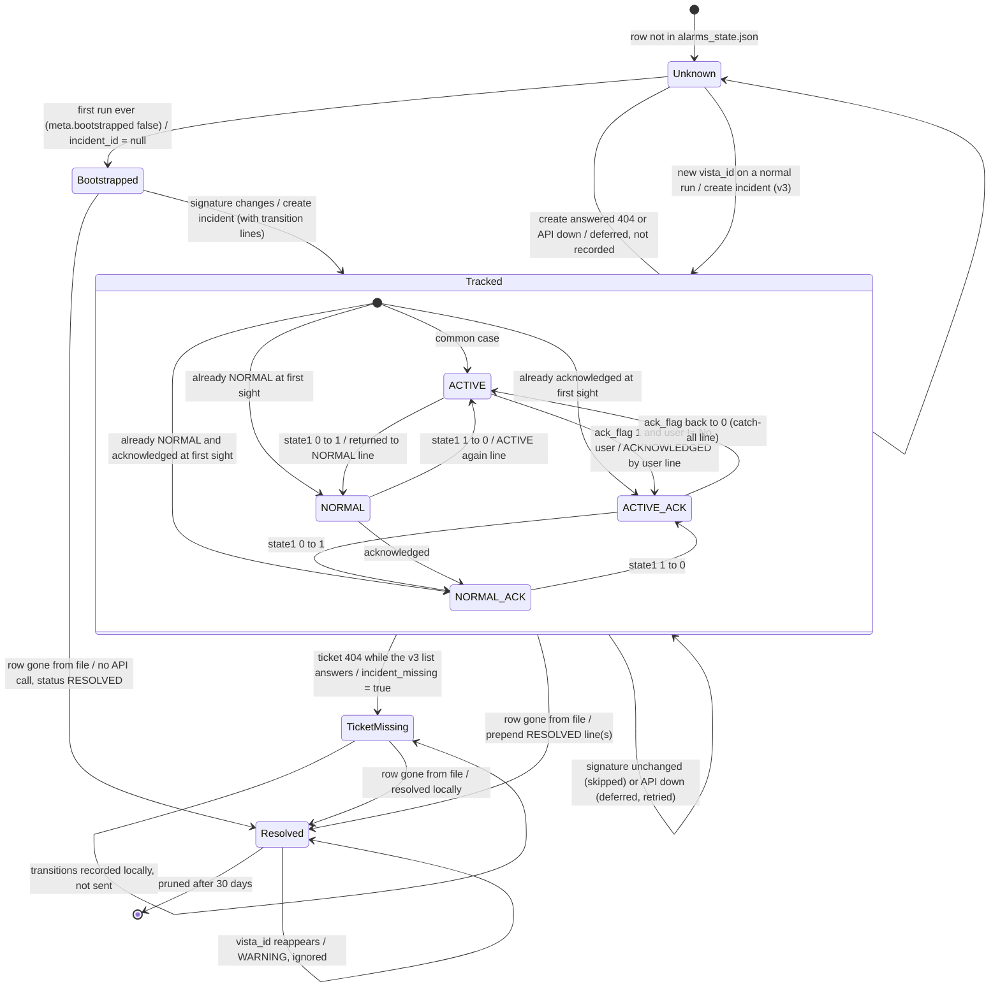
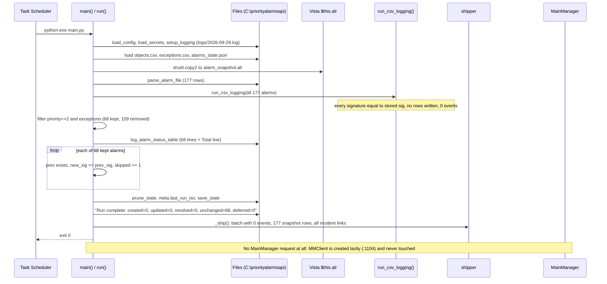
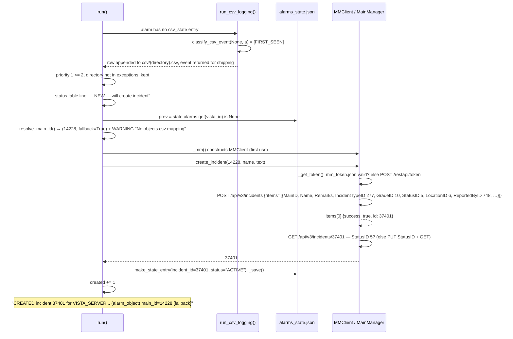
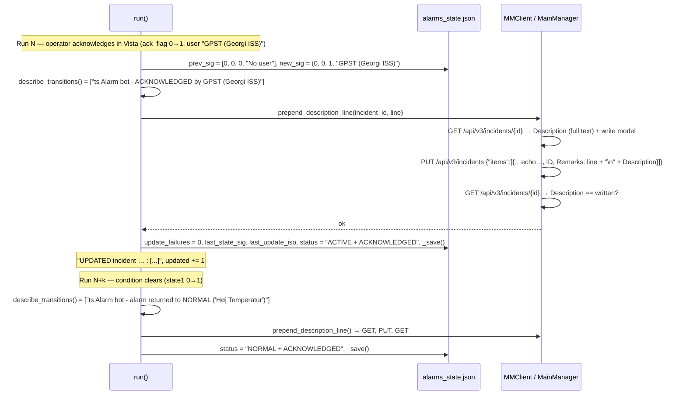
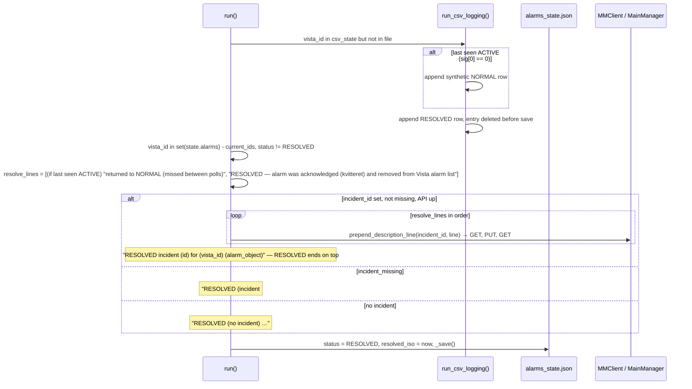
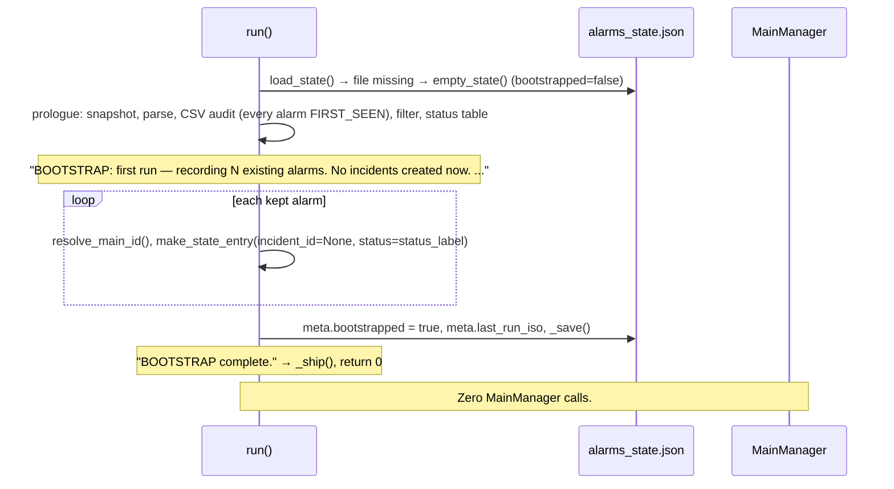

# 6. Runtime View

How the building blocks from [5. Building Block View](05-building-block-view.md) interact in concrete situations. Every scenario is one Task Scheduler invocation of `python.exe main.py` (see [7. Deployment View](07-deployment-view.md)); the process lives for a few seconds and exits. Line numbers refer to `main.py` v2.1.0 unless `shipper.py` is named.

Common prologue for every scenario (`main()` → `run()`):

1. `main()` parses CLI args, `load_config()` (`:1360`), `setup_logging()` (`:1365`) → log line `====` and `Alarm bot started (v2.1.0, dry_run=…, parse_only=…, no_bootstrap=…)`.
2. `run()` reads the credentials (`load_secrets()`, `:987` → `Credentials: from …\secrets.json`), loads `objects.csv`, `exceptions.csv`, `alarms_state.json` (`:990`–`992`) → `Loaded 0 object mappings…`, `Loaded 1 exception entries…`.
3. `snapshot_alarm_file()` copies `$this.alr` → `alarm_snapshot.alr` (`:1035`); failure after 5 tries → exit 2 (the run is still shipped).
4. `parse_alarm_file()` → `Parsed N total alarm rows` (`:1044`).
5. `run_csv_logging(write=not read_only)` (`:1053`), non-fatal; returns the run's events.
6. Filter → `N alarms after priority<=2 + exception filter (removed M)` (`:1069`), then the status table (`:1073`).

Common epilogue: prune, save, `Run complete: created=…, updated=…, resolved=…, unchanged=…, deferred=…` (`:1341`), then `_ship()` (`:1343`) → with a `"vps"` section, scenario (h).

Scenarios below start after the prologue unless stated otherwise.

## 6.1 Per-alarm lifecycle as the bot sees it



Notes:

- The four substates are the `status_label` values from `classify_alarm_status()` (`:156`): `ACTIVE`, `ACTIVE + ACKNOWLEDGED`, `NORMAL`, `NORMAL + ACKNOWLEDGED`. The entry substate is whatever `status_label` the alarm has when first seen; with a 5-minute poll `ACTIVE` is the common case, not the only one. `RESOLVED` is the bot's own term (`:147`) for "row disappeared from `$this.alr`". The code assumes (comment at `:1274`) that Vista removes a row once it is NORMAL and acknowledged (kvitteret); this is not verified against Vista documentation, and the CSV audit almost never sees the acknowledgement before the row vanishes.
- Any signature change not covered by the named transitions produces the catch-all line `status changed to <label> (state1 a->b, ack x->y)` (`:852`–`856`).
- The bot never changes the MainManager incident `StatusID` after creation; a human closes the ticket ([ADR-0010](../adr/0010-prepend-description-never-change-status.md)).
- `TicketMissing` is a flag on the entry (`incident_missing`, v2.0.0+), not a status label ([ADR-0019](../adr/0019-mainmanager-v3-incident-api.md)).

## 6.2 Scenario (a) — normal 5-minute run, no changes

The overwhelmingly common case: 288 runs/day, most with `created=0, updated=0, resolved=0`.



1. Because no alarm's `(state1, state2, ack_flag, user)` changed, `run_csv_logging()` writes no CSV row and logs nothing (the `CSV audit:` line only appears when events > 0, `:611`).
2. Loop 1 (`:1167`): every `kept` alarm has a `prev` entry with an equal signature → `skipped += 1` (`:1200`–`1202`).
3. Loop 2 (`:1266`): `set(state["alarms"]) - current_ids` contains only entries already `RESOLVED` → `continue`.
4. Prune, save, summary, ship, exit 0. Wall time ≈ 1–2 s plus one HTTPS POST when shipping is configured.

In v1.x this ideal case never happened after 2026-09-19: every run re-tried the stuck 404 updates and fetched a token ([§11 R-01, R-18](11-risks-and-technical-debt.md)). In v2 a MainManager call is made only when there is something to send.

## 6.3 Scenario (b) — a brand-new priority-1 alarm appears → incident created

Example: `Brand fra ABA` (priority 1) shows up in `$this.alr` with a `vista_id` never seen before.



1. CSV audit: no `csv_state` entry → `FIRST_SEEN` row (`:448`), entry stored.
2. Filter keeps it (priority 1 ≤ 2). Status table: tracking `NEW — will create incident`.
3. Loop 1, branch `prev is None` (`:1170`): if the API is already known to be down this run → `deferred += 1` and the alarm is **not** recorded (next run sees it as new). Otherwise `resolve_main_id()` — `objects.csv` is empty, so fallback MainID 14228 and a WARNING.
4. `create_incident_for_alarm()` (`:946`) builds `incident_name()` = `CTS Alarm - <alarm_object> - <alarm_text>` (≤ 100 chars) and `initial_description()` = `<dd-mm-yyyy HH:MM> Alarm bot - NEW alarm, status: ACTIVE, priority 1: "Brand fra ABA"` + `Object:` + `Directory:` lines.
5. `MMClient.create_incident()` (`:756`): token (cached or requested), `POST /api/v3/incidents`, read-back `GET`, and — only if `StatusID` did not stick — `PUT` + `GET`. Logs `API CREATE: POST`, `MainID=…, Name=…`, `response={…}`.
6. Success: state entry written and saved immediately. A 404 → `MMNotFound` → `_on_not_found(…, None, "CreateIncident")` treats it as API down (`deferred += 1`, not recorded). Any other exception → `CreateIncident FAILED for …`, entry saved with `incident_id: null` (the incident is created at the alarm's *next* signature change).
7. Summary line: `Run complete: created=1, …`.

## 6.4 Scenario (c) — alarm acknowledged, then returns to NORMAL → text prepended twice

Two runs (possibly with unchanged runs in between) for a tracked alarm with an incident.



1. CSV audit writes `ACKNOWLEDGED` (run N) and `NORMAL` (run N+k) rows (`:463`, `:455`).
2. Loop 1: `prev` exists, not RESOLVED, `new_sig != prev_sig`.
3. `describe_transitions(prev_sig, a)` (`:828`): ack axis → `ACKNOWLEDGED by <user>` (needs `ack_flag` 1 and a user other than `No user`, `:845`); condition axis → `alarm returned to NORMAL ("<text>")` (`:835`). Both in one run → two lines, each prepended separately in list order.
4. `incident_id` set, not `incident_missing`, API not down → `prepend_description_line()` per line (`:807`): read **`Description`** (never the truncated `Remarks`), PUT **`Remarks`** = new line + old text with the write model echoed, verify by GET. `StatusID` untouched.
5. Success: `update_failures` reset, signature/status saved, `updated += 1`. A 404 → scenario (f). Any other error → `_give_up()`: attempt n/3 logged, state untouched (retried next run); after the 3rd the transition is abandoned with an ERROR and the state advances.
6. Resulting ticket text (newest first):
   ```
   28-09-2026 10:15 Alarm bot - alarm returned to NORMAL ("Høj Temperatur")
   28-09-2026 09:40 Alarm bot - ACKNOWLEDGED by GPST (Georgi ISS)
   28-09-2026 09:10 Alarm bot - NEW alarm, status: ACTIVE, priority 2: "Høj Temperatur"
   Object: …
   Directory: …
   ```

If the alarm was only bootstrapped (`incident_id` null) when the first change happens, step 4 is replaced by `create_incident_for_alarm(…, extra_desc_lines=transition_lines)` (`:1214`, "THE FIX"): the incident is created with the transition line(s) above the initial text.

## 6.5 Scenario (d) — alarm leaves the file → RESOLVED lines

A row disappears from `$this.alr`. The bot notices the absence in Loop 2 (`:1264`–`1329`).



1. CSV audit (`:565`–`599`): if the stored `state1` was 0 (ACTIVE), a synthetic `NORMAL` row is written first (`:580`–`585`), then `csv_resolved_row()` (`:592`); the `csv_state` entry is deleted the same run.
2. `resolve_lines` (`:1282`–`1291`): the "missed between polls" line only if `last_state_sig[0] == 0`; the RESOLVED line always.
3. With a live ticket: lines are prepended **in natural order**, so RESOLVED ends on top (v1 iterated in reverse and put the NORMAL line above RESOLVED). API down → `deferred += 1`, entry untouched, retried next run. 404 → scenario (f). Other errors → three strikes as in (c).
4. `status = RESOLVED`, `resolved_iso = now`, `_save()`; `resolved_now += 1`. The ticket stays open in MainManager.
5. 30 days later `prune_state()` deletes the entry. If the same `vista_id` reappears before that, Loop 1 logs `… reappeared after RESOLVED — ignoring`.

## 6.6 Scenario (e) — first-run bootstrap

Happens once: `alarms_state.json` missing (or `meta.bootstrapped: false`) and no `--no-bootstrap`. [ADR-0006](../adr/0006-bootstrap-on-first-run.md).



1. `load_state()` (`:312`) returns `empty_state()` when the file is missing; a legacy file without `meta` is wrapped.
2. The CSV audit runs before the bootstrap check, so every non-system alarm gets a `FIRST_SEEN` row.
3. Bootstrap branch (`:1080`–`1098`): every `kept` alarm is stored with `incident_id: null`; `main_id` is resolved now and frozen in the entry.
4. The run is shipped and returns 0 before Loop 1/2.
5. Later runs show these entries as `bootstrapped — no incident yet` until their signature changes (→ "THE FIX") or they disappear (→ `RESOLVED (no incident)`).

In a **dry run** the same branch logs `[DRY] BOOTSTRAP not saved (dry-run).` and writes nothing. `--no-bootstrap` skips the branch, so every current alarm goes through scenario (b).

## 6.7 Scenario (f) — MainManager answers 404

v2.0.0+ ([ADR-0019](../adr/0019-mainmanager-v3-incident-api.md)). A 404 raises `MMNotFound` (`:709`); the caller hands it to `_on_not_found()` (`:1128`), which asks one question: does the v3 list endpoint still answer?

```mermaid
sequenceDiagram
    participant M as run()
    participant ST as alarms_state.json
    participant MM as MMClient
    participant API as MainManager

    M->>MM: prepend_description_line(34570, line)
    MM->>API: GET /api/v3/incidents/34570
    API-->>MM: 404
    MM-->>M: MMNotFound
    M->>MM: probe(): GET /api/v3/incidents?pageNumber=1&pageSize=1
    alt probe answers → the ticket is gone
        M->>ST: entry.incident_missing = true, incident_missing_iso = now
        Note over M: WARNING "… not found in MainManager during UpdateIncident — marked incident_missing"
        M->>ST: transition applied locally, _save()
        Note over M,API: never called again for 34570; the alarm is still tracked and resolved locally
    else probe fails → the API is gone
        Note over M: ERROR "MainManager API unusable this run: HTTP 404 from the v3 incident API … will retry next run"
        M->>M: api_down set; this and every later API action this run → deferred += 1, state untouched
        Note over M: end of run: ERROR "… N action(s) deferred to the next run", "Run complete: … deferred=N"
    end
```

- **API down** leaves the state exactly as it was, so when the API returns (or the client is fixed) the next run sends the whole backlog — this is what keeps the ~30 transitions stuck since 2026-09-19 deliverable.
- A **create** that answers 404 is always treated as API down (there is no ticket to be missing).
- **Other failures** (5xx, timeouts, `success: false`, read-back mismatch) are counted per entry (`update_failures`): `… FAILED for <vid> (attempt n/3)`; the 3rd gives up on that transition and advances the state.
- No credentials in a real run → `api_down` from the start (`:1111`).

**History (v1.x, 2026-09-19 … deployment of v2):** EG removed `/restapi/Incident/*`; v1 treated every 404 as a transient error, `continue`d without saving, and retried every 5 minutes forever — `Resolution update FAILED for VISTA_SERVER#6A5D0D16: 404 … GetIncident?IncidentID=34570` 2,150 times; 531 FAILED lines on 2026-09-28 alone; a token on every run ([§11 R-01, R-18](11-risks-and-technical-debt.md)).

## 6.8 Scenario (g) — CSV audit path for a priority-9 system event

Priority 9 rows are Vista system messages, e.g. `alarm_object` = `VISTA_SERVER-$EE_Mess`, text `VISTA_SERVER-LOYTEC_PORT-RHQ-34591_02_ET1_LON-1Q413_12 Offline`, directory `…_LON-1Q413_12#MA1`. They never reach the incident pipeline (9 > `max_priority_number` 2) but are fully tracked by the CSV audit logger and shipped in `events[]` and `snapshot[]`.

```mermaid
sequenceDiagram
    participant M as run()
    participant CSV as run_csv_logging()
    participant CS as csv_state.json
    participant F as csv/VISTA_SERVER-LOYTEC_PORT-RHQ-34591_02_ET1_LON-1Q413_12_MA1.csv

    M->>CSV: alarms (all 177 rows incl. priority 9)
    CSV->>CSV: a.is_system_event? state1=0, state2=0 → False, not skipped
    CSV->>CS: prev_entry for vista_id → None
    CSV->>CSV: classify_csv_event(None, a) = ["FIRST_SEEN"]
    CSV->>F: csv_row(...) appended; sanitize_filename replaces '#' with '_'; header if new
    CSV->>CS: csv_state[vista_id] = {sig, directory, alarm_object, initial_alarm_text, priority 9, vista_id}
    CSV->>CS: save_csv_state (atomic)
    Note over CSV: "CSV audit: logged 1 events across alarm directories"
    M->>M: filter: priority 9 > 2 → dropped, never in kept
```

1. `run_csv_logging()` iterates the *unfiltered* list (`:533`). The only exclusion is `is_system_event` (`state1 == 6 and state2 == 2`, `:535`).
2. No `csv_state` entry → `FIRST_SEEN` (`:448`); `csv_row()` (`:385`) renders the 17 columns ending in `ACTIVE`.
3. `append_csv_event()` (`:429`): `…1Q413_12#MA1` becomes `…1Q413_12_MA1.csv` (`:379`).
4. `csv_state[vista_id]` stored (`:557`–`563`); `save_csv_state()` (`:486`) writes atomically.
5. The filter (`:1063`) drops the row: no status-table line, no state entry, no ticket.
6. Later: `Offline` → `Online` flips `state1` 0→1 → `NORMAL` row; when Vista removes the row, a `RESOLVED` row (`:592`) and the entry is deleted (`:602`–`604`).

## 6.9 Scenario (h) — shipping the run to digibuild

After the epilogue, `_ship()` calls `shipper.ship_run()` ([reference/shipper.md](../reference/shipper.md), [ADR-0020](../adr/0020-hmac-ingest-to-digibuild.md)). Without a `"vps"` section it returns at once.

```mermaid
sequenceDiagram
    participant M as run() _ship()
    participant SH as shipper
    participant SJ as secrets.json
    participant OB as outbox.sqlite
    participant D as api.digibuild.dk (cts-alarms worker)

    M->>SH: ship_run(cfg, run_meta, events, alarms, state)
    SH->>SH: build_batch(): run · events · snapshot · incidents
    SH->>SJ: read_ingest_secret()
    alt secret missing
        SH->>OB: enqueue (not attempted), ERROR "VPS: no ingest secret …"
    else secret ok
        loop up to max_resend_per_run queued batches, oldest first
            SH->>D: POST /internal/cts-alarms/v1/ingest (fresh X-Timestamp, X-Nonce, X-Signature)
            alt 2xx
                SH->>OB: delete row, "VPS: resent queued run …"
            else retryable (401/403/404/429/5xx/network)
                SH->>OB: attempts+1, stop resending this run
            else other 4xx
                SH->>OB: move to dead
            end
        end
        SH->>D: POST this run's batch (unless the server looked down)
        alt 2xx
            Note over SH: "VPS: shipped run … — N events, M snapshot rows, K incidents (HTTP 200)"
        else retryable
            SH->>OB: enqueue, WARNING "… failed: … — queued"
        else other 4xx
            SH->>OB: dead, ERROR "rejected as malformed"
        end
    end
    SH-->>M: (never raises on network errors; any exception → "VPS shipper failed (non-fatal)")
```

- The receiver verifies the signature over the raw bytes, rejects a timestamp more than 300 s off and any replayed nonce, and dedups by `run_id` and `(vista_id, ts, event)`, so a resend is always safe.
- A receiver outage of days is a backlog in `outbox.sqlite`, not data loss; ticketing is unaffected because shipping runs after the MainManager work.

## 6.10 Scenario (i) — verifying a deployment with `--dry-run`

The owner's check before enabling the task ([§7](07-deployment-view.md), TODO T-103/T-092). Safe on the live folder since v2.0.1.

1. Prologue as usual, but `read_only` is true (`:996`): the CSV audit computes events without writing (`CSV audit: [DRY] would log N events …`).
2. Credential check (`:1117`–`1126`): one token request (or `API AUTH: using cached token` — delete `mm_token.json` first to force a real check) → `[DRY] MainManager credentials OK` or `… FAILED: <reason>`.
3. Loops 1/2 log `[DRY] Would create incident …`, `[DRY] Would update incident …`, `[DRY] Would mark … RESOLVED` — after a MainManager outage, this lists the stuck backlog that the first real run will send.
4. Epilogue: `[DRY] nothing written (state, CSV and MainManager untouched)`, `Run complete: …`.
5. With a `"vps"` section: `[DRY] Would ship …`, `[DRY] VPS ingest secret: present|MISSING`, `[DRY] VPS reachability: GET …/api/cts-alarms/healthz -> HTTP 200|404|unreachable (…)`. No POST, no outbox.

## 6.11 Scenario cross-reference

| Scenario | Log lines to look for | Files touched | HTTP calls |
|---|---|---|---|
| (a) no changes | `Run complete: created=0, updated=0, resolved=0, unchanged=N, deferred=0` | `alarms_state.json` (meta), `csv_state.json` | none to MainManager; one POST to digibuild if shipping |
| (b) new alarm | `No objects.csv mapping…`, `API CREATE:` ×3, `CREATED incident` | both state files, `csv/<dir>.csv` FIRST_SEEN | token (unless cached), POST + GET (+ PUT + GET) |
| (c) transition | `API UPDATE: PUT …`, `API UPDATE: verified …`, `UPDATED incident` | both state files, CSV row per event | GET + PUT + GET per line |
| (d) resolved | `RESOLVED incident` / `RESOLVED (incident #… missing …)` / `RESOLVED (no incident)` | both state files, CSV NORMAL? + RESOLVED | 1–2 × (GET + PUT + GET) |
| (e) bootstrap | `BOOTSTRAP: first run…`, `BOOTSTRAP complete.` | `alarms_state.json`, `csv_state.json` created | none to MainManager |
| (f) 404 | `… marked incident_missing` or `MainManager API unusable this run …` + `deferred=N` | ticket missing: entry flagged; API down: none | the failing GET + one probe |
| (g) priority-9 | `CSV audit: logged N events` only | `csv_state.json`, `csv/<dir>.csv` | none |
| (h) shipping | `VPS: shipped run …` / `VPS: … failed … — queued` / `VPS: outbox has …` | `outbox.sqlite` when something is queued | POST(s) to `api.digibuild.dk` |
| (i) dry run | `[DRY] …` lines, `[DRY] nothing written …` | `mm_token.json` only | token (or none if cached) + one healthz GET with a `"vps"` section |
