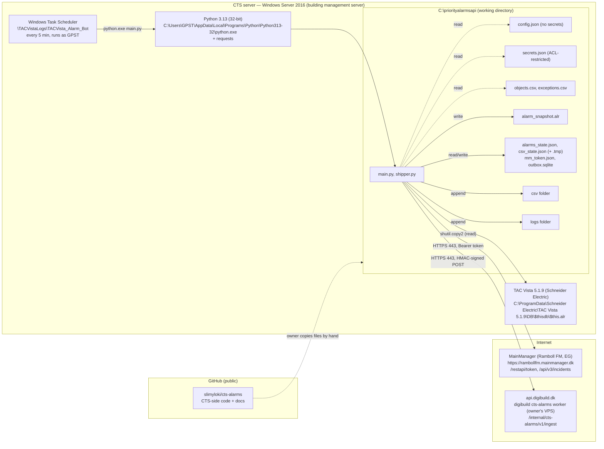
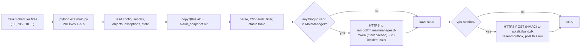

# 7. Deployment View

Where the system runs. One deployment node is under the owner's control and in scope of this repo — the
**CTS server** — plus two external endpoints: MainManager (SaaS) and the digibuild `cts-alarms` worker (the
owner's VPS, documented in the digibuild repo). Facts are taken from `TACVista_Alarm_Bot.xml`, `config.json`,
`main.py` v2.1.0, `shipper.py` and the runtime data as of 2026-09-28.

Related: [3. Context and Scope](03-context-and-scope.md), [5. Building Block View](05-building-block-view.md), [C4 container view](../c4/02-container.md), [C4 §05](../c4/05-target-architecture-proposal.md).

## 7.1 Infrastructure level 1



### Node: CTS server

| Property | Value | Source |
|---|---|---|
| Role | Building management system (CTS) server running TAC Vista; the bot is a guest process on it | `Alarm_bot_build_reference.md` |
| OS | Windows Server 2016 | owner statement |
| Vista version / alarm list | TAC Vista 5.1.9; live list at `C:\ProgramData\Schneider Electric\TAC Vista 5.1.9\DB\$thisdb\$this.alr` | `config.json` → `paths.vista_alarm_file` |
| Runtime | 32-bit CPython 3.13, per-user install for `GPST`: `C:\Users\GPST\AppData\Local\Programs\Python\Python313-32\python.exe` | `TACVista_Alarm_Bot.xml` `<Command>` |
| Third-party packages | `requests` only (version unpinned, [TODO T-029](../TODO.md)); the shipper uses stdlib `sqlite3`, `hmac`, `uuid` | `main.py:33`, `shipper.py` |
| Working directory | `C:\priorityalarmsapi` | XML `<WorkingDirectory>`, `config.json` → `paths.working_folder` |
| Service account | Windows user `GPST` (appears in Vista as "GPST (Georgi ISS)"); stored-password logon, `LeastPrivilege` | XML `<Principal>` |
| Network egress required | HTTPS 443 to `rambollfm.mainmanager.dk` (proven) and to `api.digibuild.dk` (to be proven by the dry-run reachability line, [TODO T-077](../TODO.md)). No inbound ports. No proxy configuration (`requests` defaults). | `config.json`, `shipper.py` |
| Clock | must be NTP-synchronised within 300 s for the HMAC ingest ([TODO T-107](../TODO.md)) | [ADR-0020](../adr/0020-hmac-ingest-to-digibuild.md) |
| Access to Vista | File-system read of `$this.alr` only; no Vista API, no database driver | `snapshot_alarm_file()` `main.py:205` |
| Other bots on the host | the Indeklima bot (`C:\vista-opc\indeklima-bot\`, task `Indeklima_Bot_v2`), same MainManager account | [TODO T-105](../TODO.md) |

### Task Scheduler definition (`TACVista_Alarm_Bot.xml`)

| Setting | Value | Consequence |
|---|---|---|
| URI | `\TACVistaLogs\TACVista_Alarm_Bot` | Lives in a `TACVistaLogs` folder in Task Scheduler |
| Description (verbatim) | "TAC Vista alarm bot — monitors $this.alr and creates/updates MainManager incidents for priority 1-3 alarms. Runs every 5 minutes, 24/7." | Says 1–3; `config.json` threshold is 2 ([TODO T-083](../TODO.md)) |
| Trigger | `TimeTrigger`, `StartBoundary` 2026-04-21T00:00:00, repeat `PT5M` for `P1D`, `StopAtDurationEnd` false | 288 runs/day |
| `MultipleInstancesPolicy` | `IgnoreNew` | A slow run is never overlapped by the next one |
| `ExecutionTimeLimit` | `PT5M` | A run is killed after 5 min. State is saved after every change; the shipper's time budget (120 s) keeps a backlog resend inside the limit. |
| `RestartOnFailure` | 3 × every `PT1M` | Whether an exit code 1/2 counts as a failure for this setting is not verified. |
| `StartWhenAvailable` | true | Missed runs run once when possible |
| `RunOnlyIfNetworkAvailable` | false | Runs even offline → API calls fail (API down → deferred), shipping queues, CSV audit and logging still happen |
| Priority | 7 (below normal) | Yields to Vista under CPU pressure |
| Action | `python.exe "C:\priorityalarmsapi\main.py"` in `C:\priorityalarmsapi` | Uses `DEFAULT_CONFIG_PATH`, no `--config` |

The older `Alarm_bot_build_reference.md` describes a 3-minute recurrence, `C:\ctsapi\alarms` and `exceptions.txt`; the XML and `config.json` are authoritative.

### External node: MainManager

| Property | Value |
|---|---|
| Provider | Ramboll FM MainManager, SaaS (software by EG); API changes arrive without notice (`/restapi/Incident/*` removed 2026-09-19) |
| Base URL | `https://rambollfm.mainmanager.dk` (`config.json` → `mainmanager.base_url`) |
| Endpoints used | `POST /restapi/token`, `POST/GET/PUT /api/v3/incidents` ([ADR-0019](../adr/0019-mainmanager-v3-incident-api.md)) |
| Authentication | Bearer token from the service-account credentials in `secrets.json`; cached in `mm_token.json` until 300 s before expiry |
| Timeouts | 30 s token, 60 s incident calls |
| Target object | All incidents land on `MainID` 14228 (`default_main_id`) because `objects.csv` is empty |

Details: [reference/mainmanager-api.md](../reference/mainmanager-api.md).

### External node: digibuild `cts-alarms`

The owner's portal. The worker (Python, SQLite) runs as a background service on the owner's VPS and is
reachable only through `api.digibuild.dk`; the pages run on Vercel. From this repo's point of view it is one
HTTPS endpoint with a fixed contract: `POST /internal/cts-alarms/v1/ingest` (HMAC) and
`GET /api/cts-alarms/healthz` (anonymous). Its deployment (units, reverse proxy, env file with
`CTS_ALARMS_INGEST_SECRET`, backups, watchdog) is documented in the digibuild repo, not here.

### Node: GitHub (repository, not a runtime)

`slimyloki/cts-alarms` — **public** — holds the CTS-side code, tests and docs only
([ADR-0022](../adr/0022-cts-side-only-repo-web-app-in-digibuild.md)). No CI, no deployment pipeline: files are
copied to `C:\priorityalarmsapi` by the owner. Its history up to 2026-09-29 still contains runtime data and the
(now rotated) v1 password ([TODO T-102](../TODO.md)).

## 7.2 File layout on the CTS server and growth

All paths from `config.json` → `paths`. Sizes as of 2026-09-28.

| Path | Written by | Lifecycle | Size / growth |
|---|---|---|---|
| `main.py`, `shipper.py` | owner (copy) | static; version in every run banner | ~1380 / ~470 lines |
| `config.json` | owner | static; **no credentials** | 2 KB |
| `secrets.json` | owner | static; MainManager pair + ingest secret; ACL-restricted; never in git | <1 KB |
| `objects.csv` | owner | static, currently 0 mappings (comments only) | <1 KB |
| `exceptions.csv` | owner | static, 1 directory | <1 KB |
| `alarm_snapshot.alr` | `snapshot_alarm_file()` | overwritten every run | ~58 KB |
| `alarms_state.json` (+ `.tmp`) | `save_state()` | rewritten at least once per run plus once per created/changed/resolved alarm; RESOLVED entries pruned after 30 days; not written in read-only runs | ~70 KB, 122 entries |
| `csv_state.json` (+ `.tmp`) | `save_csv_state()` | rewritten every run; resolved entries deleted immediately | ~65 KB, ≈ live rows |
| `mm_token.json` | `MMClient._get_token()` | rewritten when a new token is fetched (≤ every ~2 h while there is API work); holds a live bearer token | <2 KB |
| `outbox.sqlite` | `shipper.py` | created on the first non-dry run with a `"vps"` section; rows only while batches are undelivered; **unbounded** ([TODO T-106](../TODO.md)) | 0 when healthy; tens of MB/day while the receiver is unreachable |
| `csv\<directory>.csv` | `append_csv_event()` | append-only, never rotated | 431 files, 20,584 rows, ~6.3 MB on disk over 5.5 months |
| `logs\YYYY-MM-DD.log` | `setup_logging()` | one file per day, never rotated or deleted | ~356 MiB for 163 files; 2–4 MB/day |

Growth summary: ~1.4 GB/year of logs, ~15 MB/year of CSV, state files flat. Nothing on the server deletes
anything ([TODO T-023](../TODO.md)). The 2026-09-28 copy of the runtime data is also archived privately on the
VPS; the live files remain the source of truth.

## 7.3 Runtime process view (one invocation)



Observed v1 timing (`logs/2026-09-28.log`): about 2 s including one round-trip to MainManager; the 5-minute
limit is two orders of magnitude above normal.

## 7.4 Security-relevant deployment facts

- MainManager credentials and the ingest secret live only in `C:\priorityalarmsapi\secrets.json` (or task
  environment variables), restricted by NTFS ACL; `config.json` carries none ([ADR-0021](../adr/0021-secrets-in-secrets-json.md)).
- The MainManager password that was in the public repo history was **rotated on 2026-09-29**. The Indeklima bot
  on the same host uses the same account and still needs the new value when it is ported ([TODO T-105](../TODO.md)).
- `mm_token.json` holds a live bearer token for up to two hours — keep the same ACL as `secrets.json`.
- The task runs under a personal user (`GPST`) with a stored password, not a dedicated service account ([TODO T-015](../TODO.md)).
- Operator names are personal data in `$this.alr`, state files, `csv/`, `logs/` and every shipped batch.
- Outbound TLS verification is `requests`' default (on); no pinning, no proxy. The ingest request carries no
  reusable credential (HMAC, fresh nonce per request).

### `secrets.json` on the CTS server

Create it **without a byte-order mark** (the bot tolerates one since v2.1.0, v2.0.1 does not) and restrict it.
PowerShell 5.1 on the server, as an administrator or as `GPST`:

```powershell
$u = "<MainManager username>"      # e.g. read from the old config.json backup: (Get-Content <backup>\config.json -Raw | ConvertFrom-Json).mainmanager.username
$p = (Get-Credential -UserName $u -Message "New MainManager password").GetNetworkCredential().Password
$json = @{ mainmanager = @{ username = $u; password = $p } } | ConvertTo-Json
[IO.File]::WriteAllText("C:\priorityalarmsapi\secrets.json", $json)    # UTF-8 without BOM
Remove-Variable p, json
icacls C:\priorityalarmsapi\secrets.json /inheritance:r /grant:r "GPST:(R)" "Administrators:(F)" "SYSTEM:(F)"
icacls C:\priorityalarmsapi\secrets.json      # expect only GPST, Administrators, SYSTEM
```

Use the account name exactly as the task shows it under "Run as" (a domain account needs `DOMAIN\GPST`). When the
shipper is enabled, the file gains `"vps": {"ingest_secret": "…"}` — add it the same way (read the file with
`ConvertFrom-Json`, add the property, write it back with `WriteAllText`).

## 7.5 Deploying a new version (owner's hands)

Nothing on the VPS reaches into the building; every deployment is a file copy by the owner. Each deployed
`main.py` must be a committed version — the start banner names it.

**v2.0.1 — the v3 MainManager fix ([TODO T-103](../TODO.md)):**

1. Back up the working folder: `Copy-Item C:\priorityalarmsapi "C:\priorityalarmsapi-backup-$(Get-Date -Format yyyyMMdd-HHmm)" -Recurse`.
2. Stop the task: `Disable-ScheduledTask -TaskPath "\TACVistaLogs\" -TaskName "TACVista_Alarm_Bot"`.
3. Copy `main.py`, `config.json` and `secrets.example.json` of the release into `C:\priorityalarmsapi`; compare
   `Get-FileHash main.py` with the release's SHA-256.
4. Create `secrets.json` as in 7.4 with the new password; delete any `mm_token.json`.
5. Dry run (safe on the live folder): `& "C:\Users\GPST\AppData\Local\Programs\Python\Python313-32\python.exe" C:\priorityalarmsapi\main.py --dry-run`.
   Expect `Alarm bot started (v2.0.1, …`, `Credentials: from C:\priorityalarmsapi\secrets.json`, `API AUTH: HTTP 200`,
   `[DRY] MainManager credentials OK`, `[DRY] Would update/mark …` lines for the backlog stuck since 2026-09-19,
   `[DRY] nothing written …`. `401` → wrong password; a traceback about JSON/BOM → re-create `secrets.json` as in 7.4.
6. Start: `Enable-ScheduledTask …` then `Start-ScheduledTask -TaskPath "\TACVistaLogs\" -TaskName "TACVista_Alarm_Bot"`.
   The log should show `UPDATED` / `RESOLVED` lines and `Run complete: … deferred=0`; the backlog goes out in this
   first run. Check one ticket in MainManager.
7. When verified, delete the backup's `config.json` (it holds the old, rotated password) or the whole backup.

**v2.1.x + the shipper ([TODO T-092](../TODO.md))** — only after the digibuild worker answers
`https://api.digibuild.dk/api/cts-alarms/healthz` with 200: add `vps.ingest_secret` to `secrets.json`, copy
`shipper.py` and the v2.1.x `main.py`, add the `"vps"` block to `config.json`, dry run (expect
`[DRY] VPS ingest secret: present` and `… healthz -> HTTP 200`), then let the task run and look for
`VPS: shipped run … (HTTP 200)`. Steps in [reference/shipper.md](../reference/shipper.md#installing-on-the-cts-server).

**Rollback:** disable the task, copy the backup back, enable. The shipper alone is rolled back by removing the
`"vps"` block (or `shipper.py`).

## 7.6 What runs elsewhere

The history database, read API, web pages, friendly-name registry, reports, the historical import and the
watchdog that alerts when the bot stops reporting all belong to the digibuild sub-project `cts-alarms`
([ADR-0022](../adr/0022-cts-side-only-repo-web-app-in-digibuild.md)). This repo's side of that system ends at the
HTTPS POST.
