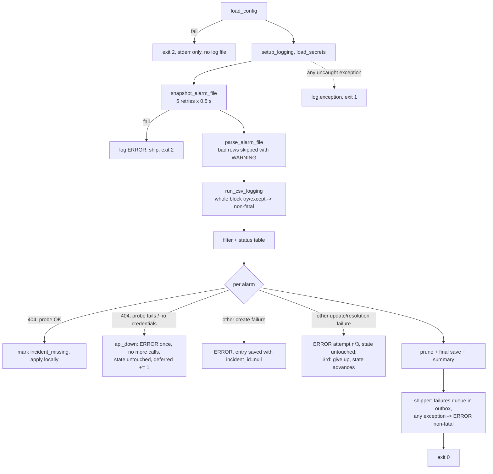

# 8. Crosscutting Concepts

Concepts that apply across the whole bot (`main.py` v2.1.0 and `shipper.py`). Each section states what the code does today (with line references to v2.1.0) and, where relevant, what is known to be weak. Future direction lives in [09 – Architecture Decisions](09-architecture-decisions.md), [11 – Risks and Technical Debt](11-risks-and-technical-debt.md) and [docs/TODO.md](../TODO.md).

Related: [05 – Building Block View](05-building-block-view.md) · [06 – Runtime View](06-runtime-view.md) · [Reference: state files](../reference/state-files.md) · [Reference: config](../reference/config-reference.md)

---

## 8.1 Alarm domain model

### Two-axis status model (Vista terminology)

TAC Vista describes an alarm row along two independent axes (`main.py:135-147`):

| Axis | Field | Values |
|---|---|---|
| Condition | `state1` (field 4) | `0` = ACTIVE (condition present), `1` = NORMAL (condition gone), `6` = system event |
| Operator | `ack_flag` (field 11) + `user` (field 10) | `0` / `"No user"` = unacknowledged, `1` / `"<name>"` = acknowledged (*kvitteret*) |

`classify_alarm_status()` (`main.py:156-166`) collapses the two axes into one of four labels, plus a fifth that is the bot's own term:

| Label | Condition | Operator | Meaning |
|---|---|---|---|
| `ACTIVE` | state1 = 0 | ack = 0 | Condition present, nobody has acknowledged |
| `ACTIVE + ACKNOWLEDGED` | state1 = 0 | ack = 1 and user ≠ "No user" | Condition present, operator has seen it |
| `NORMAL` | state1 = 1 | ack = 0 | Condition gone, not yet acknowledged |
| `NORMAL + ACKNOWLEDGED` | state1 = 1 | ack = 1 and user ≠ "No user" | Gone and acknowledged; Vista removes the row shortly |
| `RESOLVED` | — | — | Row disappeared from `$this.alr` (bot term, `main.py:147`) |

"Acknowledged" requires **both** `ack_flag == 1` and a real user name (`classify_alarm_status()`) — a row with `ack_flag = 1` but user `"No user"` is treated as unacknowledged.

The code treats `state1 = 6, state2 = 2` as a Vista system event (`Alarm.is_system_event`, `main.py:194-195`) and skips such rows in the CSV audit path (`main.py:535`). **No row in the observed data matches that test**: the 44 `VISTA_SERVER-$EE_Mess` rows in `alarm_snapshot.alr` are ordinary `(state1, state2, priority) = (0, 0, 9)` or `(1, 0, 9)` rows, and no CSV row anywhere has `state1 = 6`. `$EE_Mess` events are therefore excluded from the incident path only by the priority threshold, and are written in full to the CSV audit (309 `FIRST_SEEN` rows — the single most frequent `alarm_object` in `csv/`).

### Signature tuple

The unit of change detection is `Alarm.state_signature()` (`main.py:197-198`):

```
(state1, state2, ack_flag, user.strip())
```

Two consumers diff this tuple against their own stored copy:

- incident pipeline: `alarms_state.json -> alarms[vista_id].last_state_sig` (`main.py:1197-1202`)
- CSV audit: `csv_state.json -> [vista_id].sig` (`main.py:538-545`)

Any change in the tuple is "an event"; identical tuple means "nothing happened", regardless of `count` (field 18, re-trigger count) or `date2` changes. `count` and `date2` are recorded in CSV rows but never drive a transition.

### Identity

`vista_id` (field 1, `VISTA_SERVER#<8 hex digits>`) is the primary key everywhere — see [ADR 0003](../adr/0003-vista-id-as-primary-key.md). `alarm_object` (field 2) and `directory` (field 22) are attributes, not keys: the same object raises a fresh `vista_id` each time it re-alarms after resolution, so one physical point maps to many alarm instances over time (e.g. `320-01-07930-0101_AL` seen 14 times, per the scouting analysis of `csv/`).

### Event vocabulary

| Where | Events |
|---|---|
| CSV audit (`classify_csv_event()`, `main.py:441-475`) | `FIRST_SEEN`, `ACTIVE`, `NORMAL`, `STATE1_<a>_TO_<b>`, `ACKNOWLEDGED`, `UNACKNOWLEDGED`, `USER_CHANGED`, `STATE_CHANGED`, `RESOLVED` |
| Incident description (`describe_transitions()`, `main.py:828-858`) | "alarm returned to NORMAL", "alarm ACTIVE again", "ACKNOWLEDGED by <user>", "re-acknowledged by <user>", catch-all "status changed to <label> (state1 a->b, ack a->b)" |
| Resolution (`main.py:1280-1291`) | "alarm returned to NORMAL (missed between polls)" (only if last seen ACTIVE), "RESOLVED — alarm was acknowledged (kvitteret) and removed from Vista alarm list" |

---

## 8.2 State handling and idempotency

Every run is designed to be safe to repeat: it derives *what to do* purely from the diff between the current snapshot and the persisted state, and it persists state immediately after each side effect.

| Property | Mechanism | Lines |
|---|---|---|
| No duplicate incidents | A `vista_id` present in `alarms_state.json` is never re-created; only signature changes produce updates. A create that fails with 404/API-down leaves the alarm unrecorded, so it is retried as new — a create that *succeeded* is always recorded before anything else can fail. | `main.py:1170-1186`, `1200-1202` |
| Bootstrap safety | First run records everything with `incident_id = null` and makes no MainManager call ([ADR 0006](../adr/0006-bootstrap-on-first-run.md)) | `main.py:1080-1098` |
| Late incident creation | A bootstrapped alarm whose signature later changes gets an incident then ("THE FIX") | `main.py:1214` |
| Resolved is terminal | `RESOLVED` entries are skipped; a `vista_id` that reappears after resolution is ignored with a WARNING | `main.py:1192-1194` |
| Persist after each change | `_save()` after every create, applied transition, counted failure, resolution, and once at the end — a no-op in read-only runs | `main.py:998-1000` |
| Atomic writes | `tmp` file + `os.replace()` — a crash mid-write cannot leave a truncated JSON | `main.py:324-329`, `486-491` ([ADR 0012](../adr/0012-json-state-files-atomic-writes.md)) |
| Retry without loss | API down → state untouched (`deferred`), so the next run sends the same transitions; other failures retried at most 3 runs (`update_failures`), then the transition is abandoned and the state advances | `main.py:1128-1162` ([ADR 0019](../adr/0019-mainmanager-v3-incident-api.md)) |
| Idempotent shipping | Each batch carries `run_id`; the receiver dedups by `run_id` and `(vista_id, ts, event)`, so outbox resends are safe | `shipper.py` ([ADR 0020](../adr/0020-hmac-ingest-to-digibuild.md)) |
| No concurrent runs | Task Scheduler `MultipleInstancesPolicy = IgnoreNew`, `ExecutionTimeLimit = PT5M` | `TACVista_Alarm_Bot.xml` |

---

## 8.3 Error handling and partial-failure semantics

The pipeline degrades in layers. Failures in an outer layer abort the run; failures in an inner layer are logged and the run continues. MainManager and the VPS are independent: neither can stop the other.



| Scope | Behaviour | Lines |
|---|---|---|
| Config unreadable | `exit 2`, message on stderr (logging not yet configured) | `main.py:1359-1363` |
| No credentials | WARNING; in a real run the API is treated as unusable (ERROR, alarms tracked, nothing sent) | `main.py:88`, `1111-1115` |
| Snapshot copy fails after 5 attempts (file lock) | ERROR + `exit 2`; nothing else touched; the run is still shipped | `main.py:205`, `1034-1039` |
| Row with < 36 fields or non-parsable ints | WARNING, row skipped, run continues | `main.py:219-254` |
| CSV audit throws | ERROR "non-fatal", incident pipeline still runs, no events shipped | `main.py:1049-1057` |
| MainManager 404 | classified by `probe()`: ticket missing vs API down | `main.py:1128-1145` |
| Create fails (non-404) | ERROR; alarm stored with `incident_id = null`; created on its next signature change | `main.py:966-971` |
| Update / resolution fails (non-404) | ERROR with attempt counter; state untouched until the 3rd failure | `main.py:1147-1162` |
| Shipper fails | queued in the outbox or dead-lettered; unexpected exceptions logged as `VPS shipper failed (non-fatal)`; never changes the exit code | `main.py:1024-1027`, `shipper.py` |
| Any other exception | `log.exception`, `exit 1` | `main.py:1370-1374` |

Exit codes: `0` ok (including `--parse-only`, bootstrap runs, and runs where MainManager was unusable), `1` unhandled exception, `2` config or snapshot failure. Nothing on the CTS server consumes them beyond Task Scheduler's `RestartOnFailure`; health is watched off the server by digibuild (the run summary of every run, `late` after 15 minutes without one) once shipping is live. Observed in the v1 logs over 165 days: 0 snapshot retries, 0 parse warnings, 0 unhandled exceptions, 0 CSV-audit failures; 6,559 HTTP 404 update failures (the API removal) and 8 transient failures.

---

## 8.4 Logging concept

| Aspect | Value | Evidence |
|---|---|---|
| Logger | `logging.getLogger("alarmbot")`, level INFO | `setup_logging()` `main.py:92` |
| Sinks | `logs/YYYY-MM-DD.log` (UTF-8) **and** stdout | same |
| Format | `%Y-%m-%d %H:%M:%S [LEVEL] message` | same |
| File naming | One file per calendar day, chosen at process start | same |
| Banner | `Alarm bot started (v2.1.0, dry_run=…, parse_only=…, no_bootstrap=…)` — the version ties every line to the deployed code | `main.py:1367` |
| Rotation / deletion | None ([TODO T-023](../TODO.md)). 356 MiB for 163 files as of 2026-09-28; 2–4 MB/day | — |
| Per run | Banner, credential source, mapping/exception counts, row count, CSV event count, filter result, **full per-alarm status table**, API lines, `Run complete: created=…, updated=…, resolved=…, unchanged=…, deferred=…`, `VPS:` lines | [log format](../reference/log-format.md) |
| Secrets in logs | Never: the token request logs URL and HTTP status only; the shipper scrubs its secret from every error; the dry run says "present"/"MISSING", never the value | `main.py:683-700`, `shipper.py` `_scrub()` |
| Personal data in logs | Operator user names on every status-table line | `log_alarm_status_table()` `main.py:882` |
| Structured copy | Since shipping: every run's counters, errors, exit code and version are also stored by digibuild as a run record | [ADR 0020](../adr/0020-hmac-ingest-to-digibuild.md) |

The status table, repeated 288 times a day, is the dominant volume driver. See [Reference: log format](../reference/log-format.md).

---

## 8.5 Persistence

Local stores, all files in `working_folder` (`C:\priorityalarmsapi`) on the CTS server, none in git ([ADR 0022](../adr/0022-cts-side-only-repo-web-app-in-digibuild.md)). The long-term, queryable history is the digibuild worker's SQLite database ([ADR 0015](../adr/0015-sql-storage-for-alarm-history.md)). Full schemas in [Reference: state files](../reference/state-files.md) and [Reference: CSV audit format](../reference/csv-audit-format.md).

| Store | Purpose | Key | Payload | Retention |
|---|---|---|---|---|
| `alarms_state.json` | Incident pipeline state (filtered alarms only) | `alarms[vista_id]` | `incident_id`, `main_id`, `main_id_fallback_used`, `alarm_object`, `directory`, `priority`, `initial_alarm_text`, `first_seen_iso`, `last_state_sig`, `last_update_iso`, `status`, `resolved_iso`, `update_failures`, `incident_missing`, `incident_missing_iso`; `meta.bootstrapped`, `meta.last_run_iso` | `RESOLVED` entries pruned after 30 days; others live while the alarm lives |
| `csv_state.json` | CSV audit signature memory (all alarms except system events) | `[vista_id]` | `sig`, `directory`, `alarm_object`, `initial_alarm_text`, `priority`, `vista_id` | resolved entries deleted in the same run |
| `csv/<sanitized directory>.csv` | Append-only audit log ([ADR 0011](../adr/0011-per-directory-csv-audit-log.md)) | none | 17 `;`-separated columns | never pruned |
| `alarm_snapshot.alr` | Copy of Vista's live file | — | raw Vista rows | overwritten every 5 min |
| `mm_token.json` | MainManager token cache | — | `access_token`, `exp` | replaced when expired |
| `outbox.sqlite` | Undelivered shipper batches | `run_id` | the batch JSON | deleted on delivery; dead-lettered rows kept |

Consistency notes:

- `alarms_state.json` and `csv_state.json` are independent; they can disagree (an alarm below the threshold exists only in `csv_state.json`).
- The CSV audit and the shipped events are the same records (`run_csv_logging()` returns what it wrote) — dual write until the owner decides to stop CSV writing ([TODO T-046](../TODO.md)).
- Two entries still carry the legacy status `"ACKNOWLEDGED"` ([§11 R-08](11-risks-and-technical-debt.md#r-08-legacy-status-values-in-alarms_statejson)).

---

## 8.6 Configuration

`config.json` (default `C:\priorityalarmsapi\config.json`, `main.py:47`, overridable with `--config`) holds **settings only**; secrets are in `secrets.json` or environment variables ([ADR 0021](../adr/0021-secrets-in-secrets-json.md)). Loaded once per run; no validation beyond `KeyError` at first use. Full key list in [Reference: config](../reference/config-reference.md).

| Section | Keys | Used at |
|---|---|---|
| `thresholds.max_priority_number` | currently `2` (the adjacent `_comment` still says "1, 2, and 3", [TODO T-083](../TODO.md)) | `main.py:1060` |
| `paths.*` | `vista_alarm_file`, `objects_csv`, `exceptions_csv`, `working_folder`, `state_file`, `csv_folder`, `csv_state_file`, `log_folder`, `secrets_file` | throughout `run()`, `main()` |
| `mainmanager.*` | `base_url`, `default_main_id` (14228), `incident_defaults` (`IncidentTypeID` 277, `LocationID` 6, `ReportedByID` 748, `ReportedByOrganisationID` 11, `GradeID` 10, `StatusID` 5) | `MMClient`, `resolve_main_id()` |
| `vps` (optional) | `base_url`, `outbox_file`, `timeout_seconds`, `max_resend_per_run`, `time_budget_seconds`, `enabled` | `shipper.load_shipper_config()` |
| `log_encoding` | `iso-8859-1` (default if absent) | `main.py:1042` |
| `prune_resolved_after_days` | `30` (default if absent) | `main.py:1332` |

| Secret | Environment (wins) | `secrets.json` |
|---|---|---|
| MainManager username/password | `MM_USERNAME` + `MM_PASSWORD` | `mainmanager.username` / `.password` |
| Ingest HMAC secret | `CTS_ALARMS_INGEST_SECRET` | `vps.ingest_secret` |

Two further "configuration" files are data, not settings: `objects.csv` (alarm_object → MainID, currently empty, [ADR 0009](../adr/0009-objects-csv-mainid-mapping-with-fallback.md)) and `exceptions.csv` (directories to ignore, 1 entry, [ADR 0008](../adr/0008-directory-based-exceptions.md)). If `csv_folder` or `csv_state_file` is missing/empty the CSV audit is silently disabled.

---

## 8.7 Time and encoding

| Concern | Handling | Lines |
|---|---|---|
| Input encoding | `$this.alr` read as `iso-8859-1` with `errors="replace"`; Danish `æøå` survive; undecodable bytes become U+FFFD silently | `parse_alarm_file()` `main.py:219` |
| Output encoding | All written files (`logs/`, `csv/`, `*.json`) are UTF-8; JSON with `ensure_ascii=False`; shipped batches are UTF-8 JSON | — |
| Config / secrets / mapping files | UTF-8 read as `utf-8-sig`, so a BOM from Notepad (Server 2016) or Excel is tolerated | `load_config()` `:55`, `load_secrets()` `:61`, `load_objects_csv()` `:257`, `load_exceptions_csv()` `:283`, `shipper.read_ingest_secret()` |
| Vista timestamps | Fields 3 and 6 are Unix epochs in **hex**; parsed with `int(x, 16)`, re-emitted as `%08X` in CSV | `parse_alarm_file()`, `csv_row()` `:385` |
| `vista_id` | `VISTA_SERVER#<8 hex>` — epoch-like but not identical to `date1`; treated as opaque string | field 1 |
| Timezone | The bot uses naive **local time** of the CTS server. The shipper attaches the local UTC offset to every timestamp it sends (`iso_with_offset()`), so the receiver can store UTC unambiguously | `shipper.py:160` |
| Human formats | Log: `YYYY-MM-DD HH:MM:SS`. CSV `datetime` and `date*_human`: `DD-MM-YYYY HH:MM:SS`. Incident lines: `DD-MM-YYYY HH:MM`. State JSON: ISO 8601 seconds. Batches: ISO 8601 with offset | — |
| Clock | Must be NTP-synchronised within 300 s, or HMAC ingest requests are rejected ([TODO T-107](../TODO.md)) | [ADR 0020](../adr/0020-hmac-ingest-to-digibuild.md) |
| Line endings | Input CRLF stripped with `rstrip("\r\n")`; outputs use `\n` | `main.py:223` |

---

## 8.8 Security and secrets

| Item | Where | Status |
|---|---|---|
| MainManager service-account credentials | `secrets.json` on the CTS server (or env), ACL-restricted, git-ignored | In force since v2.0.0 ([ADR 0021](../adr/0021-secrets-in-secrets-json.md)). The v1 value was in the public history ([ADR 0013](../adr/0013-secrets-in-config-json.md), superseded) and was **rotated on 2026-09-29**. Same account as the Indeklima bot. |
| Ingest HMAC secret | `secrets.json` → `vps.ingest_secret` (or env) on the CTS server; the worker's env file on the VPS | Never on the wire, never logged; shared by exactly two hosts |
| Bearer token | OAuth2 password grant `POST /restapi/token`; cached in `mm_token.json` for up to ~2 h | Live credential on disk — same ACL as `secrets.json` |
| Transport | HTTPS to `rambollfm.mainmanager.dk` and `api.digibuild.dk`; `requests` default certificate verification; timeouts 30/60 s (MainManager), 20 s (ingest) | — |
| Ingest request integrity | HMAC-SHA256 over timestamp + nonce + raw body; ±300 s; nonce single-use; receiver may allow-list the building's source IP | [ADR 0020](../adr/0020-hmac-ingest-to-digibuild.md) |
| Personal data | Operator display names (`"<initials> (<Full Name> <org>)"`) are in `alarm_snapshot.alr`, state files, `csv/`, logs, MainManager description lines, and every shipped batch | [TODO T-007](../TODO.md) |
| Repository | **Public.** No secrets or runtime data are committed from 2026-09-29 on; `.gitignore` + `tests/test_repo_hygiene.py` guard it; docs name secrets by location only. The history still holds runtime data and the rotated v1 password ([TODO T-102](../TODO.md)). | [ADR 0022](../adr/0022-cts-side-only-repo-web-app-in-digibuild.md) |
| Least privilege | Task runs as user `GPST` with a stored password and `RunLevel = LeastPrivilege` | `TACVista_Alarm_Bot.xml` |
| Input trust | `$this.alr` is trusted; `directory` builds filenames after `sanitize_filename()` (`/ \ : " ' space # $` replaced, 150-char cap) | `main.py:372-382` |

Open: a dedicated service account for the task ([TODO T-015](../TODO.md)), the data-protection classification of operator names (T-007, T-081), repo privacy (T-102).

---

## 8.9 Naming conventions of alarm objects and directories

Observed in `alarm_snapshot.alr`, `objects.csv` comments and `csv/` filenames (no authoritative spec exists in the repo):

| Element | Pattern | Examples |
|---|---|---|
| `alarm_object` (field 2) | `<building>-<system>-<controller/point>-<index>_<suffix>` or `<building>-<nn>-<nnnnn>-<Function>-Alarm-Bit<n>_<Text>` | `320-01-07930-0101_AL`, `325-02-03901-Indblæsning-Alarm-Bit0_Fejl`, `345-51-Zonemaster_7_SAL-32090_0721ForcLuk_A` |
| Suffix | `_AL` low alarm, `_AH` high alarm, `_A` generic (from `objects.csv` header comment) | `…_AL`, `…_AH`, `…ForcLuk_A` |
| `directory` (field 22) | Full Vista path: `VISTA_SERVER-LOYTEC_PORT-<site>-<building>_<nn>_ET<floor>_XENTA-<node>-APP.<point>` for XENTA/LOYTEC objects. Exception: for `VISTA_SERVER-$EE_Mess` rows the directory is the path of the object the message concerns, suffixed `#MA1` / `#MA100` (or e.g. `VISTA_SERVER#DSSLarmObj`, `VISTA_SERVER#SqlSizeExceeded`), never the `alarm_object` itself | `VISTA_SERVER-LOYTEC_PORT-RHQ-34551_02_ET5_XENTA-5A193_10-APP.I_O_FORC_A` |
| System events | `alarm_object = VISTA_SERVER-$EE_Mess`, priority 9, `(state1, state2) = (0, 0)` or `(1, 0)` in all 44 observed rows. The code's `is_system_event` test (`state1 = 6, state2 = 2`, `main.py:195`) matches none of them, so they are audited to `csv/` like any other alarm (309 instances) and kept out of the incident path only by the priority threshold | `VISTA_SERVER-$EE_Mess` → `VISTA_SERVER-LOYTEC_PORT-RHQ-34591_02_ET4_LON-4Q442_12#MA1` |
| `alarm_text` (field 13) | Free Danish text, may change between ACTIVE and NORMAL (`"ATV21 Fejl"` → `"ATV21 OK"`) | `"Høj Temperatur"`, `"Røgspjæld er åbne"`, `"Brand fra ABA"` |
| CSV file name | `sanitize_filename(directory) + ".csv"` (`main.py:372-382`) | `csv/325-02-03901-Indblæsning-Alarm-Bit0_Fejl.csv` |
| Incident name | `CTS Alarm - <alarm_object> - <alarm_text>`, max 100 chars with `...` | `main.py:872-875` |

These codes are what the owner describes as "hard to find and hard to know what exactly they are". The friendly-name registry is part of the digibuild sub-project ([ADR 0017](../adr/0017-friendly-alarm-naming-registry.md)). The `exceptions.csv` mechanism matches on `directory` exactly (no wildcards), so any naming scheme must keep the raw `directory` and `alarm_object` as stable technical keys.

---

## 8.10 Testability

| Facility | What it does | Lines |
|---|---|---|
| Unit tests | `tests/test_main.py` (unittest; fake `requests` session and a fake v3 tenant: create + status enforcement, 404 → `MMNotFound`, probe, `Description` not `Remarks`, token cache, secrets precedence and BOM, `run()` 404 classification, three strikes, read-only dry run / parse-only, happy path), `tests/test_main_events.py` (CSV events, banner, end-to-end dry run with/without `"vps"`), `tests/test_shipper.py` (batch shape, HMAC golden vector from digibuild's `sign()`, outbox/resend/dead-letter, secret never logged), `tests/test_repo_hygiene.py` (no credentials in `config.json`, secret files ignored and untracked). Run: `python -m unittest` and `python -m pytest -q tests`. | `tests/` |
| `--dry-run` | **Read-only** since v2.0.1: full pipeline with every create/update/resolve replaced by a `[DRY]` line; no state, CSV or outbox write; one token request as a credential check; shipper reports secret presence and healthz reachability. Safe against the production folder. | `main.py:996`, `1117-1126`, `1335-1336` |
| `--parse-only` | Snapshot, parse, CSV audit computed but **not written**, filter, status table; then return 0 — no state, no API, no shipping | `main.py:1075` |
| `--no-bootstrap` | Skips the bootstrap branch so every current alarm is treated as new | `main.py:1081` |
| `--config <path>` | Point at an alternative config (and thus alternative paths) for a sandbox run | `main.py:1353` |
| Reproducibility | The 2026-09-28 snapshot, CSVs and logs (archived privately on the VPS; in the repo history) are a real 165-day input corpus | — |

Not covered yet: `parse_alarm_file()` with real ISO-8859-1 fixture rows, `describe_transitions()`, `sanitize_filename()`, `incident_name()`, `prune_state()` ([TODO T-024](../TODO.md)). There is no CI; tests run on a developer machine (the CTS server has no test tooling).
