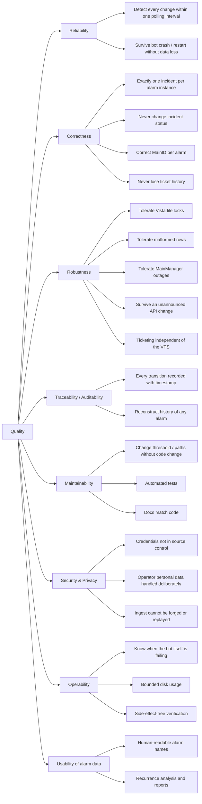

# 10. Quality Requirements

No quality requirements were written down before the bot was built; the ones below are reconstructed from what the code visibly tries to guarantee (comments, retries, atomic writes, audit table), from `Alarm_bot_build_reference.md`, and from the owner's stated goals for the next iteration. Each scenario carries a status against the **current code** (`main.py` v2.1.0, `shipper.py`) and the evidence for that status. Until v2.0.1 is deployed on the CTS server ([TODO T-103](../TODO.md)) the running v1.x still shows the old gaps (404 loop, no tickets since 2026-09-19); those rows say so.

Status legend: **met** · **partly** · **not met** · **n/a (digibuild)** — a requirement of the web application, which is the digibuild sub-project `cts-alarms` and is assessed in its own docs.

Related: [01 – Introduction and Goals](01-introduction-and-goals.md) · [08 – Crosscutting Concepts](08-crosscutting-concepts.md) · [11 – Risks and Technical Debt](11-risks-and-technical-debt.md)

## 10.1 Quality tree

## 10.2 Quality scenarios

### Reliability

| ID | Scenario | Target | Status | Evidence |
|---|---|---|---|---|
| R1 | An alarm appears, changes condition, is acknowledged, or disappears in Vista. | The corresponding incident create/update/resolve happens within one polling interval (5 min) plus API latency. | **partly** | Cadence 5 min (`PT5M`); every run diffs all kept alarms (`main.py:1164-1262`) and all missing ones (`:1264-1329`). Transitions that happen and revert *within* one interval are invisible by design; a NORMAL that precedes removal is inferred ("missed between polls", `:1282-1287`). While MainManager is unusable the actions are deferred (not lost) and sent by the first run after it recovers. |
| R2 | The process is killed mid-run (5-minute `ExecutionTimeLimit`, power loss). | Next run continues from a consistent state; nothing is created twice. | **met** | Atomic `tmp` + `os.replace()` (`main.py:324-329`); `_save()` immediately after each successful create. Gap: CSV rows are appended during the loop but `csv_state.json` is saved at the end (`:607`), so a kill mid-CSV-loop can duplicate `FIRST_SEEN`/transition rows (the receiver dedups `(vista_id, ts, event)`, the CSV files do not). |
| R3 | Vista restarts and the alarm list is momentarily empty. | No mass-resolution of incidents. | **not met** | An empty (but successfully copied) file is parsed as 0 alarms and every tracked alarm is marked RESOLVED (`:1264-1329`). No sanity check on row count. Not observed in 165 days (smallest parsed count 32). [R-16](11-risks-and-technical-debt.md#r-16-mass-resolution-on-an-empty-alarm-file) |

### Correctness

| ID | Scenario | Target | Status | Evidence |
|---|---|---|---|---|
| C1 | The same `vista_id` is seen in 288 consecutive runs. | Exactly one create. | **met** | Presence in `state["alarms"]` short-circuits creation (`:1170`); a create that failed with 404/API-down is not recorded and is retried, but a create that succeeded is saved before anything else. A `vista_id` that reappears after RESOLVED is ignored (`:1192-1194`). |
| C2 | An alarm returns to NORMAL and is acknowledged. | Ticket text gains the transition lines; `StatusID` is untouched. | **met** | The PUT echoes the ticket's own write model (`ECHO_FIELDS`, `:640`) and only replaces `Remarks`; `StatusID` is set only at create. [ADR 0010](../adr/0010-prepend-description-never-change-status.md), [ADR 0019](../adr/0019-mainmanager-v3-incident-api.md). |
| C3 | An alarm from building 320 is created. | Incident is filed on the MainID for that building/object. | **not met** | `objects.csv` contains 0 mappings; every ticket gets fallback MainID 14228. [R-02](11-risks-and-technical-debt.md#r-02-objectscsv-is-empty--every-incident-lands-on-the-fallback-mainid) |
| C4 | The alarm text changes between ACTIVE and NORMAL (`"ATV21 Fejl"` → `"ATV21 OK"`). | The incident name reflects the original alarm; the transition line quotes the current text. | **met** | Name built once at create (`:872-875`); transition lines quote the current `alarm_text` (`:835-841`). |
| C5 | A ticket already has a long trail (dozens of lines) and gets one more. | No earlier line is lost. | **met** (v2.0.0) | The v3 `Remarks` reads back truncated to ~245 chars; the client reads `Description` and verifies the write (`_text()` `:801`, `prepend_description_line()` `:807`; test `test_prepend_reads_full_description_not_truncated_remarks`). The first live test truncated ticket 34570 before this rule existed; it was restored the same minute. |

### Robustness

| ID | Scenario | Target | Status | Evidence |
|---|---|---|---|---|
| RB1 | Vista holds a write lock on `$this.alr` at poll time. | The run retries and, if still locked, exits cleanly without touching state. | **met** | 5 × `shutil.copy2` with 0.5 s pause (`:205`), then `exit 2` before any state write (`:1034-1039`). 0 retry warnings in 165 days. |
| RB2 | A row has fewer than 36 fields or a non-hex date. | The row is skipped with a WARNING; the rest of the file is processed. | **met** | `parse_alarm_file()` `:219-254`. Caveat: a skipped row for a tracked alarm looks "gone" and triggers RESOLVED. |
| RB3 | MainManager returns 5xx / times out / connection drops. | The affected update is retried on later runs; other alarms are unaffected. | **met** | Per-alarm handling; `update_failures` retries up to 3 runs, then the transition is abandoned with an ERROR (`_give_up()`, `:1147`). v1 logs: 8 transient failures, each followed by success. |
| RB4 | MainManager returns 404 for one incident (deleted by a human). | The bot stops sending for it and records the fact. | **met** (v2.0.0; running v1 until T-103) | Probe answers → `incident_missing` + `incident_missing_iso`, alarm still tracked and resolved locally (`_on_not_found()`, `:1128`); tests in `RunTests`. v1 retried such calls forever (34570: 2,150 times). |
| RB5 | The CSV audit path throws (disk full, bad filename). | Incident pipeline still runs. | **met** | Wrapped in `try/except` → "non-fatal" (`:1049-1057`). 0 occurrences. |
| RB6 | MainManager removes or renames its API without notice (as on 2026-09-19). | One ERROR per run, nothing lost, backlog delivered when fixed. | **met** (v2.0.0; running v1 until T-103) | 404 + failing probe → `api_down`: no further calls, state untouched, `deferred=N` (`:1142`, `:1339`). The ~30 transitions stuck since 2026-09-19 were never consumed and go out on the first v2 run. |
| RB7 | The VPS / `api.digibuild.dk` is unreachable for days, or the ingest secret is missing. | Ticketing unaffected; no run lost. | **met** (outbox unbounded) | Shipping runs after the MainManager work and cannot raise into `run()`; undelivered batches wait in `outbox.sqlite` and are resent oldest-first ([ADR 0020](../adr/0020-hmac-ingest-to-digibuild.md)). Growth is unbounded ([R-20](11-risks-and-technical-debt.md#r-20-unbounded-outbox-growth)). |

### Traceability / auditability

| ID | Scenario | Target | Status | Evidence |
|---|---|---|---|---|
| T1 | An operator asks "what happened to alarm X on 12 June?" | Every transition of every alarm is recorded with a timestamp, independent of the incident pipeline. | **met** (all priorities) | `csv/` per-directory rows (`run_csv_logging()`, `:515`); from shipping on, the same events in digibuild. |
| T2 | An operator asks "which incident belongs to alarm X?" | `vista_id ↔ incident_id` is recoverable at any age. | **met** (2026-09-30) | On the CTS server only while the state entry exists (RESOLVED pruned after 30 days). Every batch carries all links and the history was imported, so digibuild keeps them permanently: shipping is live since 2026-09-30 (T-115), and the 28–30 Sep gap was backfilled (T-116). |
| T3 | Reconstruct the full alarm picture at a given minute. | Possible from logs. | **met** but expensive | The status table is logged every run (`:882`); only *kept* alarms appear. The shipped snapshot (all priorities) makes this a query in digibuild. |
| T4 | Query "how many times did `320-01-07930-0101_AL` alarm this year?" | Answerable without ad-hoc scripts. | **n/a (digibuild)** | The recurring-alarm report of the digibuild sub-project ([ADR 0015](../adr/0015-sql-storage-for-alarm-history.md), [ADR 0022](../adr/0022-cts-side-only-repo-web-app-in-digibuild.md)). |

### Maintainability

| ID | Scenario | Target | Status | Evidence |
|---|---|---|---|---|
| M1 | Change the priority threshold, paths, MainID or prune window. | Config change only, no code edit. | **met** | All in `config.json`. The `_comment` next to `max_priority_number` is out of date ([TODO T-083](../TODO.md)). |
| M2 | Refactor the transition logic. | Unit tests catch regressions. | **partly** | 59 tests (unittest + pytest) cover the MainManager client, the 404 paths, secrets, dry-run semantics and the shipper; the pure text/parse functions are still uncovered and `run()` is ~360 lines mixing I/O and logic; no CI ([R-06](11-risks-and-technical-debt.md#r-06-single-file-script-with-no-automated-tests), [TODO T-024](../TODO.md)). |
| M3 | A new maintainer reads the design doc. | Doc matches deployed behaviour. | **met** (this doc set) | arc42/ADR/C4/reference re-verified against v2.1.0 on 2026-09-29. `Alarm_bot_build_reference.md` is historical ([R-07](11-risks-and-technical-debt.md#r-07-build-reference-drift)). |
| M4 | Know which code version is deployed. | Version ↔ deployed file. | **met** (from v2.0.1 on) | `__version__` in every start banner (`:40`, `:1367`); every deployed `main.py` is a committed version ([R-10](11-risks-and-technical-debt.md#r-10-deployed-code-changed-over-time-without-version-history)). |

### Security and privacy

| ID | Scenario | Target | Status | Evidence |
|---|---|---|---|---|
| S1 | The repository is cloned by a third party. | No usable credentials are obtained. | **met** (2026-09-29) | No credential in the tip (`tests/test_repo_hygiene.py`); the v1 password in the history was rotated on 2026-09-29. [R-03](11-risks-and-technical-debt.md#r-03-secrets-committed-to-a-public-repository), [ADR 0021](../adr/0021-secrets-in-secrets-json.md) |
| S2 | Same. | No personal data of operators is obtained. | **partly** | Runtime data leaves the repo tip on 2026-09-29, but the public history still holds operator names in logs, CSVs and state ([R-04](11-risks-and-technical-debt.md#r-04-personal-data-in-committed-files), [TODO T-102](../TODO.md)). |
| S3 | The token or a secret leaks from a log file. | Impossible. | **met** | Token never logged (`:683-700`); the shipper scrubs its secret from every message and outbox row (test `test_secret_never_logged`). `mm_token.json` holds a live token on disk (ACL). |
| S4 | Transport interception. | TLS with certificate verification. | **met** | `requests` defaults over `https://` to both endpoints. |
| S5 | Someone captures an ingest request and replays or alters it. | Rejected. | **met** (by contract) | HMAC over timestamp + nonce + raw body, ±300 s, nonce single-use, verified by the receiver ([ADR 0020](../adr/0020-hmac-ingest-to-digibuild.md)). |

### Operability

| ID | Scenario | Target | Status | Evidence |
|---|---|---|---|---|
| O1 | The bot has been failing (exit 2, or 100 % API errors) for 6 hours. | Someone is notified. | **partly** → met with T-065 | On the CTS server: errors only in the daily log. Since 2026-09-30 every run reaches digibuild (T-115), which is designed to flag `late` (> 15 min without a run) and its watchdog alerts; API errors travel in each run's `errors[]` ([R-13](11-risks-and-technical-debt.md#r-13-no-alerting-when-the-bot-itself-fails)). |
| O2 | Run for two years. | Disk usage stays bounded. | **not met** | Logs never rotated (~4 MB/day); CSV files permanent; outbox unbounded. [R-05](11-risks-and-technical-debt.md#r-05-no-log-rotation-and-no-csvstate-retention-strategy), [R-20](11-risks-and-technical-debt.md#r-20-unbounded-outbox-growth) |
| O3 | Vista file is copied while MainManager is down. | The run finishes in under the 5-minute limit. | **met** (v2.0.0) | After the first 404 + failed probe no further MainManager call is made that run; non-404 failures cost one timeout per affected alarm; the shipper stops at `time_budget_seconds` (120). |
| O4 | Verify a deployment on the live server. | Without side effects. | **met** (v2.0.1) | `--dry-run` writes nothing, checks the credentials, lists what would be sent, and probes the VPS. |

### Usability of alarm data

| ID | Scenario | Target | Status | Evidence |
|---|---|---|---|---|
| U1 | A facility manager sees `345-51-Zonemaster_7_SAL-32090_0721ForcLuk_A`. | They know which room/plant it is. | **n/a (digibuild)** | Friendly-name registry in the digibuild sub-project ([ADR 0017](../adr/0017-friendly-alarm-naming-registry.md)); MainManager ticket names are unchanged ([TODO T-053](../TODO.md)). |
| U2 | Monthly report: top recurring alarms, counts by priority, flapping points. | Produced by the system, not by hand. | **n/a (digibuild)** | Reports of the digibuild sub-project; the bot supplies every event and the full snapshot. |

## 10.3 Summary

| Category | met | partly | not met | n/a (digibuild) |
|---|---|---|---|---|
| Reliability | 1 | 1 | 1 | 0 |
| Correctness | 4 | 0 | 1 | 0 |
| Robustness | 7 | 0 | 0 | 0 |
| Traceability | 2 | 1 | 0 | 1 |
| Maintainability | 3 | 1 | 0 | 0 |
| Security | 4 | 1 | 0 | 0 |
| Operability | 2 | 1 | 1 | 0 |
| Usability | 0 | 0 | 0 | 2 |

v2 closes the permanent-error and security-hygiene gaps in code; they close in production with the v2.0.1
deployment (T-103, done) and the shipper (T-115, live since 2026-09-30). What remains on the CTS side: retention (logs, outbox), the empty-file
guard, the empty `objects.csv`, and the operator names in the public history.
