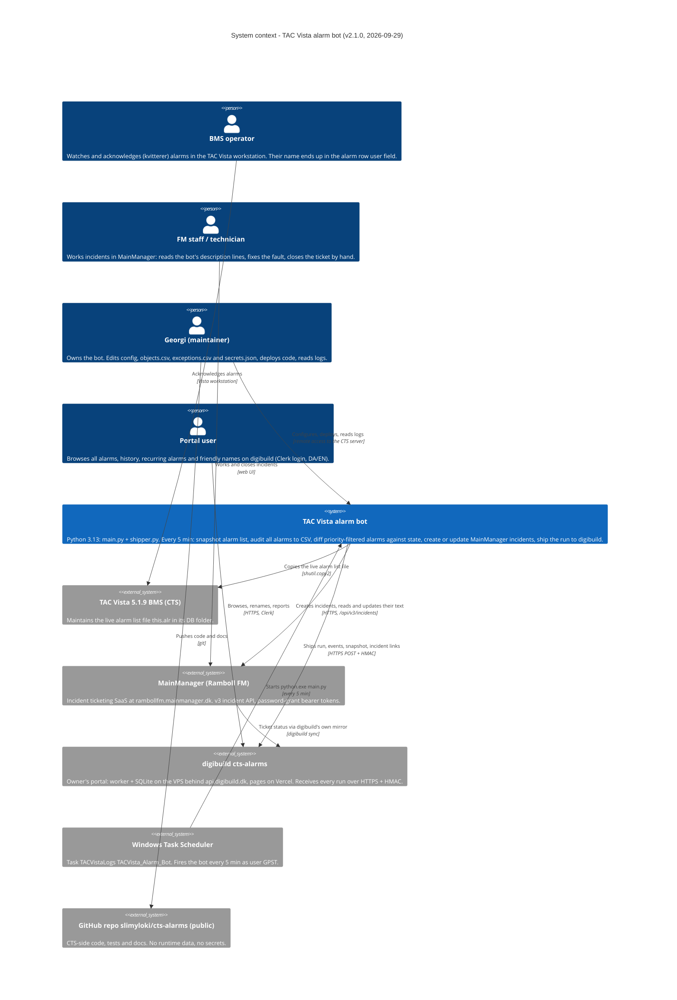

# C4 level 1 — System context

The alarm bot is a one-way bridge: it watches the live alarm list of a Schneider Electric TAC
Vista 5.1.9 building-management system (CTS), turns priority-1/2 alarms into incidents in
Ramboll FM's MainManager, and hands every run to the owner's portal **digibuild** (`cts-alarms`
sub-project), which keeps the full history and shows it on web pages. It never writes back to Vista
and never closes an incident.

Prose version: [arc42 §03 context and scope](../arc42/03-context-and-scope.md).
Next level down: [02-container.md](02-container.md).

## Elements

| Element | Kind | Description | Technology / evidence |
|---------|------|-------------|------------------------|
| BMS operator | Person | Watches the Vista alarm list and acknowledges (*kvitterer*) alarms; acknowledging sets `ack_flag=1` and writes the operator's name into the `user` field (shape `"<LOGIN> (<name> <organisation>)"`, e.g. the owner's "GPST (Georgi ISS)"). The code assumes Vista drops a row once it is NORMAL and acknowledged and labels the disappearance RESOLVED. | TAC Vista workstation. Names are personal data and flow into the state files, `csv/`, `logs/` and every shipped batch. |
| FM staff / technician | Person | Receives the incident in MainManager, reads the dated lines the bot prepends, closes the ticket manually. The bot never changes `StatusID` after creation ([ADR 0010](../adr/0010-prepend-description-never-change-status.md)). | MainManager web UI. |
| Georgi (maintainer) | Person | Owns `config.json`, `secrets.json`, `objects.csv` (empty), `exceptions.csv` (one entry), the scheduled task, the GitHub repo and digibuild. Also appears in Vista as an operator ("GPST (Georgi ISS)"). | Remote access to the CTS server; git. |
| Portal user | Person | Uses the digibuild `cts-alarms` pages. Not a user of the bot itself. | digibuild (outside this repo). |
| TAC Vista alarm bot | System (ours) | `main.py` + optional `shipper.py`, dependency `requests` only. Runs to completion each invocation; no daemon, no listener. Outputs: a CSV audit trail of **all** alarms; MainManager incidents for priority ≤ 2 alarms not in `exceptions.csv`; one ingest batch per run to digibuild. | Python 3.13 32-bit; working folder `C:\priorityalarmsapi`. |
| TAC Vista 5.1.9 BMS | External system | Writes `C:\ProgramData\Schneider Electric\TAC Vista 5.1.9\DB\$thisdb\$this.alr`: tab-delimited, ISO-8859-1, 36 fields per row, rewritten in place. | Same Windows Server 2016 host. [alr-file-format.md](../reference/alr-file-format.md) |
| MainManager (Ramboll FM) | External system | Incident SaaS (software by EG). The bot uses `POST /restapi/token` and `POST/GET/PUT /api/v3/incidents`; the v1 `/restapi/Incident/*` routes were removed on 2026-09-19 ([ADR 0019](../adr/0019-mainmanager-v3-incident-api.md)). Incidents: `MainID` 14228 (fallback), `IncidentTypeID` 277, `GradeID` 10, `StatusID` 5, location 6, reporter 748 / org 11. | HTTPS, JSON, bearer token from a password grant with the credentials in `secrets.json`. [mainmanager-api.md](../reference/mainmanager-api.md) |
| digibuild `cts-alarms` | External system | The owner's portal sub-project: a Python worker with its own SQLite database on the VPS (reachable only via `api.digibuild.dk`), pages on Vercel behind Clerk in Danish and English, a watchdog. Stores every run, the history imported from 2026-04-17 … 2026-09-28, friendly names; joins live ticket status from digibuild's MainManager mirror. | [ADR 0022](../adr/0022-cts-side-only-repo-web-app-in-digibuild.md); contract in [shipper.md](../reference/shipper.md); documented in the digibuild repo. |
| Windows Task Scheduler | External system | `\TACVistaLogs\TACVista_Alarm_Bot`: every `PT5M`, runs as `GPST` with stored password, `IgnoreNew`, `ExecutionTimeLimit=PT5M`, `RestartOnFailure` 3× at 1 min. | `TACVista_Alarm_Bot.xml` |
| GitHub repo | External system | `slimyloki/cts-alarms`, **public**. CTS-side code, tests and docs only since 2026-09-29; its history still holds the runtime data of 2026-09-28 and the rotated v1 password ([TODO T-102](../TODO.md)). | git / GitHub. No CI, no automated deployment. |

## Relationships / interfaces

| From → To | What crosses | Protocol / mechanism | Frequency | Code |
|-----------|--------------|----------------------|-----------|------|
| Task Scheduler → alarm bot | Process start, working directory `C:\priorityalarmsapi`, no arguments | `Exec` action | every 5 min, ~288 runs/day | `main()` `main.py:1351` |
| Alarm bot → TAC Vista | Whole alarm list file, read-only, copied before parsing (5 retries) | `shutil.copy2` | once per run | `snapshot_alarm_file()` `main.py:205` |
| Alarm bot → MainManager | Token (cached ~2 h); create for new priority-≤2 alarms (POST + GET, PUT if status did not stick); GET + PUT + GET per transition line and resolution line; a probe after a 404 | HTTPS, JSON, `Authorization: Bearer`; 30 s / 60 s timeouts | only when there is something to send | `MMClient` `main.py:624` |
| Alarm bot → digibuild | One IngestBatch (`run`, `events`, `snapshot`, `incidents`), queued batches first | HTTPS POST to `/internal/cts-alarms/v1/ingest`, HMAC (`X-Signature`, `X-Timestamp`, `X-Nonce`) | once per run with a `"vps"` section | `shipper.ship_run()` |
| MainManager → digibuild | Ticket status for the alarm↔ticket join | digibuild's own mirror sync (not this bot) | hourly (digibuild) | — |
| BMS operator → TAC Vista | Acknowledgements, forced points | Vista workstation | ad hoc | observed via `user`/`ack_flag` |
| FM staff → MainManager | Ticket handling and closure | web UI | ad hoc | [ADR 0010](../adr/0010-prepend-description-never-change-status.md) |
| Maintainer → alarm bot | `config.json`, `secrets.json`, `objects.csv`, `exceptions.csv`, `main.py`/`shipper.py`; reading `logs/` | file system on the CTS server | ad hoc | [arc42 §7.5](../arc42/07-deployment-view.md#75-deploying-a-new-version-owners-hands) |

## Boundaries and things deliberately outside the picture

- **Vista → alarm bot is file-based, not an API.** The snapshot-then-parse pattern ([ADR 0005](../adr/0005-snapshot-then-parse.md)) is the only guard against partial writes.
- **Nothing flows back into Vista**, and the bot never reads from digibuild.
- **MainManager and digibuild are independent outputs.** A MainManager outage never stops shipping; an unreachable VPS never delays a ticket (shipping runs after the MainManager work and queues on failure).
- **The Indeklima bot** (room-temperature logs → MainManager, type 281) is a sibling on the same host with the same MainManager account; not in this repo, not modelled ([TODO T-105](../TODO.md)).
- **Inside digibuild** (worker, database, pages, watchdog) is out of scope here; see the digibuild repo.
