# C4 level 2 — Containers

Everything the alarm bot consists of lives on one host: the CTS server (Windows Server 2016, which
also runs TAC Vista 5.1.9). There is one process (`main.py`, importing the optional `shipper.py`), a
scheduler entry that starts it, and a set of files under `C:\priorityalarmsapi`. The remote containers
are the MainManager REST API and the digibuild `cts-alarms` ingest endpoint.

Prose version: [arc42 §07 deployment view](../arc42/07-deployment-view.md) and
[§05 building block view](../arc42/05-building-block-view.md).
Up: [01-system-context.md](01-system-context.md). Down: [03-component.md](03-component.md).

```mermaid
C4Container
    title Containers - CTS server, MainManager, digibuild (v2.1.0, 2026-09-29)

    Person(maintainer, "Georgi (maintainer)", "Edits config, secrets and mapping files, reads logs.")
    Person(bmsOperator, "BMS operator", "Acknowledges alarms in Vista.")

    System_Boundary(cts, "CTS server - Windows Server 2016") {
        Container(taskSched, "Scheduled task", "Windows Task Scheduler", "TACVistaLogs TACVista_Alarm_Bot. Every 5 min, user GPST, IgnoreNew, 5 min limit.")
        Container(bot, "main.py + shipper.py", "Python 3.13 32-bit + requests", "Runs to completion: snapshot, parse, CSV audit, filter, diff against state, call MainManager, save state, log, ship the run.")

        Container_Boundary(vistaBox, "TAC Vista 5.1.9 (external, same host)") {
            ContainerDb(alrLive, "this.alr - live alarm list", "Tab-delimited text, ISO-8859-1, 36 fields", "Rewritten in place by Vista. Read-only for the bot.")
        }

        Container_Boundary(work, "C:\priorityalarmsapi (working folder)") {
            ContainerDb(config, "config.json", "JSON", "Thresholds, paths, MainManager base URL and incident defaults, optional vps section. No secrets.")
            ContainerDb(secrets, "secrets.json", "JSON, ACL-restricted, git-ignored", "MainManager username/password, VPS ingest secret.")
            ContainerDb(objectsCsv, "objects.csv / exceptions.csv", "CSV", "alarm_object to MainID (0 mappings); directories to ignore (1).")
            ContainerDb(snapshot, "alarm_snapshot.alr", "Copy of this.alr", "Overwritten every run.")
            ContainerDb(alarmsState, "alarms_state.json", "JSON, atomic", "Incident-pipeline state per vista_id.")
            ContainerDb(csvState, "csv_state.json", "JSON, atomic", "CSV-audit state per vista_id.")
            ContainerDb(csvFolder, "csv folder", "Semicolon CSV per Vista directory", "Append-only audit trail, all priorities.")
            ContainerDb(logs, "logs folder", "YYYY-MM-DD.log", "One file per day, never rotated.")
            ContainerDb(token, "mm_token.json", "JSON", "Cached MainManager bearer token + expiry.")
            ContainerDb(outbox, "outbox.sqlite", "SQLite", "Batches not yet accepted by digibuild.")
        }
    }

    System_Ext(mm, "MainManager REST API", "https://rambollfm.mainmanager.dk - /restapi/token, /api/v3/incidents")
    System_Ext(dgb, "digibuild cts-alarms ingest", "https://api.digibuild.dk - POST /internal/cts-alarms/v1/ingest (HMAC), GET /api/cts-alarms/healthz")

    Rel(taskSched, bot, "Starts", "python.exe main.py")
    Rel(bot, config, "Reads at start", "utf-8-sig")
    Rel(bot, secrets, "Reads", "utf-8-sig")
    Rel(bot, objectsCsv, "Reads at start", "utf-8-sig")
    Rel(bot, alrLive, "Copies", "shutil.copy2, 5 retries")
    Rel(bot, snapshot, "Writes then parses", "iso-8859-1")
    Rel(bot, csvState, "Loads, updates, saves", "JSON")
    Rel(bot, csvFolder, "Appends event rows", "UTF-8")
    Rel(bot, alarmsState, "Loads, saves after every change", "JSON")
    Rel(bot, logs, "Writes", "logging")
    Rel(bot, token, "Reads / writes", "JSON")
    Rel(bot, outbox, "Queues / drains", "sqlite3")
    Rel(bot, mm, "Calls", "HTTPS JSON, bearer token")
    Rel(bot, dgb, "Ships each run", "HTTPS POST + HMAC")
    Rel(bmsOperator, alrLive, "Changes ack_flag and user via Vista", "Vista workstation")
    Rel(maintainer, config, "Edits", "remote access to the CTS server")

    UpdateLayoutConfig($c4ShapeInRow="3", $c4BoundaryInRow="1")
```

## Containers on the CTS server

All paths come from `config.json -> paths` and `TACVista_Alarm_Bot.xml`. "Owner" is who writes the file.

| Container | Exact path | Format | Owner (writer) | Read by | Lifecycle / size | Reference |
|-----------|-----------|--------|----------------|---------|------------------|-----------|
| Scheduled task | `\TACVistaLogs\TACVista_Alarm_Bot` | Task Scheduler XML (declares `encoding="UTF-16"`, the committed file is UTF-8 — see [arc42 §3 I2](../arc42/03-context-and-scope.md)) | Maintainer | Windows | Every 5 min, `StartWhenAvailable`, `LeastPrivilege`, priority 7 | `TACVista_Alarm_Bot.xml` |
| Python process | `…\Python313-32\python.exe "C:\priorityalarmsapi\main.py"`, cwd `C:\priorityalarmsapi` | Python 3.13 (32-bit), stdlib + `requests` | — | — | Seconds per run. Exit 0 ok, 1 unhandled exception, 2 config/snapshot failure. `shipper.py` is imported if present. | `main()` `main.py:1351`, `run()` `:983` |
| `$this.alr` (live) | `C:\ProgramData\Schneider Electric\TAC Vista 5.1.9\DB\$thisdb\$this.alr` | Tab-delimited, ISO-8859-1, 36 fields/row, no header | TAC Vista | Bot (copy only) | ~180 rows (pri1 18, pri2 53, pri3 60, pri9 49 on 2026-09-28) | [alr-file-format.md](../reference/alr-file-format.md) |
| `config.json` | `C:\priorityalarmsapi\config.json` | JSON, UTF-8 (BOM tolerated) | Maintainer | Bot at start | `thresholds` (2), `paths` (9 keys incl. `secrets_file`), `mainmanager` (`base_url`, `default_main_id` 14228, `incident_defaults`), optional `vps`. **No secrets** (guard test). | [config-reference.md](../reference/config-reference.md) |
| `secrets.json` | `C:\priorityalarmsapi\secrets.json` (`paths.secrets_file`) | JSON `{"mainmanager":{username,password},"vps":{ingest_secret}}`; env vars override | Maintainer | Bot, shipper | ACL: task account + Administrators; never in git | [ADR 0021](../adr/0021-secrets-in-secrets-json.md) |
| `objects.csv` | `C:\priorityalarmsapi\objects.csv` | `<alarm_object>,<main_id>`, `#` comments, UTF-8 with optional BOM | Maintainer | Bot at start | 0 mappings → fallback MainID + WARNING per create | [ADR 0009](../adr/0009-objects-csv-mainid-mapping-with-fallback.md) |
| `exceptions.csv` | `C:\priorityalarmsapi\exceptions.csv` | First column = full Vista directory (exact match) | Maintainer | Bot at start | 1 entry | [ADR 0008](../adr/0008-directory-based-exceptions.md) |
| `alarm_snapshot.alr` | `C:\priorityalarmsapi\alarm_snapshot.alr` | Byte copy of `$this.alr` | Bot | Bot (parser) | Overwritten each run | [ADR 0005](../adr/0005-snapshot-then-parse.md) |
| `alarms_state.json` | `C:\priorityalarmsapi\alarms_state.json` | JSON `{meta, alarms}`, `.tmp` + `os.replace` | Bot (not in read-only runs) | Bot | RESOLVED pruned after 30 days; entries carry `update_failures`/`incident_missing` when relevant | [state-files.md](../reference/state-files.md) |
| `csv_state.json` | `C:\priorityalarmsapi\csv_state.json` | JSON, atomic | Bot (not in read-only runs) | Bot | ≈ live rows; resolved entries deleted immediately | [state-files.md](../reference/state-files.md) |
| `csv/` | `C:\priorityalarmsapi\csv\<sanitized directory>.csv` | `;` CSV, UTF-8, 17 columns | Bot (append only) | Nobody on the server; the same events are shipped | 431 files, ~21k rows by 2026-09-28 | [csv-audit-format.md](../reference/csv-audit-format.md) |
| `logs/` | `C:\priorityalarmsapi\logs\YYYY-MM-DD.log` | `%Y-%m-%d %H:%M:%S [LEVEL] message`, UTF-8; also stdout | Bot | Maintainer | Never rotated, ~2–4 MB/day | [log-format.md](../reference/log-format.md) |
| `mm_token.json` | `C:\priorityalarmsapi\mm_token.json` | JSON `{access_token, exp}` | Bot (`MMClient`) | Bot | Live token for up to ~2 h; same ACL as `secrets.json` | [state-files.md](../reference/state-files.md#mm_tokenjson) |
| `outbox.sqlite` | `vps.outbox_file`, default `C:\priorityalarmsapi\outbox.sqlite` | SQLite, tables `outbox`, `dead` | Shipper | Shipper | Empty when healthy; unbounded while undelivered ([TODO T-106](../TODO.md)) | [shipper.md](../reference/shipper.md#outbox-and-failure-behaviour) |

## External containers

| Container | Endpoint | Used by | Notes |
|-----------|----------|---------|-------|
| MainManager REST API | `https://rambollfm.mainmanager.dk` (`mainmanager.base_url`) | `MMClient` `main.py:624` | `POST /restapi/token` (form password grant, 30 s) → bearer, cached in `mm_token.json`. `POST /api/v3/incidents {"items":[item]}` → `items[0].id`; `GET /api/v3/incidents/{id}`; `PUT /api/v3/incidents` with the echoed write model and `Remarks` (read `Description`, verify after). Timeouts 60 s. 404 → `MMNotFound` + probe. [mainmanager-api.md](../reference/mainmanager-api.md), [ADR 0019](../adr/0019-mainmanager-v3-incident-api.md) |
| digibuild `cts-alarms` ingest | `https://api.digibuild.dk` (`vps.base_url`) | `shipper.py` | `POST /internal/cts-alarms/v1/ingest` — IngestBatch JSON, headers `X-Timestamp`, `X-Nonce`, `X-Signature` (hex HMAC-SHA256 over `timestamp.nonce.raw_body`); 2xx = accepted; 401/403/404/429/5xx retried from the outbox; other 4xx dead-lettered. `GET /api/cts-alarms/healthz` only in `--dry-run`. The worker, its SQLite database and the pages are digibuild containers. [shipper.md](../reference/shipper.md), [ADR 0020](../adr/0020-hmac-ingest-to-digibuild.md) |

## Data flow across containers in one run

Order as executed by `run()` (`main.py:983`); details in [03-component.md](03-component.md) and
[arc42 §06 runtime view](../arc42/06-runtime-view.md).

1. `config.json` (main), `secrets.json`, `objects.csv`, `exceptions.csv`, `alarms_state.json` are loaded (`main.py:987-992`).
2. `$this.alr` → `alarm_snapshot.alr` (`:1035`); failure → exit 2 (still shipped).
3. `alarm_snapshot.alr` → list of `Alarm` (`:1041`).
4. All alarms → `csv_state.json` diff → rows appended to `csv/` and returned as events (`:1053`); any exception is logged and swallowed.
5. Priority ≤ 2 and not in exceptions → status table into `logs/` (`:1059-1073`).
6. Kept alarms diffed against `alarms_state.json` → MainManager calls (token from `mm_token.json` if valid) → `alarms_state.json` saved after every change (`:1164-1333`).
7. Run summary → shipper → outbox resend → POST to `api.digibuild.dk` (`:1343`).

## Deployment facts worth knowing

- Everything on the CTS side is one host; no redundancy, no second environment, no CI/CD. Files are
  copied to `C:\priorityalarmsapi` by the owner ([arc42 §7.5](../arc42/07-deployment-view.md#75-deploying-a-new-version-owners-hands)).
- The bot runs as `GPST` with a stored password; it needs read access to Vista's `DB` folder and write
  access to `C:\priorityalarmsapi`.
- Outbound HTTPS to `rambollfm.mainmanager.dk` works; to `api.digibuild.dk` it is proven by the dry run's
  reachability line ([TODO T-077](../TODO.md)). No inbound access to the CTS server is needed.
