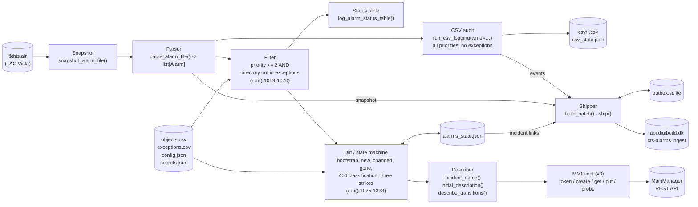

# C4 level 3 — Components inside `main.py` and `shipper.py`

`main.py` (v2.1.0, ~1,380 lines) is one module with the classes `Alarm`, `MMNotFound` and `MMClient`;
`shipper.py` (~470 lines) is an optional module imported by `main.py`. The components below are
functional groupings of their functions, in the order they run. The orchestration is a single function,
`run()` (`main.py:983-1344`), which holds the filter, bootstrap, diff and resolve logic inline plus the
closures `_save()`, `_ship()`, `_mm()`, `_on_not_found()`, `_give_up()`; where a "component" is a block
inside `run()`, the line range is given.

Up: [02-container.md](02-container.md). Down: [04-code.md](04-code.md).
Prose and sequence diagrams: [arc42 §05](../arc42/05-building-block-view.md), [§06](../arc42/06-runtime-view.md).

## Data flow



The CSV audit branch and the incident branch are independent: the audit sees every parsed alarm
(minus `(state1,state2)=(6,2)` system events) and is wrapped in a `try/except` so its failure cannot
stop incident processing (`main.py:1049-1057`); the incident branch sees only what survives the filter.
The shipper runs last and cannot raise into `run()` (`_ship()`, `:1008-1028`).

## Component diagram

```mermaid
C4Component
    title Components of main.py + shipper.py

    Container_Boundary(mainpy, "main.py") {
        Component(cli, "CLI and entry point", "argparse, main()", "Parses --config, --dry-run, --parse-only, --no-bootstrap. Loads config, sets up logging, exit codes 0/1/2.")
        Component(cfg, "Config, secrets and logging", "load_config(), load_secrets(), setup_logging()", "config.json (utf-8-sig); credentials from env or secrets.json; daily log + stdout.")
        Component(snapshot, "Snapshot", "snapshot_alarm_file()", "Copies the live alarm list. 5 retries, 0.5 s.")
        Component(parser, "Parser", "parse_alarm_file(), Alarm, classify_alarm_status()", "36 fields expected; bad rows skipped with WARNING.")
        Component(mapping, "Mapping and exceptions", "load_objects_csv(), load_exceptions_csv(), resolve_main_id()", "alarm_object to MainID with fallback; directory exclusion set.")
        Component(csvAudit, "CSV audit", "run_csv_logging(), classify_csv_event(), event_record(), …", "Signature diff against csv_state.json; append rows; return events; write=False in read-only runs.")
        Component(filter, "Filter", "inline in run()", "priority <= max_priority_number and directory not in exceptions.")
        Component(statusTable, "Status table", "log_alarm_status_table()", "One log line per kept alarm every run.")
        Component(stateStore, "State store", "load_state(), save_state(), prune_state(), make_state_entry(), _save()", "alarms_state.json, atomic; no writes in read-only runs.")
        Component(diff, "Diff / state machine", "inline in run(), _on_not_found(), _give_up()", "Bootstrap; new -> create; changed -> describe + update; gone -> resolve lines; 404 -> ticket missing or API down; three strikes.")
        Component(describer, "Describer", "incident_name(), initial_description(), describe_transitions(), dk_now_str()", "Incident name and dated description lines.")
        Component(mmClient, "MainManager client", "class MMClient, MMNotFound", "Token (file cache), create + status enforcement, get, prepend (read Description, write Remarks, verify), probe.")
    }
    Container_Boundary(shipperpy, "shipper.py") {
        Component(ship, "Shipper", "ship_run(), build_batch(), ship(), _post(), signed_headers(), probe()", "IngestBatch per run; HMAC signing; outbox resend; dry-run checks.")
    }

    ContainerDb_Ext(files, "Working-folder files", "config.json, secrets.json, objects.csv, exceptions.csv, alarm_snapshot.alr, alarms_state.json, csv_state.json, csv/, logs/, mm_token.json, outbox.sqlite")
    ContainerDb_Ext(alrLive, "this.alr", "TAC Vista live alarm list")
    System_Ext(mm, "MainManager REST API", "rambollfm.mainmanager.dk")
    System_Ext(dgb, "digibuild cts-alarms", "api.digibuild.dk")

    Rel(cli, cfg, "loads config, sets up log")
    Rel(cli, diff, "calls run()")
    Rel(diff, mapping, "loads at start")
    Rel(diff, stateStore, "load / save after every change")
    Rel(diff, snapshot, "snapshot")
    Rel(snapshot, alrLive, "copies")
    Rel(diff, parser, "parse snapshot")
    Rel(diff, csvAudit, "all alarms")
    Rel(diff, filter, "all alarms")
    Rel(filter, statusTable, "kept alarms")
    Rel(diff, describer, "name and lines")
    Rel(diff, mmClient, "create / prepend / probe")
    Rel(mmClient, mm, "HTTPS JSON")
    Rel(diff, ship, "_ship(): run meta, events, alarms, state")
    Rel(ship, dgb, "HTTPS POST + HMAC")
    Rel(csvAudit, files, "csv/, csv_state.json")
    Rel(stateStore, files, "alarms_state.json")
    Rel(mmClient, files, "mm_token.json")
    Rel(ship, files, "secrets.json, outbox.sqlite")
    Rel(cfg, files, "config.json, secrets.json, logs/")

    UpdateLayoutConfig($c4ShapeInRow="3", $c4BoundaryInRow="1")
```



## Components

| Component | Functions (line) | Responsibility | Reads | Writes | Failure behaviour |
|-----------|------------------|----------------|-------|--------|-------------------|
| CLI and entry point | `main()` `main.py:1351` | Parse `--config`, `--dry-run`, `--parse-only`, `--no-bootstrap`; banner with `__version__`; call `run()`; exit codes | argv | stderr on config failure | Config load error → exit 2 before logging exists; unhandled exception in `run()` → `log.exception` + exit 1 |
| Config, secrets and logging | `load_config()` `:55`, `load_secrets()` `:61`, `setup_logging()` `:92` | `config.json` (`utf-8-sig`); credentials: env `MM_USERNAME`/`MM_PASSWORD` → `secrets.json` → legacy `config.json` pair (DEPRECATED warning) → none; `logs/YYYY-MM-DD.log` + stdout | `config.json`, `secrets.json` | `logs/` | No credentials → WARNING; the run treats the API as unusable |
| Snapshot | `snapshot_alarm_file()` `:205` | Copy `$this.alr` → `alarm_snapshot.alr`, 5 × 0.5 s | `$this.alr` | `alarm_snapshot.alr` | After 5 attempts `run()` logs "Could not snapshot alarm file", ships, returns 2 (`:1034-1039`) |
| Parser | `parse_alarm_file()` `:219`, `Alarm` `:168`, `classify_alarm_status()` `:156`, field constants `:120-133` | ISO-8859-1 with `errors="replace"`; ≥ 36 tab-separated fields; indices 1,2,3,4,5,6,7,10,11,13,18,22; hex epochs | `alarm_snapshot.alr` | — | Bad rows WARNING + skipped |
| Mapping and exceptions | `load_objects_csv()` `:257`, `load_exceptions_csv()` `:283`, `resolve_main_id()` `:937` | `alarm_object → MainID`; `set[directory]`; `(main_id, fallback_used)` with a WARNING on fallback | `objects.csv`, `exceptions.csv` | — | Missing files tolerated |
| CSV audit | `run_csv_logging()` `:515`, `classify_csv_event()` `:441`, `event_record()` `:494`, `csv_row()` `:385`, `csv_resolved_row()` `:409`, `append_csv_event()` `:429`, `sanitize_filename()` `:372`, `epoch_hex_to_human()` `:364`, `load_csv_state()`/`save_csv_state()` `:478`/`:486`, `CSV_HEADER` `:357` | Signature diff per non-system alarm; append rows; synthetic `NORMAL` + `RESOLVED` for vanished rows; return the event records; with `write=False` compute only | all parsed alarms, `csv_state.json` | `csv/`, `csv_state.json` | Wrapped in `run()` `:1049-1057`: ERROR "non-fatal", run continues, no events shipped |
| Filter | inline `run()` `:1059-1070` | Keep `priority <= max_priority_number` and `directory not in exceptions` | thresholds, exception set | — | — |
| Status table | `log_alarm_status_table()` `:882` | One INFO line per kept alarm + summary | kept alarms, state | `logs/` | — |
| State store | `empty_state()` `:308`, `load_state()` `:312`, `save_state()` `:324`, `prune_state()` `:332`, `make_state_entry()` `:919`, `_save()` `:998` | Load (wrap legacy files), atomic save, prune RESOLVED after 30 days; `_save()` is a no-op when `read_only` | `alarms_state.json` | `alarms_state.json` | Corrupt JSON → exit 1 |
| Diff / state machine | inline `run()` `:1075-1333`, `_mm()` `:1104`, `_on_not_found()` `:1128`, `_give_up()` `:1147` | `--parse-only` → return. **Bootstrap** (`:1080-1098`). **Availability**: no credentials → `api_down`; dry run → `check_auth()` only (`:1111-1126`). **Process** (`:1164-1262`): new → create (deferred if API down); RESOLVED reappearing → WARNING; unchanged → skipped; changed → describe; `incident_missing` → local only; `incident_id` None → create ("THE FIX"); else prepend per line. **Resolve** (`:1264-1329`): lines in natural order (RESOLVED on top). **404**: probe → ticket missing (flag) or API down (defer, state untouched). **Other failures**: `update_failures` up to 3, then give up. **End** (`:1331-1344`): prune, save, `[DRY] nothing written`, `Run complete: … deferred=N`, ship | kept alarms, state, mapping | `alarms_state.json`, `logs/` | See [ADR 0019](../adr/0019-mainmanager-v3-incident-api.md) and [arc42 §6.7](../arc42/06-runtime-view.md#67-scenario-f--mainmanager-answers-404) |
| Describer | `incident_name()` `:872`, `initial_description()` `:861`, `describe_transitions()` `:828`, `dk_now_str()` `:824` | Name `CTS Alarm - <alarm_object> - <alarm_text>` (≤ 100 chars); initial text; transition lines ("alarm returned to NORMAL", "alarm ACTIVE again", "ACKNOWLEDGED by <user>", "re-acknowledged by <user>", catch-all) | `Alarm`, previous signature | — | Pure functions |
| MainManager client | `MMNotFound` `:619`; `MMClient` `:624`: `_get_token()` `:665`, `_request()` `:709`, `_echo()` `:722`, `_put()` `:725`, `check_auth()` `:732`, `probe()` `:738`, `get_incident()` `:749`, `create_incident()` `:756`, `_text()` `:801`, `prepend_description_line()` `:807` | Token via password grant, cached in `mm_token.json` (300 s margin); create = POST → GET → (PUT `StatusID` → GET); prepend = GET `Description` → PUT `Remarks` with the echoed write model → GET verify; 404 → `MMNotFound`; lazy instance, so an idle run makes no call | `config.mainmanager`, credentials, `mm_token.json` | `mm_token.json` | `raise_for_status()`; `RuntimeError` on `success: false` or a read-back mismatch; handled by the diff component |
| Shipper | `shipper.py`: `ship_run()` `:447`, `load_shipper_config()` `:99`, `read_ingest_secret()` `:126`, `signed_headers()` `:143`, `build_batch()` `:202`, `ship()` `:358`, `_post()` `:315`, `probe()` `:344`, outbox helpers `:249-307` | No-op without a `"vps"` section; build the IngestBatch; dry run → log would-ship, secret presence, healthz probe; otherwise resend queued batches (re-signed), post this run, classify the response | `config.json`, `secrets.json`, `outbox.sqlite` | `outbox.sqlite` | Missing secret → queue without request; retryable → queue; malformed → dead; any exception → `VPS shipper failed (non-fatal)` in `_ship()` |

## Control flow summary

```
main()                                  exit 2 if config.json cannot be loaded
└─ run()
   ├─ load_secrets(); load objects.csv, exceptions.csv, alarms_state.json
   ├─ snapshot $this.alr -> alarm_snapshot.alr      failure: ship, exit 2
   ├─ parse_alarm_file() -> alarms
   ├─ run_csv_logging(alarms, write=not read_only)  errors swallowed; returns events
   ├─ filter -> kept ; log_alarm_status_table(kept)
   ├─ --parse-only ? return 0 (no shipping)
   ├─ not bootstrapped ? record kept, _save(), ship, return 0
   ├─ no credentials ? api_down ; --dry-run ? check_auth()
   ├─ for a in kept: new / resolved-reappeared / unchanged / changed      (404 → probe → missing | api_down)
   ├─ for vid in state - kept: resolve                                     (same failure handling)
   ├─ prune_state(); _save(); "[DRY] nothing written" if read-only; "Run complete: … deferred=N"
   └─ _ship() → shipper.ship_run()                   return 0
```

## What is *not* a component

- No retry/back-off inside one run beyond `requests` timeouts; retries happen across runs (state, outbox).
- No notification (digibuild's watchdog does that from the shipped runs), no scheduling (Task Scheduler), no database of its own, no web endpoint.
- No friendly-name registry on the CTS side: the incident name uses the raw `alarm_object` code; the registry lives in digibuild ([ADR 0017](../adr/0017-friendly-alarm-naming-registry.md)).
