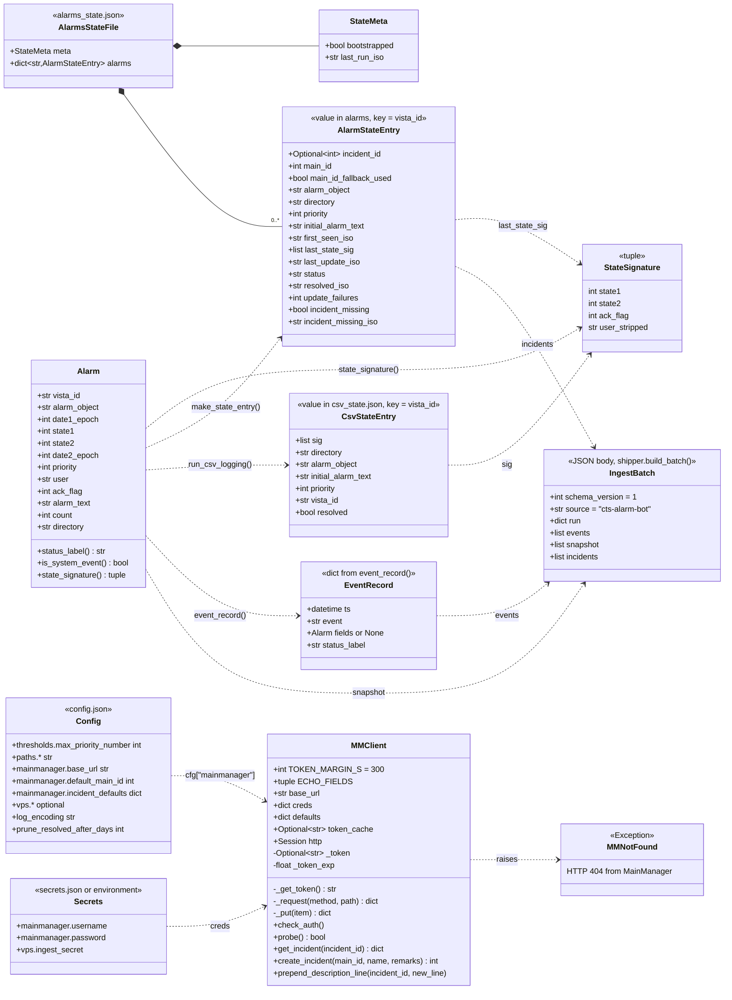

# C4 level 4 — Code

The data structures that `main.py` v2.1.0 and `shipper.py` build, persist and send. Everything here is
read straight from the code: `Alarm` `main.py:168`, `MMClient` `main.py:624`, `make_state_entry()`
`main.py:919`, `run_csv_logging()` `main.py:515`, `build_batch()` `shipper.py:202`. Figures about the data
("68 of 180 rows", "20,584 CSV rows") come from the runtime data as it was on 2026-09-28; that data is no
longer in this repo and is archived privately on the VPS ([ADR-0022](../adr/0022-cts-side-only-repo-web-app-in-digibuild.md)).

Up: [03-component.md](03-component.md). Field-level file formats:
[alr-file-format.md](../reference/alr-file-format.md), [state-files.md](../reference/state-files.md),
[csv-audit-format.md](../reference/csv-audit-format.md), [mainmanager-api.md](../reference/mainmanager-api.md),
[shipper.md](../reference/shipper.md).

## Class diagram

## `Alarm` (`main.py:168-198`)

Immutable-by-convention record built once per row by `parse_alarm_file()`; uses `__slots__`.
Index = 0-based field position in the tab-delimited `$this.alr` row (36 fields expected,
`EXPECTED_FIELDS` `main.py:133`).

| Field | Type | `.alr` index (constant) | Parse | Meaning |
|-------|------|-------------------------|-------|---------|
| `vista_id` | `str` | 1 (`F_VISTA_ID`) | `.strip()` | `VISTA_SERVER#<8 hex>`; the hex suffix looks like a Unix epoch and is usually close to `date1`, but it is not equal to it (only 68 of 180 snapshot rows matched), so treat it as an opaque identifier assigned by Vista. Primary key everywhere ([ADR 0003](../adr/0003-vista-id-as-primary-key.md)). |
| `alarm_object` | `str` | 2 (`F_ALARM_OBJECT`) | `.strip()` | Short point name, e.g. `320-01-07930-0101_AL`, `325-10-04806-Udsugning-Alarm-Bit0_Fejl`. Key into `objects.csv`. Suffix `_AL` low, `_AH` high, `_A` generic. |
| `date1_epoch` | `int` | 3 (`F_DATE1`) | `int(x, 16)` | First occurrence, Unix epoch. |
| `state1` | `int` | 4 (`F_STATE1`) | `int` | `0` ACTIVE, `1` NORMAL (returned to normal); the code comment (`main.py:123`) also names `6` = system/info, but no such row was ever observed. |
| `state2` | `int` | 5 (`F_STATE2`) | `int` | `0` in every observed row; the code comment (`main.py:124`) reserves `2` for info/system events. |
| `date2_epoch` | `int` | 6 (`F_DATE2`) | `int(x, 16)` | Last state transition, Unix epoch. |
| `priority` | `int` | 7 (`F_PRIORITY`) | `int` | Vista priority, **1 = most urgent**. Only 1, 2, 3 and 9 occurred; priority 9 carries both `VISTA_SERVER-$EE_Mess` system messages and real `…-nvoAlarmStatus_A0` "Rumtemperatur afviger fra setpunkt" alarms. |
| `user` | `str` | 10 (`F_USER`) | `.strip()` | `"No user"` or an operator label, e.g. `SYSTEM (User Profile SYSTEM)`, `LON-OP`, or an FM operator's initials and name. |
| `ack_flag` | `int` | 11 (`F_ACK_FLAG`) | `int` | `0` unacknowledged, `1` acknowledged. |
| `alarm_text` | `str` | 13 (`F_ALARM_TEXT`) | `.strip()` | Danish text, e.g. "Høj Temperatur", "ATV61 Fejl". May change to an "OK" variant when the condition clears (e.g. "ATV21 Fejl" → "ATV21 OK"). |
| `count` | `int` | 18 (`F_COUNT`) | `int` | Re-trigger count reported by Vista. |
| `directory` | `str` | 22 (`F_DIRECTORY`) | `.strip()` | Full Vista object path, e.g. `VISTA_SERVER-LOYTEC_PORT-RHQ-345_02_ET9_XENTA-0208_01-32001_07931.0101TT_AH`. Key for `exceptions.csv` and for the CSV file name. |

Derived members:

| Member | Definition | Values |
|--------|------------|--------|
| `status_label` (property) | `classify_alarm_status(state1, ack_flag, user)` `main.py:156`: `is_active = state1 == 0`; `is_acked = ack_flag == 1 and user.strip().lower() != "no user"` | `ACTIVE`, `ACTIVE + ACKNOWLEDGED`, `NORMAL`, `NORMAL + ACKNOWLEDGED` (constants `main.py:149-153`; `RESOLVED` is only ever assigned by the state machine, never by this function) |
| `is_system_event` (property) | `state1 == 6 and state2 == 2` | Skipped by the CSV audit (`main.py:535`) and left out of the shipped snapshot (`build_batch()`). This is what the code comments assume a system event looks like; no (6,2) row appeared in the 180-row snapshot or in any of the 20,584 CSV rows, so the check has never fired. Priority-9 rows carry ordinary `state1` 0/1, are audited to `csv/` and are kept out of incidents only by the priority threshold |
| `state_signature()` | `(state1, state2, ack_flag, user.strip())` | See next section |

## The state signature tuple (`main.py:197-198`)

`(state1, state2, ack_flag, user)` is the only thing compared between polls
([ADR 0004](../adr/0004-state-signature-diff.md)); alarm text is deliberately ignored because
Vista changes it inconsistently. Stored as a JSON list in both state files
(`last_state_sig` and `sig`) and converted back with `tuple(...)`.

| Signature | Status label | Meaning in Vista terms |
|-----------|--------------|------------------------|
| `(0, 0, 0, "No user")` | ACTIVE | Condition present, nobody has acknowledged |
| `(0, 0, 1, "<operator>")` | ACTIVE + ACKNOWLEDGED | Condition present, operator has seen it (*kvitteret*) |
| `(1, 0, 0, "No user")` | NORMAL | Condition gone, not yet acknowledged |
| `(1, 0, 1, "<operator>")` | NORMAL + ACKNOWLEDGED | Gone and acknowledged; the code assumes Vista removes the row shortly after (`main.py:1274-1277`) |
| `(6, 2, *, *)` | — | System / info event as assumed by the code comments (`main.py:123-124`); never observed. Observed combinations are only `(1,0)` and `(0,0)` |
| row absent | RESOLVED (bot's own term) | Row deleted from `$this.alr`. The code assumes this only happens once the alarm is NORMAL and acknowledged, but the CSVs showed 1,078 RESOLVED events against 148 ACKNOWLEDGED events and 184 rows that vanished while last seen ACTIVE, so the acknowledgement is usually not observed by the bot |

How a signature change is turned into events (two independent consumers):

| Change (prev → now) | CSV event, `classify_csv_event()` `main.py:441` | Incident line, `describe_transitions()` `main.py:828` |
|---------------------|------------------------------------------------|--------------------------------------------------------|
| no previous signature | `FIRST_SEEN` | n/a (incident created with `initial_description()`) |
| `state1` 0 → 1 | `NORMAL` | `… Alarm bot - alarm returned to NORMAL ("<text>")` |
| `state1` 1 → 0 | `ACTIVE` | `… Alarm bot - alarm ACTIVE again ("<text>")` |
| `state1` other change | `STATE1_<a>_TO_<b>` | catch-all line |
| `ack_flag` 0 → 1 | `ACKNOWLEDGED` | `… Alarm bot - ACKNOWLEDGED by <user>` (only if user ≠ "No user") |
| `ack_flag` 1 → 0 | `UNACKNOWLEDGED` | catch-all line |
| only `user` changed | `USER_CHANGED` | `… Alarm bot - re-acknowledged by <user>` (if `ack_flag == 1`) |
| anything else | `STATE_CHANGED` | `… Alarm bot - status changed to <label> (state1 a->b, ack c->d)` |
| row gone, last `state1 == 0` | `NORMAL` then `RESOLVED` | "returned to NORMAL (missed between polls)" then "RESOLVED — … (kvitteret) …" |
| row gone, last `state1 == 1` | `RESOLVED` | "RESOLVED — alarm was acknowledged (kvitteret) and removed from Vista alarm list" |

Several CSV events can be emitted for one change (e.g. `NORMAL` + `ACKNOWLEDGED` in one poll). The
incident lines are prepended one at a time in list order, in both the update branch (`main.py:1243`)
and the resolve branch (`main.py:1305`), so the last line of a batch ends on top: the acknowledgement
above the condition line, RESOLVED above "missed between polls". All lines in one batch carry the same
`dk_now_str()` timestamp.

## Event record (`event_record()` `main.py:494`)

One dict per CSV row, returned by `run_csv_logging()` whether or not the rows are written
(`write=False` in `--dry-run` / `--parse-only`). Keys: every `Alarm` slot, `status_label`, `ts` (an aware
`datetime`), `event`. For the synthetic rows of a vanished alarm (`NORMAL`, `RESOLVED`) the record is built
from the `csv_state.json` entry: `vista_id`, `alarm_object`, `directory`, `priority` and
`alarm_text` (= `initial_alarm_text`) are set, `status_label` is the event name, every other field is
`None`. The shipper turns it into an `AlarmEventIn` (`event_row()` `shipper.py:180`).

## `MMClient` (`main.py:624-821`)

Constructed by `_mm()` (`main.py:1104`) from `config.json → mainmanager` (`base_url`,
`incident_defaults`) and the credentials from `load_secrets()` (`secrets.json → mainmanager.username` /
`mainmanager.password`, or `MM_USERNAME` / `MM_PASSWORD`); lazily, once per run, so a run with nothing to
send makes no MainManager call. The v3 contract, field rules and history are in
[mainmanager-api.md](../reference/mainmanager-api.md) and [ADR-0019](../adr/0019-mainmanager-v3-incident-api.md).

| Method | HTTP | Endpoint | Request | Response handling | Timeout |
|--------|------|----------|---------|-------------------|---------|
| `_get_token()` `:665` | `POST` | `/restapi/token` | form `username`, `password`, `grant_type=password` | Reuse the in-memory token, else `mm_token.json` (`{"access_token", "exp"}`), while more than `TOKEN_MARGIN_S` = 300 s remain; else request one (`expires_in`, default 7200 s) and write the cache. `RuntimeError` without credentials | 30 s |
| `_request()` `:709` | any | any | Bearer token, JSON | 404 → `MMNotFound`; other errors → `raise_for_status()`; returns `json()` | 60 s |
| `check_auth()` `:732` | `POST` | `/restapi/token` | — | The dry-run credential check: `_get_token()` and nothing else | 30 s |
| `probe()` `:738` | `GET` | `/api/v3/incidents?pageNumber=1&pageSize=1` | — | `True` if it answers at all; any error → `False`. Tells "API down" from "ticket missing" after a 404 | 60 s |
| `get_incident(id)` `:749` | `GET` | `/api/v3/incidents/<id>` | — | First of `items`; none → `MMNotFound` | 60 s |
| `create_incident(main_id, name, remarks)` `:756` | `POST`, then `GET` (+ `PUT`, `GET`) | `/api/v3/incidents` | `{"items":[{MainID, Name, Remarks, IncidentTypeID, CheckwordItemID, GradeID, StatusID[, LocationID, ReportedByID, ReportedByOrganisationID]}]}` | `RuntimeError` unless `success` and `id`; returns `int(id)`. Then reads the ticket back and, if `StatusID` did not stick, PUTs it with the echoed write model; a failure here is a WARNING, never a second create | 60 s |
| `_text(item)` `:801` | — | — | — | `Description`, else `Remarks` (the ~245-char copy) | — |
| `prepend_description_line(id, line)` `:807` | `GET`, `PUT`, `GET` | `/api/v3/incidents[/<id>]` | `{"items":[{…_echo(current), ID, Remarks: line + "\n" + Description}]}` | `RuntimeError` if the PUT answers `success: false` or the read-back text differs | 60 s |

`ECHO_FIELDS` (`main.py:640`) is the 20-key subset of the tenant's write model that every PUT copies from
the current ticket (keys with a `None` value are left out), so an update cannot blank them; `ID` and `Remarks`
are set per call.

Callers and what they do with failures:

- `create_incident_for_alarm()` `main.py:946` re-raises `MMNotFound`, otherwise catches everything, logs
  `CreateIncident FAILED`, returns `None` (create again on the next change).
- `run()` turns `MMNotFound` into `_on_not_found()` (`main.py:1128`): `probe()` answers → the ticket is
  missing, the entry gets `incident_missing`; `probe()` fails (or it was a create) → `api_down`, the action
  is deferred and state is left untouched.
- Any other update or resolve failure goes through `_give_up()` (`main.py:1147`): the entry's
  `update_failures` counts up; below `MAX_API_FAILURES` (3, `main.py:52`) the transition is retried next run,
  at 3 it is abandoned and the state advances.

## `alarms_state.json` schema

Top level (`empty_state()` `main.py:308`; `load_state()` `:312` upgrades a legacy file that has no
`meta` by wrapping it):

| Key | Type | Notes |
|-----|------|-------|
| `meta.bootstrapped` | `bool` | Set to `true` at the end of the first run; while `false`, the run records alarms and creates no incidents ([ADR 0006](../adr/0006-bootstrap-on-first-run.md)) |
| `meta.last_run_iso` | `str` ISO-8601 seconds | Written after bootstrap and at the end of every normal run |
| `alarms` | `dict[vista_id → entry]` | One entry per alarm that passed the filter at least once and has not been RESOLVED for more than `prune_resolved_after_days` (30); unresolved entries are kept indefinitely |

Entry (`make_state_entry()` `main.py:919-934`, plus fields added later by `run()`):

| Field | Type | Set by | Notes |
|-------|------|--------|-------|
| `incident_id` | `int` or `null` | create `:1184`, "THE FIX" `:1233` | `null` after bootstrap or a failed create. `null` means "create on next change". A dry run never saves, so it leaves no `null` behind. |
| `main_id` | `int` | `resolve_main_id()` at first sight | Frozen at first sight; a later `objects.csv` mapping is not applied retroactively. |
| `main_id_fallback_used` | `bool` | `resolve_main_id()` | `true` for every entry while `objects.csv` is empty. |
| `alarm_object` | `str` | first sight | Copied from `Alarm`. |
| `directory` | `str` | first sight | Copied from `Alarm`. |
| `priority` | `int` | first sight | Copied from `Alarm`. |
| `initial_alarm_text` | `str` | first sight | Text at first sight; later text changes are not stored. |
| `first_seen_iso` | `str` | first sight | Bot wall-clock time (naive, server local), not Vista's `date1`. |
| `last_state_sig` | `list[int,int,int,str]` | first sight, every handled change `:1259` | The signature tuple as a JSON list. Not advanced while an update is deferred or being retried. |
| `last_update_iso` | `str` | first sight, every handled change `:1260` | |
| `status` | `str` | first sight, every handled change `:1261`, resolve `:1326` | One of `ACTIVE`, `ACTIVE + ACKNOWLEDGED`, `NORMAL`, `NORMAL + ACKNOWLEDGED`, `RESOLVED`. Older files may carry the legacy value `ACKNOWLEDGED`; it is overwritten on the next signature change. |
| `resolved_iso` | `str` | resolve `:1327` | Only present once `status == RESOLVED`; drives `prune_state()` (`:332`). |
| `update_failures` | `int` | `_give_up()` `:1151`; reset `:1161`, `:1254`, `:1316` | Consecutive non-404 failures of the pending transition. Absent until the first failure. |
| `incident_missing` | `bool` | `_on_not_found()` `:1135` | `true` once the ticket answered 404 while the API was up. From then on transitions are logged and tracked, never sent. |
| `incident_missing_iso` | `str` | `_on_not_found()` `:1136` | When it was found missing. |

## `csv_state.json` schema

Flat `dict[vista_id → entry]` (`run_csv_logging()` `main.py:557-563`):

| Field | Type | Notes |
|-------|------|-------|
| `sig` | `list[int,int,int,str]` | Last signature seen by the CSV audit. |
| `directory` | `str` | Used to pick the CSV file for the synthetic NORMAL/RESOLVED rows once the alarm row is gone. |
| `alarm_object` | `str` | |
| `initial_alarm_text` | `str` | Despite the name, the text at the *latest* change (the entry is rewritten on every change); reused in the RESOLVED row (`csv_resolved_row()` `:409`). |
| `priority` | `int` | |
| `vista_id` | `str` | Duplicate of the key. |
| `resolved` | `bool` | Set to `true` when the row disappears (`:598`), and the entry is deleted in the same run (`:600-604`), so it is never observed in the saved file. |

## `IngestBatch` (`build_batch()` `shipper.py:202`)

The JSON body of one POST to `https://api.digibuild.dk/internal/cts-alarms/v1/ingest`, one per bot run.
Transport, signing and outbox are in [shipper.md](../reference/shipper.md) and
[ADR-0020](../adr/0020-hmac-ingest-to-digibuild.md); the receiving schema belongs to digibuild.

| Key | Content |
|-----|---------|
| `schema_version` | `1` (`SCHEMA_VERSION` `shipper.py:57`) |
| `source` | `"cts-alarm-bot"` (`SOURCE` `shipper.py:58`) |
| `run` | `run_id` (the start time, ISO with offset: the idempotency key), `started_at`, `finished_at`, `bot_version`, `host`, `parsed_rows`, `kept`, `csv_events`, `created`, `updated`, `resolved`, `unchanged`, `errors` (at most 100 + an "omitted" line), `exit_code`; missing counters are `null` |
| `events` | One `AlarmEventIn` per event record: the 13 `ALARM_FIELDS` (`shipper.py:67`) + `ts` + `event` |
| `snapshot` | One `AlarmRowIn` per parsed alarm (all priorities, system events excluded): the 13 `ALARM_FIELDS` |
| `incidents` | One `IncidentIn` per `alarms_state.json` entry: `vista_id`, `incident_id`, `main_id`, `main_id_fallback_used`, `status`, `first_seen`, `last_update`, `resolved_at` |

Timestamps are ISO 8601 with the CTS server's UTC offset (`iso_with_offset()` `shipper.py:160`); the bot's
naive local times are given the server's offset.

## `outbox.sqlite` schema (`OUTBOX_SCHEMA` `shipper.py:249`)

| Table | Columns | Meaning |
|-------|---------|---------|
| `outbox` | `id`, `created_iso`, `run_id` (unique), `payload`, `attempts`, `last_error` | Batches not yet accepted; resent (re-signed) oldest first at the start of every shipping run |
| `dead` | `id`, `created_iso`, `run_id`, `payload`, `attempts`, `last_error`, `dead_iso` | Batches the server rejected as malformed; kept for inspection, never resent |

Neither table is capped ([R-20](../arc42/11-risks-and-technical-debt.md#r-20-unbounded-outbox-growth), T-106).

## Config and secrets

`config.json` is read once by `load_config()` `main.py:55` and accessed as a plain `dict`; the credentials
come from `load_secrets()` `main.py:61`. Keys and their consumers are listed in
[config-reference.md](../reference/config-reference.md). Non-obvious couplings:

- `paths.csv_folder` and `paths.csv_state_file` are optional; if either is empty the CSV audit is
  silently skipped, and no events are shipped (`main.py:1049`).
- `mainmanager.incident_defaults.StatusID` and `GradeID` are required; `IncidentTypeID` falls back to the
  old key `CheckwordItemID`; `LocationID`, `ReportedByID` and `ReportedByOrganisationID` are optional,
  with a WARNING at start-up when missing (`MMClient.__init__` `main.py:649`).
- Without a `"vps"` section the shipper does nothing (`load_shipper_config()` `shipper.py:99`).
