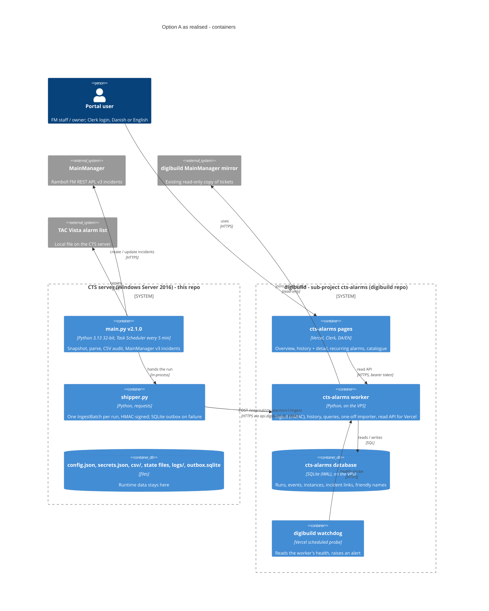
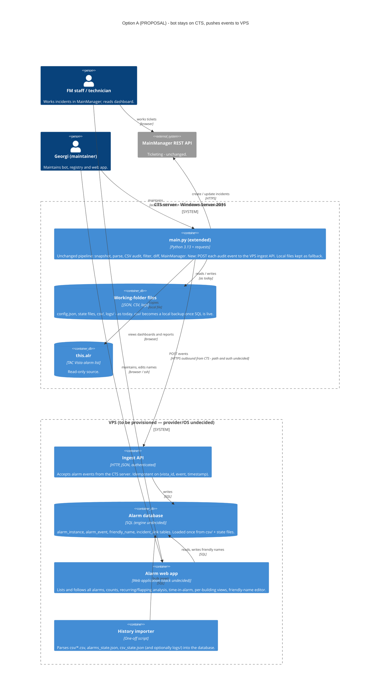
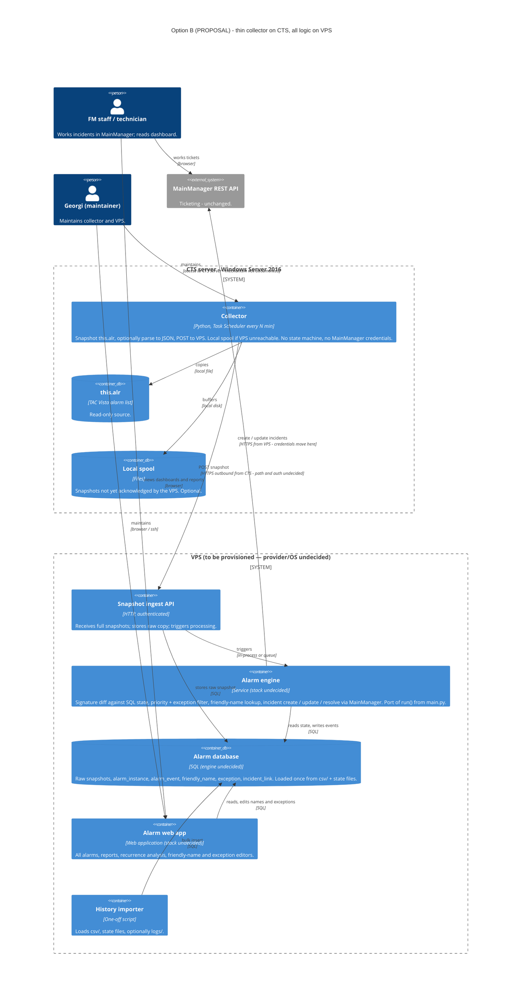

# Target architecture — realised as the digibuild sub-project `cts-alarms`

> **Status: realised (2026-09-29).** The owner chose **Option A** below: the bot stays on the CTS server,
> keeps writing MainManager, and ships each run to the VPS side
> ([ADR 0016](../adr/0016-cts-server-vs-vps-responsibility-split.md)). The VPS side is not a standalone
> app: it is the **digibuild sub-project `cts-alarms`**
> ([ADR 0022](../adr/0022-cts-side-only-repo-web-app-in-digibuild.md)), fed over HTTPS POST + HMAC
> ([ADR 0020](../adr/0020-hmac-ingest-to-digibuild.md)). Its architecture (arc42, ADRs, C4, UI docs) lives
> in the **digibuild repo**; this page keeps the CTS-side view of it and the original proposal for the record.
>
> A first implementation of the VPS side (`server/`, a FastAPI app with its own pages and API keys) was
> built in this repo on 2026-09-29 and then removed: its models, ingest, queries and importer were ported
> into the digibuild worker; its pages, auth and PostgreSQL default were dropped.

## As realised (2026-09-29)

What changed against the proposal below:

| Proposal (2026-09-28) | As realised |
|-----------------------|-------------|
| "Ingest API, stack undecided"; bearer API key | HMAC-signed POST with timestamp and nonce ([ADR 0020](../adr/0020-hmac-ingest-to-digibuild.md)) |
| "Alarm database, engine undecided" | SQLite (WAL) in the digibuild worker ([ADR 0015](../adr/0015-sql-storage-for-alarm-history.md)) |
| "Alarm web app, stack undecided" on the VPS | Pages on Vercel behind Clerk; only the worker on the VPS ([ADR 0022](../adr/0022-cts-side-only-repo-web-app-in-digibuild.md)) |
| Friendly-name registry, keying undecided | In digibuild ([ADR 0017](../adr/0017-friendly-alarm-naming-registry.md)) |
| History importer reads the runtime data committed to this repo | Reads the private archive of the data as of 2026-09-28 on the VPS; the data left this repo |
| Credentials out of git (U2) | `secrets.json` on the CTS server ([ADR 0021](../adr/0021-secrets-in-secrets-json.md)) |

Details on this side: [reference/shipper.md](../reference/shipper.md) (wire contract, outbox, install),
[arc42 §7](../arc42/07-deployment-view.md) (deployment). Open work: [../TODO.md](../TODO.md).

---

## Original proposal (2026-09-28, kept for the record)

> Written before the decision. Line references are to `main.py` v1.x; figures such as "431 files" and
> "45,612 runs" describe the runtime data as it was committed then, which is now archived privately on
> the VPS. The unknowns table at the end is answered in [Status of the unknowns](#status-of-the-unknowns-2026-09-29).

## What the owner asked for (the drivers)

Taken from the owner's request; nothing added.

| # | Want | Implication for the architecture |
|---|------|----------------------------------|
| D1 | A website, hosted on a VPS ("DPS server" in the request, read as VPS) | A second host appears; the CTS server is a Windows Server 2016 box inside the building network and the only outbound connection the bot itself makes is to MainManager; whether the host may reach other Internet hosts is unknown (see U1). |
| D2 | See and follow **all** alarms ever created, not read-only any more; produce reports on them | Alarm history must be stored somewhere queryable and complete — today it is split across `csv/` (all priorities), `alarms_state.json` (priority ≤ 2, 30-day prune) and `logs/`. |
| D3 | Friendly names for alarms, which are hard to identify (`320-01-07930-0101_AL`, LOYTEC/XENTA paths) | A registry mapping `alarm_object` / `directory` to human names, buildings, floors, systems. Maintained by humans, so it needs a UI or at least a versioned file. |
| D4 | Analysis: how many alarms, which ones recur constantly, trends | Aggregations over history: counts per object/text/priority/period, flapping detection (8.6k ACTIVE transitions for 1.2k instances in the committed CSVs), time-in-alarm. |
| D5 | Move storage from CSV to SQL, exposed on the website | Relational schema for alarm instances and events; a one-off import of `csv/`, state files and possibly `logs/`. |
| D6 | Decide later what stays on CTS vs VPS | Both options below must remain viable; the collector on the CTS server must not be re-architected twice. |
| D7 | Rotate and move the secrets that are currently in `config.json` | Whatever is built must not repeat [ADR 0013](../adr/0013-secrets-in-config-json.md). |

## Fixed points common to both options

- TAC Vista only exposes alarms as the file `$this.alr` on the CTS server's local disk, so **some
  process must run on the CTS server**. There is no Vista API in play and nothing here changes that.
- MainManager stays the ticketing system; FM staff keep closing tickets by hand
  ([ADR 0010](../adr/0010-prepend-description-never-change-status.md)).
- The signature-diff model and `vista_id` as key ([ADR 0003](../adr/0003-vista-id-as-primary-key.md),
  [ADR 0004](../adr/0004-state-signature-diff.md)) are the natural event model for the SQL schema:
  one row per alarm *instance* (`vista_id`), many rows per *event* (signature change), exactly what
  `csv/` already records.
- The CTS server runs 32-bit Python 3.13 (task XML); `main.py` needs only `requests`
  (`main.py:29`) and no other installed packages are documented.

## Option A — bot stays on the CTS server, pushes events to a VPS web app

The existing `main.py` keeps all of its logic (snapshot, parse, filter, diff, MainManager calls)
and gains one output: every event it already writes to `csv/` is also POSTed to the VPS. The VPS
stores events in SQL and serves the website. If the VPS is unreachable the bot keeps working
against MainManager and buffers or drops the push (to be decided).

| Element | Description | Technology | Status |
|---------|-------------|------------|--------|
| `main.py` (extended) | Today's bot plus an HTTP push of every CSV-audit event (and optionally the incident create/update/resolve events) to the VPS. All decisions (filter, MainManager) stay on the CTS server. | Python 3.13 32-bit, `requests` | Proposed; the push must be non-fatal like the CSV audit (`main.py:805-808`) |
| Working-folder files | Exactly as in [02-container.md](02-container.md). `csv/` continues as local backup at least until the SQL store is trusted. | JSON / CSV / text | Existing |
| Ingest API | Small authenticated endpoint accepting batches of events; must be idempotent so a re-sent batch after a network hiccup does not duplicate rows. | Undecided | Proposed |
| Alarm database | Instance + event tables mirroring the signature model; friendly-name registry; link to MainManager incident ids from `alarms_state.json`. | SQL, engine undecided (SQLite / PostgreSQL / MySQL all plausible) — [ADR 0015](../adr/0015-sql-storage-for-alarm-history.md) | Proposed |
| Alarm web app | Read views (all alarms, per building/floor/system, currently active), analysis (counts, recurrence, flapping, time-in-alarm, trends), and write views (friendly names, maybe exception list). | Stack undecided — [ADR 0018](../adr/0018-alarm-web-application-on-vps.md) | Proposed |
| History importer | Reads the 431 `csv/` files (~21k rows), `alarms_state.json` (incident ids), `csv_state.json`, and optionally reconstructs runs from `logs/` (45,612 runs, 163 files, ~356 MiB). | Python, one-off | Proposed; the reason the runtime data was committed ([ADR 0014](../adr/0014-commit-runtime-data-for-migration.md)) |

Trade-offs of A:

| Pro | Con |
|-----|-----|
| Smallest change to a system that has run 45k times; MainManager integration untouched. | Logic remains on a Windows box with 32-bit Python, no tests, manual deploys. |
| CTS server never needs inbound connectivity; one outbound HTTPS destination is added. | Two sources of truth for a while: `alarms_state.json`/`csv/` on CTS and SQL on the VPS; drift must be reconciled. |
| VPS outage does not stop incident creation. | Needs an outbound path CTS → VPS, which is unverified (see unknowns). |
| Friendly names can live only on the VPS initially; the bot does not need them to create incidents. | If friendly names should appear in MainManager incident names, the bot must fetch them from the VPS or from a synced file — a second interface. |

## Option B — thin collector on the CTS server, all logic on the VPS

The CTS server runs only a collector: snapshot `$this.alr`, parse (or not even parse — ship the
raw snapshot), and POST it to the VPS. The VPS owns state, diffing, the exception list, the
priority threshold, the friendly-name registry, MainManager calls, SQL and the website.

| Element | Description | Technology | Status |
|---------|-------------|------------|--------|
| Collector | Replaces `main.py` on the CTS server with the first two components of [03-component.md](03-component.md) (snapshot, parse) plus an HTTP push. Holds no MainManager credentials, no state. | Python 3.13 32-bit, `requests`; Task Scheduler as today | Proposed |
| Local spool | Optional buffer so that snapshots are not lost while the VPS is down. Without it, a VPS outage means missed transitions (which the existing "missed between polls" logic already tolerates for resolves, but not for ACTIVE↔NORMAL flaps). | Files | Proposed, optional |
| Snapshot ingest API | Accepts full snapshots (~60 KB each, every 5 min ≈ 17 MB/day raw; less if parsed) and keeps the raw copy for auditability. | Undecided | Proposed |
| Alarm engine | Server-side port of `run()` `main.py:776`: bootstrap, diff, filter, describer, MainManager client. Can use friendly names in incident names and can be unit-tested. | Undecided | Proposed |
| Alarm database, web app, importer | As in Option A, plus tables for exceptions and raw snapshots. | SQL, undecided | Proposed |

Trade-offs of B:

| Pro | Con |
|-----|-----|
| One source of truth (SQL); the state machine, exception list, threshold and friendly names are all in one editable place with a UI. | Re-implements and must re-validate logic that has 5 months of production behaviour, including edge cases (bootstrap, 404 loop, legacy statuses). |
| MainManager credentials leave the CTS server and the repo; only the VPS needs them. | MainManager calls now originate from the VPS — must be allowed by Ramboll FM (IP allow-listing unknown). |
| Collector is trivial, so CTS-side deployments become rare. | Incident creation now depends on the VPS being up **and** the CTS → VPS path being up; today it depends only on MainManager being up. |
| Raw snapshots stored centrally allow re-processing history with improved logic. | More moving parts to host, monitor and secure on a VPS that does not exist yet. |

## Options not drawn

- **C — everything on the CTS server, VPS serves a read-only UI over a synced SQLite file** (the
  bot writes SQLite on the CTS server; the file is synced one-way to the VPS, which only reads it).
  This is option C in [ADR 0016](../adr/0016-cts-server-vs-vps-responsibility-split.md) and
  TODO T-001(c). Not drawn because it cannot satisfy "not read-only" (T-002) without a second
  channel back to the CTS server; kept in the option list so the letters A/B/C mean the same thing
  in ADR 0016, T-001 and this page.
- **D — no VPS at all** (web app + SQL on the Windows box). Not drawn because the owner
  explicitly asked for a VPS-hosted website; it would avoid the network question entirely but
  exposes a BMS host as a web server. Mentioned so it is consciously rejected or revived.
- **Hybrid**: A first (bot pushes events), then migrate towards B once the VPS engine is proven
  against the same event stream. This is a sequencing choice, not a third architecture, and is
  the reason the collector interface in both options should be the same shape (events or
  snapshots with `vista_id` + signature + timestamps).

## Unknown / undecided

Each of these blocks the choice between A and B or the design inside either. They mirror the open
items in [../TODO.md](../TODO.md).

| # | Unknown | Why it matters | Where it will be decided |
|---|---------|----------------|--------------------------|
| U1 | **Network path from the CTS server to the VPS**: is outbound HTTPS to an arbitrary host allowed from the building network? Proxy? Only MainManager's host is proven today. | Both options need it; if only a VPN or a reverse tunnel is possible, the collector design changes. | [ADR 0016](../adr/0016-cts-server-vs-vps-responsibility-split.md) |
| U2 | **Authentication CTS → VPS**: API key, mTLS, signed requests; and where that secret lives on the CTS server (not `config.json` in git). | Follows from [ADR 0013](../adr/0013-secrets-in-config-json.md) being deprecated. | ADR 0016 / ADR 0018 |
| U3 | **Who calls MainManager**: CTS bot (A) or VPS engine (B). Includes whether Ramboll FM restricts source IPs and whether a second service account is wanted. | Determines where the credentials go and what fails when the VPS is down. | ADR 0016 |
| U4 | **How history is imported** from `csv/` (431 files, ~21k rows, semicolon, `dd-mm-yyyy` timestamps in bot local time), `alarms_state.json` (incident ids, 30-day prune means older incidents exist only in `logs/`), `csv_state.json`, and `logs/` (45,612 runs; the per-run status table is the only record of priority-≤2 alarms' status per 5-minute slot). Whether `logs/` is worth parsing at all. | Defines the SQL schema's minimum and whether the committed runtime data can be removed from the repo afterwards ([ADR 0014](../adr/0014-commit-runtime-data-for-migration.md)). | [ADR 0015](../adr/0015-sql-storage-for-alarm-history.md) |
| U5 | **Retention**: keep everything forever (D2 says "all alarms ever created"), retention for raw snapshots (B) and for personal data in the `user` field (operator names). | Storage sizing and GDPR posture. | ADR 0015 / ADR 0018 |
| U6 | **Friendly-name registry**: keyed by `alarm_object`, by `directory`, or by both; who maintains it; whether names flow back into MainManager incident names; whether it also carries building / floor / system for grouping (the `320-01-07930-0101_AL` codes and "Etage N" paths suggest a building-system-controller-point hierarchy but no authoritative decoding exists in the repo). | Needed for D3 and for per-building views. | [ADR 0017](../adr/0017-friendly-alarm-naming-registry.md) |
| U7 | **Reporting and analysis features**, in scope but undefined: alarm counts (per object, text, priority, building, period); recurring / flapping alarms (e.g. `VISTA_SERVER-$EE_Mess` 309 instances, "Høj Temperatur" 171); time-in-alarm and time-to-acknowledge; per-building views; whether reports are dashboards, scheduled exports, or both. | Shapes the schema (event granularity is enough for all of these) and the web stack choice. | ADR 0018 |
| U8 | **VPS itself**: provider, OS, who administers it, backups, TLS, domain. | Prerequisite for anything on the right-hand side of both diagrams. | ADR 0018 |
| U9 | **Fate of the CTS-side files** after SQL is live: keep `csv/` as backup, stop it, or keep only `logs/`. | Disk growth on the CTS server (logs alone ≈ 2–4 MB/day, never rotated). | ADR 0016 |
| U10 | **Fixing known defects before or during the move**: the 404 retry loop, the frozen `main_id`, the legacy `ACKNOWLEDGED` statuses, empty `objects.csv`. | In B they must be handled in the port; in A they persist on the CTS server. | [../TODO.md](../TODO.md), [arc42 §11](../arc42/11-risks-and-technical-debt.md) |

## Reading the two options side by side

| Concern | Option A | Option B |
|---------|----------|----------|
| Code on CTS server | Today's `main.py` + push (≈ +50 lines) | New small collector (≈ 150 lines), `main.py` retired |
| Where the state machine runs | CTS server (`alarms_state.json`) | VPS (SQL) |
| MainManager credentials | CTS server (moved out of git) | VPS only |
| Source of truth for history | SQL on VPS, mirrored from CTS files | SQL on VPS |
| Behaviour when VPS is down | Incidents continue; history gap or spool | No incidents; spool replays later |
| Behaviour when CTS → VPS path is down | Same as above | Same as above |
| Friendly names in MainManager incident names | Needs a sync back to CTS or a lookup call | Native |
| Testability of alarm logic | As today (none) | Server-side, testable |
| Effort to first dashboard | Lower (import `csv/`, add push) | Higher (port engine first) |

No winner is picked here. The decision is recorded, when made, in
[ADR 0016](../adr/0016-cts-server-vs-vps-responsibility-split.md).

## Status of the unknowns (2026-09-29)

| # | Answer |
|---|--------|
| U1 | Outbound HTTPS from the CTS server works; the shipper posts to `api.digibuild.dk`. Confirmed in production only once the v2.1.x deploy is live (T-092). |
| U2 | HMAC with a shared secret in `secrets.json` (`vps.ingest_secret`) on the CTS server ([ADR 0020](../adr/0020-hmac-ingest-to-digibuild.md), [ADR 0021](../adr/0021-secrets-in-secrets-json.md)). |
| U3 | The CTS bot keeps calling MainManager (Option A); the digibuild side only reads its mirror. |
| U4 | The digibuild worker imports the archived `csv/`, state files and `logs/` once; details in the digibuild repo. |
| U5 | Decided on the digibuild side; not a CTS-side concern. |
| U6 | Registry in digibuild, one row per alarm point ([ADR 0017](../adr/0017-friendly-alarm-naming-registry.md)); names are not pushed back to the CTS server, so `incident_name()` still uses the raw code. Who may edit, and whether names should ever reach MainManager incident names, are still open. |
| U7 | First pages: overview, history + detail, recurring alarms, catalogue (digibuild). |
| U8 | The owner's existing VPS and Vercel project, under digibuild's operations. |
| U9 | The CTS server keeps writing `csv/`, state files and `logs/` (dual write); nothing is removed there. |
| U10 | The 404 loop is fixed in v2.0.0 ([ADR 0019](../adr/0019-mainmanager-v3-incident-api.md)); frozen `main_id`, the legacy `ACKNOWLEDGED` status and the empty `objects.csv` remain open in [../TODO.md](../TODO.md). |
