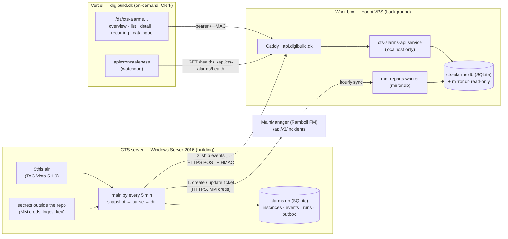

# CTS alarms → digibuild: the "branch to the VPS" design

*Decided with the owner on 2026-09-28 (see "Decisions"); written on the VPS from the repo, the committed runtime
data, and read-only inspection of the sibling projects on this box (`digibuild`, `mm-helpdesk-ai`,
`mm-automations`, `cts-opc`). Nothing was copied from them and nothing there was changed.*

This document is the design the owner asked for before any code changes. Its decisions have since been folded
into the ADRs and the backlog (see the status section below); this file stays as the dated record of how they
were reached.

## Status 2026-09-29 — everything below is decided; where it lives now

| Decision | Outcome | Recorded in |
|---|---|---|
| D-A incidents stay on the CTS server | in force; `MMClient` moved to `/api/v3/incidents` (v2.0.0, live-tested 2026-09-28; read-only dry run v2.0.1) — deploy pending | [ADR-0019](../adr/0019-mainmanager-v3-incident-api.md), [ADR-0016](../adr/0016-cts-server-vs-vps-responsibility-split.md), TODO T-103 |
| D-B the bot branches to the VPS | built: `shipper.py` posts one batch per run after the MainManager work; SQLite outbox on the CTS side. The planned local `alarms.db` was **not** built — CSV + JSON state stay the local store (dual write) | [ADR-0020](../adr/0020-hmac-ingest-to-digibuild.md), [reference/shipper.md](../reference/shipper.md) |
| D-C digibuild sub-project `cts-alarms` | being built in the digibuild repo (worker + SQLite on the VPS, pages on Vercel, watchdog probe); the cloud session's `server/` was ported there and removed from this repo | [ADR-0022](../adr/0022-cts-side-only-repo-web-app-in-digibuild.md) (0018 superseded, 0015/0017 accepted) |
| D-D fix the dead endpoints | done in v2.0.0 (root cause: EG removed `/restapi/Incident/*` on 2026-09-19) | [ADR-0019](../adr/0019-mainmanager-v3-incident-api.md) |
| D-E HTTPS POST + HMAC | implemented: `POST https://api.digibuild.dk/internal/cts-alarms/v1/ingest` (versioned path, not the `/ingest` sketched below), digibuild's X-Signature/X-Timestamp/X-Nonce contract; secret in `secrets.json` | [ADR-0020](../adr/0020-hmac-ingest-to-digibuild.md) |
| Secrets out of `config.json` | done (v2.0.0); MainManager password rotated by the owner on 2026-09-29 | [ADR-0021](../adr/0021-secrets-in-secrets-json.md) (0013 superseded) |
| Runtime data out of the repo | the 2026-09-28 data is archived privately on the VPS for the import and leaves the repo tip | [ADR-0022](../adr/0022-cts-side-only-repo-web-app-in-digibuild.md) (0014 superseded), TODO T-049, T-102 |

Details below that differ from what was built (the local `alarms.db` tables, `ingest.hmac_secret` as the key
name, `config.example.json`, the unversioned `/ingest` path, 10 s timeout, 500-event batches) are the plan as
of 2026-09-28 and are superseded by the ADRs above.

## Decisions (owner, 2026-09-28)

| # | Decision | Status |
|---|----------|--------|
| D-A | **MainManager incidents keep being created from the CTS server** by `main.py`, as today. Not moved to the VPS. | decided |
| D-B | **The bot branches**: every run first does its MainManager work, then also ships the run's alarm events to the VPS. A **local database on the CTS server** and **one on the VPS**. | decided |
| D-C | **The VPS side is a new digibuild sub-project `cts-alarms`** (own worker, own units, own SQLite, own pages under `digibuild.dk`), following digibuild's ADR-0042 shape. Not an extension of the `mm-reports` worker, not a standalone site. | decided |
| D-D | **The bot's dead MainManager endpoints are designed here, fixed later** ("design first"). | decided |
| D-E | **Transport CTS → VPS: HTTPS `POST` + HMAC to `api.digibuild.dk`** — chosen by the owner after the security comparison below ("A — HTTPS POST + HMAC", 2026-09-28). | decided |

## Findings that shaped the design

1. **The bot's 404s since 2026-09-19 are a dead endpoint, not deleted tickets.** digibuild's MainManager mirror
   (`mirror.db`, synced 2026-09-28 03:11 UTC) holds incidents 34570, 36692, 36693 and 37058 — the very ids the
   bot fails on — as live rows, status *Awaits handling*, `deleted_seen_utc` empty. `POST /restapi/token` still
   answers 200, while `/restapi/Incident/GetIncident`, `UpdateIncident` and (since 2026-09-25 in the logs)
   `CreateIncident` all return 404. Consequence: **no CTS alarm has produced a ticket since 2026-09-14 13:35**
   (incident 37058) and nothing has been appended to an existing ticket since 2026-09-19 00:40.
2. **Two working MainManager write clients exist on this box**, both against the same tenant and both in use in
   September 2026: `mm-helpdesk-ai` (`helpdesk/mmapi.py`) and `mm-automations` (`mm/api.py`). They use
   `POST /api/v3/incidents {"items":[item]}` to create, `PUT /api/v3/incidents {"items":[item]}` to update,
   `GET /api/v3/incidents/{id}` to read, and the same `POST /restapi/token` password grant. Known gotcha recorded
   there: the `StatusID` sent on create does not stick — enforce it with a follow-up `PUT` and verify with a
   `GET`. digibuild's read-only client refuses `/restapi/incident/getincident` outright ("1.14 MB per record,
   with binaries").
3. **The mirror already contains every ticket the bot ever made**: 453 incidents named `CTS Alarm - …`
   (2025-07-16 … 2026-09-14), **429 of them still open** in *Awaits handling*. The alarm overview can therefore
   show ticket status from day one by joining on `incident_id`, without the bot ever touching a ticket's status.
4. digibuild's rules the sub-project inherits: **Vercel is on-demand, the VPS is background, one watchdog
   carve-out** (ADR-0024); **the box is read-only towards MainManager by construction** (ADR-0001) — keeping
   incident creation on the CTS server is what preserves that; **Vercel↔VPS trust = HMAC + Clerk actor token**
   (ADR-0022); **PII stays on the box, pages get PII-free documents** (ADR-0026/0027); a sub-project is a registry
   entry + route group + own worker + own env file + own docs (ADR-0042); the worker takes the next free localhost port from the box's port register
   (`vps-docs/06-building-new-apps.md`).

## Target architecture



The two arrows out of the bot are independent: a MainManager failure never stops shipping, and an unreachable
VPS never delays a ticket. The VPS never needs the CTS server to be up to serve pages; the CTS server never
needs the VPS to be up to create tickets.

## CTS server side — changes to `main.py` (later, in this order)

### 1. MainManager client: move off the dead endpoints (P0, ships first, alone)

| Today (`MMClient`, dead since 2026-09-19) | Target (as used by the two working clients on this box) |
|---|---|
| `POST /restapi/Incident/CreateIncident` body `{IncidentMode, MainID, Name, Description, CheckwordID, CheckwordItemID, GradeID, StatusID}` → `{"Success", "ID"}` | `POST /api/v3/incidents` body `{"items":[item]}` → `items[0].success`, `items[0].id`; then `PUT /api/v3/incidents` to enforce `StatusID`, then `GET /api/v3/incidents/{id}` to verify |
| `GET /restapi/Incident/GetIncident?IncidentID=` (read Description before prepending) | `GET /api/v3/incidents/{id}` |
| `POST /restapi/Incident/UpdateIncident` `{IncidentID, IncidentRemarks}` | `PUT /api/v3/incidents {"items":[{"ID": id, <remarks field>}]}` |
| `POST /restapi/token` (password grant) | unchanged; cache the token with its expiry (the other clients cache to a file with a margin) |

Open points to settle by reading the v3 item shape in `mm-helpdesk-ai/helpdesk/mmapi.py` (`build_item`,
`RENAMED_WRITE_KEYS`, `READBACK_CHECK`) **before** coding: the exact v3 field names for MainID / Name /
Description / Checkword / Grade, and whether "prepend a line to the description" is still the right
mechanism (the other projects append comments through `/api/v1/app/incidentcomment`; a comment trail may
be the better fit and would end the GET-then-overwrite dance).

Also in the same change:

- **404 handling**: distinguish *endpoint-wide* failure (every call 404 / create 404 too → one `ERROR` per run,
  state untouched, `bot_run.error` set) from *one missing ticket* (one id 404 while others succeed → mark the
  state entry `incident_missing`, warn once, stop retrying). Never mark an alarm `RESOLVED` because of a 404.
  Today the `continue` at the failure sites leaves state untouched, so the same call is retried every 5 minutes
  forever (one id 2,150 times) and a token is fetched on every run.
- `__version__` in the start banner, so log lines can be tied to the code that wrote them.

### 2. Secrets out of `config.json` (precondition for the branch)

The ingest key is a second secret on the BMS host. `config.json` is committed in a public repository, so the
key cannot go there. `main.py` reads `mainmanager.username`, `mainmanager.password` and the new
`ingest.hmac_secret` from a file outside the repo (`C:\priorityalarmsapi\secrets.json`, or environment
variables set on the scheduled task); `config.json` keeps only non-secret settings and `config.example.json`
is added. The MainManager password is rotated at the same time (it has been public). One restart of the task.

### 3. Local database: `alarms.db` (SQLite, stdlib `sqlite3`, WAL)

Replaces `csv_state.json` and, after a dual-write period, the `csv/` folder. `alarms_state.json` can be
folded in later; it is not required for the branch.

| Table | Columns (all from data the bot already has) | Notes |
|-------|----------------------------------------------|-------|
| `alarm_instance` | `vista_id PK, alarm_object, directory, priority, first_seen_utc, last_seen_utc, last_state1, last_state2, last_ack_flag, last_user, last_alarm_text, status_label, resolved_utc, incident_id, main_id, main_id_fallback_used, date1_epoch` | one row per Vista ID; `(vista_id, date1_epoch)` unique so a reused id cannot silently merge histories |
| `alarm_event` | `id PK, vista_id, observed_utc, event, state1, state2, ack_flag, user, alarm_text, priority, count, date1_epoch, date2_epoch, status_label, run_id` | exactly the CSV audit row, plus `run_id`; `UNIQUE(vista_id, event, observed_utc)` = the idempotency key |
| `bot_run` | `id PK, started_utc, finished_utc, version, parsed_rows, kept_rows, created, updated, resolved, unchanged, csv_events, mm_ok, error` | the "Run complete" line as a row |
| `outbox` | `event_id PK → alarm_event, attempts, last_attempt_utc, last_error, shipped_utc` | rows with `shipped_utc IS NULL` are pending |

Times are stored in UTC ISO-8601 (`Z`); the Copenhagen local strings in the CSVs are converted on import.

### 4. Shipper (runs after the MainManager step, never before it)

- Select pending `outbox` rows (oldest first, ≤ 500 per batch), plus the current `bot_run` row.
- `POST https://api.digibuild.dk/internal/cts-alarms/ingest` with headers `X-Timestamp`, `X-Nonce`,
  `X-Signature = HMAC-SHA256(secret, timestamp + "." + nonce + "." + body)` — the same shape digibuild uses on
  its `/internal/*` routes. Timeout 10 s. Body: `{ "bot_version", "run": {…}, "events": [ … ] }`.
- On `2xx`: mark the batch shipped. On anything else: increment `attempts`, keep, log **once per run**. Nothing
  is ever dropped; the next run retries. A VPS outage of a week is a backlog, not data loss.
- `--dry-run` / `--parse-only` never ship and never write (a true read-only mode is part of this change).

### 5. Dual-write and retirement of the CSVs

Keep writing `csv/` while `alarms.db` runs for an agreed period; compare event counts per Vista ID; then stop
the CSV writer and archive the folder. The committed `csv/`, `alarms_state.json`, `csv_state.json` and
`logs/` are imported once into the VPS database (below) and then removed from the repo.

## VPS side — digibuild sub-project `cts-alarms`

Everything below is in the digibuild monorepo, **proposed here, not written there**:
a sub-project is a change to that repository and its ADR set, and its owner decides.

### Registry (ADR-0042 shape)

```ts
// packages/shared/src/modules.ts — proposed
{ key: 'cts-alarms', labels: { da: 'CTS-alarmer', en: 'CTS alarms' }, permission: 'cts-alarms.read', order: 20,
  modules: ['cts-alarms', 'cts-alarms-history', 'cts-alarms-recurring', 'cts-alarms-catalogue'] }
```

Segments carry the sub-project prefix (`/da/cts-alarms`, `/da/cts-alarms-history`, …); both labels and both
blurbs in the message catalogues; `grants` give a `user` the read permission, `admin` sees everything. Editing
friendly names (the catalogue) is a separate permission `cts-alarms.edit`.

### Worker `apps/cts-alarms` (Node ≥ 22 ESM, Express, better-sqlite3 — the same stack as `apps/worker`)

| Item | Value |
|------|-------|
| Port | a localhost-only port (next free on the box), public only through Caddy as `api.digibuild.dk` with new path prefixes `/api/cts-alarms/*` and `/internal/cts-alarms/*` (Caddy `404`s everything not on its allow-list) |
| Units | `cts-alarms-api.service` (enabled), `cts-alarms-backup.timer` (nightly `.backup` of `cts-alarms.db`, 14 kept), `cts-alarms-alert@.service` as `OnFailure=` target — the `mm-reports-*` kit, renamed |
| Env file | the worker's own env file on the VPS (not world-readable): `CTS_INGEST_HMAC_SECRET`, `READ_API_TOKEN`, `VPS_SHARED_SECRET`, `CLERK_JWT_KEY` / `CLERK_JWKS_URL`, `DATA_DIR`. No MainManager credential — this worker never talks to MainManager |
| Data | `apps/cts-alarms/data/cts-alarms.db` (WAL, dir `700`); `mirror.db` attached **read-only** (`file:…?mode=ro`) for the ticket join — same `admin` user, no copy of the mirror |
| Shared | `packages/shared` gains the sub-project's route names, env names and the ingest payload contract, so web and worker cannot disagree on a field name |

### Routes

| Method · path | Gate | Purpose |
|---|---|---|
| `GET /healthz` | none | `ok` — reachability only |
| `GET /api/cts-alarms/health` | bearer | `last_ingest_utc`, `last_bot_run_utc`, `lag_minutes`, `pending_outbox_reported`, `ok` (false when lag > 15 min = 3 missed runs) |
| `POST /internal/cts-alarms/ingest` | HMAC (timestamp + nonce, ±5 min window, nonce table) | idempotent upsert of `bot_run` + `alarm_event` (`INSERT … ON CONFLICT DO NOTHING`), maintains `alarm_instance`; answers `{accepted, duplicates}` |
| `GET /api/cts-alarms/summary` | bearer | current ACTIVE / ACTIVE+ACK / NORMAL / NORMAL+ACK counts by priority, today/7d/30d first-seen counts, bot health |
| `GET /api/cts-alarms/instances`, `/instances/{vista_id}` | bearer | the list (filters: priority, status, building/directory prefix, text, date range, friendly name) and the detail: full event timeline + the joined ticket (`status_name_raw`, `is_open`, `date_finished_utc` from `mirror.db`) |
| `GET /api/cts-alarms/recurring` | bearer | ranked alarm points by instance count, ACTIVE↔NORMAL flaps, time-in-alarm, over a period |
| `GET /api/cts-alarms/points` | bearer | the catalogue: alarm_object / directory → friendly name, building, floor, system, notes |
| `POST /internal/cts-alarms/points` | HMAC **+ Clerk actor** | edit the catalogue — the one write a person makes ("not read-only"); `audit_log` row with the actor |

### Schema (`cts-alarms.db`)

`alarm_instance`, `alarm_event`, `bot_run` — the CTS-side tables, same columns, plus `source`
(`live` / `csv-import` / `state-import` / `log-import`); `alarm_point` (`alarm_object PK, directory, friendly_name,
building, floor, system, point_type, notes, updated_utc, updated_by`); `ingest_nonce` (`nonce PK, seen_utc`);
`audit_log`; `schema_migration`. Ticket status is **not** stored — it is read from `mirror.db` at query time, so
it is exactly as fresh as MM-reports' hourly sync.

### Historical import (one-off, on the VPS, from the data already in this repo)

`csv/` (431 files, ~20.6 k rows → `alarm_event`, `source='csv-import'`), `alarms_state.json` (122 instances with
`incident_id` — the only source of the alarm↔ticket link) and `csv_state.json` (180), and from `logs/` the
`CREATED incident N for VISTA_ID` / `UPDATED` / `RESOLVED` / `FAILED` lines plus every `Run complete:` line
(45,612 runs → `bot_run`). Idempotent; row counts per file are asserted; legacy status labels are mapped.

### PII

Operator names (`user` field, e.g. `GPST (Georgi ISS)`) stay on the box exactly like `mirror.db` does
(ADR-0026). Pages receive the operator **initials/login token only** (e.g. `GPST`) unless the caller holds
`cts-alarms.pii`; the `alarm_text` is not personal data. The catalogue and reports carry no names. T-007 (the
data-controller question) stays open and does not block the build.

### Watchdog

The existing Vercel cron `GET /api/cron/staleness` gains a second probe: `api.digibuild.dk/healthz` and
`/api/cts-alarms/health`; verdict `stale` when `lag_minutes > 15` or the health payload says `ok: false`. That is
the only way anyone learns the bot on the CTS server has stopped — the building cannot be probed from outside,
so the bot's *last ingest* is its heartbeat. (This is the reading of "we need to probe Vercel as well".)

## Pages (Vercel, `apps/web`, Danish + English, Clerk-gated)

| Page | Shows |
|------|-------|
| `/da/cts-alarms` (overview) | Current alarms by priority and status, bot health (last run, lag), tickets open per priority (from the mirror), top recurring points this month |
| `/da/cts-alarms-history` | Every alarm instance ever (imported + live), filters, sort, friendly name, ticket link → `/da/incidents/{id}` (the MM-reports page that already exists) |
| detail (`/da/cts-alarms-history/{vista_id}`) | Timeline: FIRST_SEEN → ACTIVE/NORMAL flaps → ACKNOWLEDGED by whom (initials) → RESOLVED; re-trigger `count`; the ticket's status and dates |
| `/da/cts-alarms-recurring` | "the same alarms appear all the time": ranked by instances / flaps / time-in-alarm, period picker, trend |
| `/da/cts-alarms-catalogue` | Friendly names, editable by `cts-alarms.edit`; import of the 290 known alarm objects as the first rows |

Reports (per period counts, per building, recurring list) reuse MM-reports' print/PDF path (ADR-0039/0050) once
the overview exists; the exact report contents remain the owner's call (T-059).

## Transport security: HTTPS + HMAC vs the existing SSH reverse tunnel

| Criterion | A — HTTPS `POST` + HMAC to `api.digibuild.dk` | B — over the `VistaOpcTunnel` SSH connection |
|---|---|---|
| Exposure | One public HTTPS path on a host that is public anyway; Caddy allow-lists the path, caps body size, can rate-limit and **restrict the source to the building's IP** (the building's public egress IP, recorded privately on the VPS) | No public endpoint; traffic rides inside SSH |
| Authentication | Shared secret, HMAC over timestamp + nonce + body → replay-proof, tamper-proof; secret only allows *appending alarm events* | The tunnel's SSH key, whose permissions on the box are broader than an ingest needs (details in the private VPS estate docs); the worker would still need its own auth, otherwise anything on either end can inject |
| Transport encryption | TLS (Let's Encrypt via Caddy) | SSH |
| Blast radius if the CTS side is compromised | Forge alarm events into one sub-project DB | Whatever the tunnel key allows on the box; the tunnel also carries other building traffic — coupling alarm ingest to it widens what the tunnel is for |
| Coupling | None — outbound HTTPS, which the CTS server already has (it reaches MainManager) | Bot health becomes tunnel health; the tunnel is being re-pointed in the work-box migration (`28-…` § 4e) and its Windows side is "Georgi's hands" |
| Assumption to verify | Outbound HTTPS from the CTS server to `api.digibuild.dk` is allowed (likely; not tested) | The alarm bot runs on `wgcphcts01`, the same host that holds the tunnel — **not verified** anywhere in this repo |
| Pattern already audited in this estate | Yes — digibuild ADR-0022 (Vercel↔VPS HMAC), same code path | No — would be the first data channel over that tunnel |

**Recommendation: A**, hardened with the source-IP allow-list at Caddy and a nonce store on the worker. B is
more *private* but not more *secure* as the tunnel stands, and it ties the alarm history to a link built for a
different purpose. If the owner prefers B anyway, the SSH key must first be narrowed to port forwarding and the
worker must still verify HMAC — at which point B is A with an extra dependency. **Owner's choice (2026-09-28): A.**

## What this asks of digibuild (its owner's decision, its own ADR)

1. **A second inbound and the first write path.** Today digibuild has one authenticated inbound trigger and it
   is read-only (ADR-0023). `POST /internal/cts-alarms/ingest` is an inbound that *writes* — into a sub-project
   database, never into `mirror.db` and never towards MainManager. ADR-0001 stays intact because the writer of
   MainManager tickets remains the CTS server.
2. Sub-project #2 in the registry, the `cts-alarms-*` unit family, its localhost port, the Caddy prefixes, the env file,
   the second probe in the watchdog.
3. `mirror.db` read by a second process (read-only, same user). MM-reports' "cache by contract" rule is
   unaffected: if the mirror is rebuilt, the join simply reflects the rebuilt rows.

## Rollout order

1. Secrets out of `config.json` on the CTS server + rotate the MainManager password (one task restart).
2. `main.py` MainManager client on `/api/v3/incidents` + 404 handling + version banner — **small, separate,
   first**, because tickets are not being created today. Verify with `--dry-run`, then one real run.

   **Status 2026-09-28 — steps 1 and 2 are coded in this repo (`main.py` v2.0.0), not yet deployed:**
   - `load_secrets()`: `MM_USERNAME`/`MM_PASSWORD` env → `paths.secrets_file` (`secrets.json`, gitignored,
     see `secrets.example.json`) → legacy `config.json` values with a DEPRECATED warning. The committed
     `config.json` no longer carries credentials.
   - `MMClient` on `/api/v3/incidents`: create = `POST {"items":[item]}` with `IncidentTypeID 277`,
     `LocationID 6`, `ReportedByID 748`, `ReportedByOrganisationID 11`, `GradeID 10`, `StatusID 5` (the values
     every ticket since 2026-04 carries) → `GET` read-back → `PUT` to enforce `StatusID` if it did not stick →
     `GET` verify. Update = `GET` → `PUT` with the write-model fields echoed (`ECHO_FIELDS`) and `Remarks`
     prepended → `GET` verify that it read back as written. Token cached in `mm_token.json` with its expiry.
   - 404 classification: a 404 with the list endpoint also failing = **API down** → one `ERROR`, no further
     calls this run, state untouched (`deferred=N` in the run summary); a 404 for one id while the list
     answers = **ticket missing** → entry gets `incident_missing` + `incident_missing_iso`, is never sent
     again, still tracked and still resolved locally. Non-404 failures retry at most `MAX_API_FAILURES` (3)
     runs per transition (`update_failures` on the entry), then the transition is abandoned with an `ERROR`.
   - Resolution lines are now prepended in natural order so `RESOLVED` ends on top (the old `reversed()` put
     the "missed NORMAL" line above it).
   - Start banner is `Alarm bot started (v2.0.0, dry_run=…)`; the run summary gained `deferred=…`. The log
     importer's patterns (`reference/log-format.md`) must allow both.
   - 20 unit tests in `tests/` (`python -m unittest`), fake API only.
   - **Live test 2026-09-28 (owner-approved), with the bot's account from this box:**
     - `GET /api/v3/incidents/37058` → 200; `/restapi/Incident/GetIncident?IncidentID=37058` → 404 (diagnosis
       confirmed).
     - Update on ticket **34570**: the PUT works and changes no other field — but the first attempt exposed that
       **`Remarks` is a ~245-character truncated copy of `Description`** (true for 440 of 453 bot tickets in the
       mirror; the longest `Description` is 38 KB). Reading `Remarks` back as the source and re-writing it cut
       34570's description to 5 lines; it was **restored from the mirror copy** the same minute (13 lines: the test
       line + the original 12, verified identical). The client now reads `Description`, writes `Remarks` (which
       the tenant stores as the full `Description`) and verifies `Description`.
     - Create: test ticket **37378** (`CTS Alarm - TEST - v2.0.0 endpoint test (ignore)`, MainID 14228) is
       identical to reference ticket 37058 on every derived field (status 5 *Awaits handling*, type 277 *CTS API*,
       group 8, site 2, building 6, location 6, reporter 748 / org 11, grade 10, creator 747). `StatusID 5` stuck
       on create, so the enforcement PUT was not needed (it stays as a guard). One transition line was then
       prepended and verified. **37378 must be cancelled by hand in MainManager** — the bot never closes tickets.
     - The create response echoes the tenant's write model (22 keys: `MainID, IncidentTypeID, Name, Remarks,
       LocationID, BuildingZoneID, StatusID, IncidentPriorityID, DateInspected, ReportedByID,
       ReportedByOrganisationID, Contact, ContactEmail, ContactNumber, ConditionGradeID, ConsequenceGradeID,
       EstimatedCost, PriorityRemarks, XID, GradeID, ID, Inactive`). `Description`, `DateReported` and
       `CheckwordItemID` are dropped silently; `DateReported` is set by the tenant to the creation time.
       `ECHO_FIELDS` in `main.py` is that list minus `ID`/`Remarks`.

   - **v2.0.1 (same day):** `--dry-run` and `--parse-only` are now truly read-only — no state save, no CSV
     audit, no `mm_token.json`-independent side effects; a dry run makes exactly one API call, the token
     request, and logs `[DRY] MainManager credentials OK`. Before this, a dry run on the live folder would
     have advanced `alarms_state.json` past every pending update and resolution (the ~30 stuck since
     2026-09-19), so the real run would never have sent them — caught by the backlog agent's review (then `todo-keeper`, now `cts-todo-keeper`).

   **Deploy to the CTS server (owner's hands):** copy `main.py`, `config.json`; create
   `C:\priorityalarmsapi\secrets.json` from `secrets.example.json` with the *rotated* password — **the same
   MainManager account (user 747) is used by the Indeklima bot** (7,265 `CTS Log - Rum …` incidents in the
   mirror), so rotate for both bots at once; run `python main.py --dry-run` (expect `API AUTH: HTTP 200`,
   `[DRY] MainManager credentials OK`, the `[DRY] Would …` lines for the pending burst, and `[DRY] nothing
   written`); then let the task run. The old `config.json` on the server still works meanwhile (legacy fallback,
   warns). Note: the Indeklima bot has created no incident since 2026-09-18 09:45 UTC (last 37287) — it very
   likely uses the same dead `/restapi/Incident/*` routes and needs the same port.
3. `alarms.db` + outbox + shipper in `main.py`, dual-writing CSV.
4. digibuild: worker, ingest, Caddy, units, watchdog probe; historical import from this repo's data.
5. Pages: overview → history/detail → recurring → catalogue.
6. Retire CSV writing; remove runtime data from this repo; ADR-0014 superseded.

Deployment to the CTS server is the owner's hands at every step; this box never reaches into the building.

## Open items (status 2026-09-29)

- ~~D-E confirmation~~ — decided: A ([ADR-0020](../adr/0020-hmac-ingest-to-digibuild.md)).
- ~~v3 field names~~ — settled by the live test (the 22-key write model, `Remarks` write / `Description` read,
  [ADR-0019](../adr/0019-mainmanager-v3-incident-api.md)); the trail stays "prepend to description", comments not adopted.
- Whether the CTS server can reach `api.digibuild.dk` — answered by the v2.1.x dry run's
  `[DRY] VPS reachability: …` line (TODO T-077, T-092).
- PII permission and who holds it; the data-controller question (T-007) — open, in digibuild.
- Report contents and formats (T-059) — open, in digibuild.
- ~~Agent name collision~~ — the repo's backlog agent is now `cts-todo-keeper`; the box-wide `todo-keeper` keeps the
  estate backlog.

## Future, optional — "close the triangle" (owner idea, 2026-09-28)

*Not mandatory for the build above. Optional; if taken up, (2) and (3) are digibuild work and (1) is a one-line
change to `initial_description()` in `main.py` once the pages exist.*

Today the flow is one-directional around the three corners: bot → MainManager (ticket), MainManager → mirror →
VPS (ticket status), and the VPS pages join alarm ↔ ticket. What is missing is the way back — **someone looking at
a ticket in MainManager (or at an incident in MM-reports) wants the alarm's details**. Three cheap ways to close
it, in increasing order of effort:

1. **Ticket carries a link to the alarm.** When the bot creates a ticket, the description (or a comment) includes
   `https://digibuild.dk/da/cts-alarms-history/<vista_id>`. One string in the create payload; needs the pages to
   exist first. Anyone in MainManager can jump to the timeline.
2. **MM-reports incident page shows the alarm.** `/da/incidents/{id}` gains a "CTS alarm" panel when
   `cts-alarms.db` holds an instance with that `incident_id` — the same join, read in reverse, inside digibuild.
3. **An API for MainManager's side to ask.** `GET /api/cts-alarms/by-incident/{id}` (bearer) returning the
   instance + timeline, for a MainManager integration or any other consumer that only knows the ticket id.

(1) and (2) need no new infrastructure; (3) is only worth it if something outside digibuild will call it.
