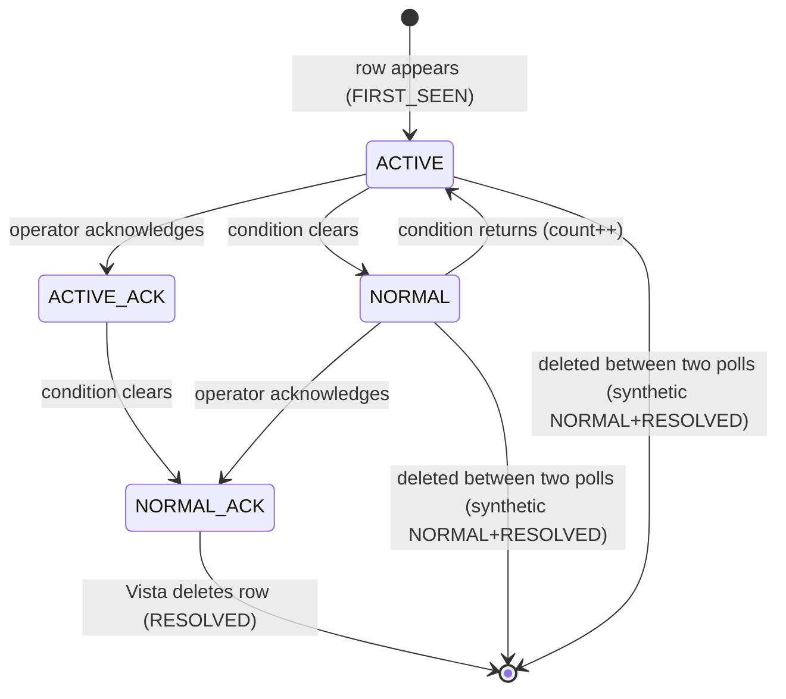

# Reference: the `$this.alr` alarm-list file

The only input the bot reads from TAC Vista. Everything downstream (CSV audit, state files, MainManager incidents) is derived from the 12 fields described here.

Related: [csv-audit-format.md](csv-audit-format.md) · [state-files.md](state-files.md) · [config-reference.md](config-reference.md) · [arc42 §8 cross-cutting concepts](../arc42/08-crosscutting-concepts.md) · [ADR-0003 Vista ID as primary key](../adr/0003-vista-id-as-primary-key.md) · [ADR-0004 state-signature diff](../adr/0004-state-signature-diff.md) · [ADR-0005 snapshot-then-parse](../adr/0005-snapshot-then-parse.md) · [glossary](../arc42/12-glossary.md)

## Where it lives

| Item | Value | Source |
|---|---|---|
| Live file | `C:\ProgramData\Schneider Electric\TAC Vista 5.1.9\DB\$thisdb\$this.alr` | `config.json -> paths.vista_alarm_file` |
| Snapshot read by the parser | `C:\priorityalarmsapi\alarm_snapshot.alr` (`paths.working_folder` + fixed name) | `main.py:1033` |
| Copy method | `shutil.copy2`, up to 5 attempts, 0.5 s apart; if all fail the run logs an ERROR, ships (if configured) and exits with code 2 | `snapshot_alarm_file()` `main.py:205-216`, `main.py:1034-1039` |
| Writer | TAC Vista 5.1.9 rewrites the file in place whenever an alarm enters, changes or leaves the list | build reference §3 |
| Reference copy | the snapshot as of 2026-09-28 (180 rows); archived privately on the VPS, no longer in this repo. The observed values on this page come from it | [ADR-0022](../adr/0022-cts-side-only-repo-web-app-in-digibuild.md) |

## Physical format

| Property | Value | Where enforced |
|---|---|---|
| Encoding | ISO-8859-1 (Danish `æ ø å °`; also a non-breaking space `0xA0` inside some object names, e.g. `345-01-Etage 5-…`) | `config.json -> log_encoding`, `parse_alarm_file()` opens with `errors="replace"` (`main.py:221`) |
| Delimiter | TAB (`\t`) | `main.py:226` |
| Line ending | LF in the 2026-09-28 snapshot (0 CRLF, 180 LF). The live file on the Windows server may be CRLF — the parser accepts either | stripped by `rstrip("\r\n")` (`main.py:223`) |
| Header | none — every non-blank line is one alarm | |
| Fields per row | exactly 36 (`EXPECTED_FIELDS`, `main.py:133`); all 180 rows in the 2026-09-28 snapshot have 36 | rows with fewer fields are skipped with a WARNING (`main.py:227-230`) |
| Row order | as Vista writes it (roughly by creation); the bot never relies on order | |
| Uniqueness | field 1 (`vista_id`) is unique per row (180 distinct in 180 rows) | assumed by both state files |

## Field map (all 36, 0-based)

Only the 12 rows marked **used** are read; the constants are at `main.py:120-131`. The other 24 columns are described from the 2026-09-28 snapshot only; their meaning is not documented anywhere in this repo and is marked *unknown*.

| Idx | Name in code | Used | Observed values (snapshot) | Meaning |
|---:|---|:-:|---|---|
| 0 | – | | always `1` | unknown (record type / version?) |
| 1 | `vista_id` (`F_VISTA_ID`) | **yes** | `VISTA_SERVER#67969A95` … `VISTA_SERVER#6ABxxxxx`, unique | **Primary key.** `VISTA_SERVER#` + 8 hex digits that look like a Unix epoch close to `date1` (equal in 68 of 180 rows, within ~90 s in 110, months apart in 2 — see below); treat it as an opaque id, not a timestamp. Stable for the lifetime of one alarm instance. |
| 2 | `alarm_object` (`F_ALARM_OBJECT`) | **yes** | 137 distinct, e.g. `320-01-07931-1102_A`, `325-10-04806-Udsugning-Alarm-Bit0_Fejl`, `VISTA_SERVER-$EE_Mess` | Short point name. Key for `objects.csv` (MainID mapping) and part of the incident name. |
| 3 | `date1_epoch` (`F_DATE1`) | **yes** | 8 hex digits, e.g. `67969A77` | First occurrence, Unix epoch in hex. Usually **differs** from the `vista_id` suffix (112 of 180 rows), by a few seconds either way and occasionally by months (see below). |
| 4 | `state1` (`F_STATE1`) | **yes** | `0` (42 rows) / `1` (138 rows) | Condition axis: `0` = ACTIVE, `1` = NORMAL (returned to normal). `6` = system event (defined in code, not observed). |
| 5 | `state2` (`F_STATE2`) | **yes** | always `0` in snapshot | `0` normally; `2` together with `state1=6` marks an info/system event (defined in code, not observed). |
| 6 | `date2_epoch` (`F_DATE2`) | **yes** | 8 hex digits, e.g. `68525DF3` | Last state transition, Unix epoch in hex. |
| 7 | `priority` (`F_PRIORITY`) | **yes** | `1` (18) / `2` (53) / `3` (60) / `9` (49) | Vista priority, **lower = more urgent**. See [Priority semantics](#priority-semantics). |
| 8 | – | | always `0` | unknown |
| 9 | – | | always `0` | unknown |
| 10 | `user` (`F_USER`) | **yes** | `No user` (153); three operators as `INITIALS (Name Organisation)` (23 rows); one bare set of initials (1); `LON-OP` (2); `SYSTEM (User Profile SYSTEM)` (1). Real labels are not reproduced here | Operator who acknowledged, or `No user`. Personal data — see [arc42 §11](../arc42/11-risks-and-technical-debt.md). |
| 11 | `ack_flag` (`F_ACK_FLAG`) | **yes** | `0` (153) / `1` (27) | `1` = acknowledged (*kvitteret*). |
| 12 | – | | always `0` | unknown |
| 13 | `alarm_text` (`F_ALARM_TEXT`) | **yes** | 94 distinct Danish texts, e.g. `Høj Temperatur`, `Lav Temperatur`, `I/O Punkt forceret`, `Røgspjæld er åbne`, `Brand fra ABA`, `Rumtemperatur afviger fra setpunkt ` (trailing space) | Human-readable text. **May change** when the condition clears (`ATV21 Fejl` → `ATV21 OK`, `Lav beholder Temperatur` → `Beholder Temperatur OK`), which is why state is diffed on the signature, not on text (ADR-0004). |
| 14 | – | | `#RRGGBBAA`-style 8-hex token, e.g. `#0259002C`; `#FFFFFFFF` on 48 rows | unknown (build reference calls the ignored columns "colours, bitfield, internal handles") |
| 15 | – | | always `0` | unknown |
| 16 | – | | always `#FFFFFFFF` | unknown |
| 17 | – | | always `#FFFFFFFF` | unknown |
| 18 | `count` (`F_COUNT`) | **yes** | `1` (86 rows) … `448` | Re-trigger count of this alarm instance. High values = flapping point (e.g. `320-01-07931-1102_A` "Pumpefejl" at 448). |
| 19 | – | | 8 hex digits; strongly correlated with priority: `00000060` ↔ pri 3 (55/60), `00000003` ↔ pri 9 (49/49), `0000005F` ↔ pri 2 (32/53), `0000005E`/`00000074` ↔ pri 1/2 | unknown — looks like an alarm-class / definition handle. Could become useful for friendly naming (ADR-0017); needs verification against Vista. |
| 20 | – | | 8 hex digits, 137 distinct = same cardinality as `alarm_object` | unknown — likely an internal object handle (one per point) |
| 21 | – | | 40 hex chars = field 14 without `#`, right-padded with `F` | unknown |
| 22 | `directory` (`F_DIRECTORY`) | **yes** | 180 distinct full Vista paths, e.g. `VISTA_SERVER-LOYTEC_PORT-RHQ-345_02_ET9_XENTA-0208_01-32001_07931.1102_A`; for some points identical to field 2 (`325-10-04806-Udsugning-Alarm-Bit0_Fejl`) | Full Vista object path. Key for `exceptions.csv` (ADR-0008) and for the per-directory CSV file name (ADR-0011). |
| 23 | – | | always a single space | unknown |
| 24 | – | | always `-1` | unknown |
| 25–27 | – | | always empty | unknown |
| 28 | – | | always `-1` | unknown |
| 29 | – | | always `-1` | unknown |
| 30–32 | – | | always empty | unknown |
| 33 | – | | always `-1` | unknown |
| 34 | – | | same value as field 14 | unknown |
| 35 | – | | always `0` | unknown |

### Parsing rules (`parse_alarm_file()`, `main.py:219-250`)

1. Blank lines are skipped silently.
2. `< 36` fields → `WARNING line N: expected 36 fields, got M — skipping`.
3. Fields 3, 6 are parsed with `int(x, 16)`; fields 4, 5, 7, 11, 18 with `int(x)`; all string fields are `.strip()`ed (this removes the trailing space in `Rumtemperatur afviger fra setpunkt `, but the two texts with/without trailing space still count as distinct in the raw file).
4. Any `ValueError`/`IndexError` → `WARNING line N: parse error (…) — skipping`; the run continues.
5. Result is a list of `Alarm` objects (`main.py:168-198`) in file order. The parser never logged a skip in the 45,612 runs logged up to 2026-09-28 (no such WARNING in `logs/`).

## Example rows (from the 2026-09-28 `alarm_snapshot.alr`, tabs shown as `⇥`, operator labels replaced by placeholders)

Active, acknowledged, priority 3, re-triggered 448 times:

```
1⇥VISTA_SERVER#68516EF0⇥320-01-07931-1102_A⇥68516EF0⇥0⇥0⇥687772F4⇥3⇥0⇥0⇥<INITIALS> (<operator name> FM)⇥1⇥0⇥Pumpefejl⇥#E5F9002F⇥0⇥#FFFFFFFF⇥#FFFFFFFF⇥448⇥00000060⇥9A370081⇥E5F9002FFFFFFFFFFFFFFFFFFFFFFFFFFFFFFFFF⇥VISTA_SERVER-LOYTEC_PORT-RHQ-345_02_ET9_XENTA-0208_01-32001_07931.1102_A⇥ ⇥-1⇥⇥⇥⇥-1⇥-1⇥⇥⇥⇥-1⇥#E5F9002F⇥0
```

Priority 1, active, acknowledged by an operator:

```
1⇥VISTA_SERVER#6A8BE2E0⇥305-01-0402-0101_A_A⇥6A8BE2DF⇥0⇥0⇥6A8BE2DF⇥1⇥0⇥0⇥<INITIALS> (<operator name> ISS)⇥1⇥0⇥Høj Vandstand ved handicap parkering på p-plads⇥…
```

Priority 2, returned to NORMAL, not acknowledged (the most common signature in the snapshot, 138 rows have `state1=1, ack=0`):

```
1⇥VISTA_SERVER#6A9A5C9F⇥320-01-07923-0101_AL⇥6A9A5C9F⇥1⇥0⇥6ABA0904⇥2⇥0⇥0⇥No user⇥0⇥0⇥Lav Temperatur⇥#A9710037⇥0⇥#FFFFFFFF⇥#FFFFFFFF⇥7⇥0000005F⇥2E58009B⇥A9710037FFFFFFFFFFFFFFFFFFFFFFFFFFFFFFFF⇥VISTA_SERVER-LOYTEC_PORT-RHQ-345_02_ET9_XENTA-0206_01-32001_07923.0101_AL⇥ ⇥-1⇥⇥⇥⇥-1⇥-1⇥⇥⇥⇥-1⇥#A9710037⇥0
```

Priority 9 "system noise" row (`$EE_Mess` = Vista's own event messages; 44 of the 49 priority-9 rows have `alarm_object = VISTA_SERVER-$EE_Mess`):

```
1⇥VISTA_SERVER#6A9A71E1⇥345-51-Etage 5-5N383_12-nvoAlarmStatus_A0⇥6A9A71E1⇥0⇥0⇥6ABA07EF⇥9⇥0⇥0⇥No user⇥0⇥0⇥Rumtemperatur afviger fra setpunkt ⇥#A84D0002⇥0⇥#FFFFFFFF⇥#FFFFFFFF⇥27⇥00000003⇥06AF003A⇥…⇥VISTA_SERVER-LOYTEC_PORT-RHQ-34551_02_ET5_LON-5N383_12-nvoAlarmStatus_A0⇥…
```

## Hex epochs

Fields 1 (suffix), 3 and 6 are Unix epochs written as 8 upper-case hex digits.

| Example | `int(x, 16)` | UTC | Server local time, as the bot writes it (inferred from the data as Europe/Copenhagen, +02:00 on 2026-06-24; not configured anywhere) |
|---|---:|---|---|
| `6A3BE340` | 1782309696 | 2026-06-24 14:01:36 | `24-06-2026 16:01:36` (seen in `csv/…Bit0_Fejl.csv`) |
| `67969A77` | 1737923191 | 2025-01-26 20:26:31 | 2025-01-26 21:26:31 |

Conversion in the bot: `epoch_hex_to_human()` (`main.py:364-369`) uses `datetime.fromtimestamp()` → **server local time, no timezone marker**. The CSV audit files therefore contain local wall-clock time (CET/CEST). The shipper sends the epochs as integers and its own timestamps with an explicit offset ([shipper.md](shipper.md)); only the historical import of the CSV files has to convert local time (see [csv-audit-format.md](csv-audit-format.md#loading-the-files-migration-hint)).

Observations about the three timestamps:

- `vista_id` suffix and `date1` differ in 112 of the 180 snapshot rows (equal in 68). The difference is usually a few seconds either way — `VISTA_SERVER#67969A95` has `date1 = 67969A77` (30 s earlier), `#6A9A5EF7` has `6A9A5EF8` and `#6A9A6053` has `6A9A6058` (later) — but can be months: `#68789481` has `date1 = 66E73676` (2024-09-15, ten months before its suffix). `VISTA_SERVER#683F053E` and `#683F053F` share `date1 = 683F053E` (two alarms raised by one event get consecutive IDs). Treat the suffix as an ID, not as a timestamp.
- `date2` ≥ `date1`; `date2` moves on every ACTIVE/NORMAL transition. Together with `count` it is the only history Vista keeps per alarm — the bot's CSV audit exists precisely because the file itself has no history.
- Alarms can sit in the list for a very long time: the oldest row in the snapshot by `date1` is `VISTA_SERVER#68789481` with `date1` = 2024-09-15, two years before the snapshot; the lowest `vista_id` suffix (`#67969A95`) corresponds to 2025-01-26.

## Priority semantics

- Vista priority is an integer where **1 is the most urgent**. Observed values: 1, 2, 3, 9. Nothing in the repo says whether 4–8 exist in this installation.
- Priority 9 is used for Vista's own system/event messages (`VISTA_SERVER-$EE_Mess`: controller online/offline, "Filoverførsel er mislykket mindst 6 gange i træk", "[DSS] Log data inserted successful!") and for LON `nvoAlarmStatus` room-temperature deviations.
- The incident pipeline keeps only `priority <= thresholds.max_priority_number` (currently **2**; `main.py:1059-1070`). The CSV audit keeps **all** priorities.
- Snapshot distribution: pri 1 = 18, pri 2 = 53, pri 3 = 60, pri 9 = 49. FIRST_SEEN counts by priority up to 2026-09-28 (from `csv/`): pri 3 = 456, pri 2 = 384, pri 9 = 336, pri 1 = 82.

## The state signature

`Alarm.state_signature()` (`main.py:197-198`) returns `(state1, state2, ack_flag, user.strip())`. Both state files store it (`last_state_sig` / `sig`) and a change in any element is what the bot reacts to (ADR-0004). `classify_alarm_status()` (`main.py:156-165`) maps it to a label; note that "acknowledged" additionally requires `user != "No user"`.

| Signature | `status_label` | Meaning (Vista terms) | In snapshot |
|---|---|---|---:|
| `(0, 0, 0, "No user")` | `ACTIVE` | condition present, nobody has acknowledged | 15 |
| `(0, 0, 1, "<operator>")` | `ACTIVE + ACKNOWLEDGED` | condition present, operator has seen it (*kvitteret*) | 27 |
| `(1, 0, 0, "No user")` | `NORMAL` | condition gone, not acknowledged — waits for an operator | 138 |
| `(1, 0, 1, "<operator>")` | `NORMAL + ACKNOWLEDGED` | gone and acknowledged; Vista removes the row shortly after, so this is rarely observed | 0 |
| *(row absent)* | `RESOLVED` | bot's own term: row disappeared from the file | – |
| `(6, 2, *, *)` | – | system/info event, see below | 0 |



Because the bot polls every 5 minutes, several transitions can collapse into one observed signature change; `classify_csv_event()` (`main.py:441-475`) and `describe_transitions()` (`main.py:828-858`) both emit multiple events/lines for that case.

## System events `(6, 2)`

- Defined by `Alarm.is_system_event` (`main.py:193-195`): `state1 == 6 and state2 == 2`.
- Effect: skipped by the CSV audit (`main.py:535-536`) and left out of the snapshot the shipper sends (`build_batch()`). They are *not* explicitly skipped by the incident pipeline; there they are only excluded because they are priority 9 (build reference §3).
- **Not observed** in the 2026-09-28 snapshot (all rows have `state1 ∈ {0,1}`, `state2 = 0`) nor in any of the ~20.6k CSV rows. The `$EE_Mess` rows that do occur use the normal `(0,0)`/`(1,0)` signatures and therefore *are* written to the CSV audit (they account for 309 FIRST_SEEN instances, the largest single source). Whether Vista 5.1.9 ever writes `(6,2)` in this installation is unknown; the check is kept as a safeguard from the design phase.

## Naming conventions seen in `alarm_object` / `directory`

Documented here because the owner wants friendlier names (ADR-0017); the patterns below are inferred from data, not from a Vista naming standard.

| Pattern | Example | Reading |
|---|---|---|
| `BBB-SS-PPPPP-NNNN_AL` / `_AH` / `_A` | `320-01-07923-0101_AL` | building/area `320`, system `01`, controller/plant `07923`, point `0101`; suffix `_AL` = low-limit alarm, `_AH` = high-limit alarm, `_A` = generic alarm, `_A_A` also seen |
| `…TT_AH`, `…PT_A` | `320-01-07931-0101TT_AH`, `315-01-05901-1101PT_A` | `TT` temperature transmitter, `PT` pressure transmitter (assumed) |
| `NNN-NN-NNNNN-<word>-Alarm-BitN_<Fejl>` | `325-10-04806-Udsugning-Alarm-Bit0_Fejl` | drive/AHU fault bits (`Udsugning` = extract, `Indblæsning` = supply) |
| `345-NN-Etage N-<room>_12-nvoAlarmStatus_A0` | `345-51-Etage 5-5N383_12-nvoAlarmStatus_A0` | LON room controller on floor N, room 5N383 (priority 9) |
| `VISTA_SERVER-$EE_Mess` | with directory `…XENTA-4A271_16#MA100` | Vista system message; the directory names the controller it concerns |
| Directory prefix `VISTA_SERVER-LOYTEC_PORT-RHQ-345xx_02_ETn_XENTA-…` / `…_LON-…` | | network route: LOYTEC gateway → floor `ETn` → Xenta or LON device → object |

Distinct values over the history up to 2026-09-28: 290 `alarm_object`s, 336 `alarm_text`s over all CSV rows (245 at `FIRST_SEEN`; from `csv/`).
