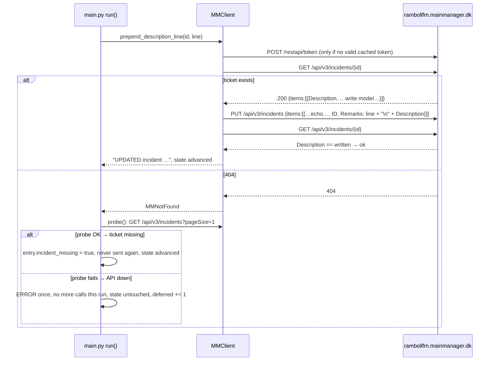

# Reference: MainManager REST API as used by the bot

MainManager (Ramboll FM tenant `rambollfm.mainmanager.dk`, software by EG) is the facility-management /
ticketing system that receives one incident per qualifying alarm. Since `main.py` v2.0.0 the bot uses the
**v3 incident API** through `MMClient` (`main.py:624-822`); the old `/restapi/Incident/*` routes were removed
by EG on 2026-09-19 ([ADR-0019](../adr/0019-mainmanager-v3-incident-api.md)). Everything below is what the code
does, what the live test of 2026-09-28 showed and what the logs up to 2026-09-28 show; the API's own
documentation is not part of this repo, so field semantics beyond that are marked unknown.

Related: [config-reference.md](config-reference.md#mainmanager) · [state-files.md](state-files.md) ·
[log-format.md](log-format.md) · [ADR-0010 prepend, never change status](../adr/0010-prepend-description-never-change-status.md) ·
[ADR-0019 v3 API](../adr/0019-mainmanager-v3-incident-api.md) · [ADR-0021 secrets](../adr/0021-secrets-in-secrets-json.md) ·
[arc42 §3 context](../arc42/03-context-and-scope.md)

> Credentials: the token request uses the MainManager service-account credentials from `secrets.json`
> (`mainmanager.username` / `mainmanager.password`) or `MM_USERNAME`/`MM_PASSWORD`. Their values are
> deliberately not reproduced anywhere in `docs/`. The password was rotated on 2026-09-29 after it had been in the
> public history. The same account is used by the Indeklima bot (which still needs the new value, TODO T-105).

## Status (2026-09-29)

| | |
|---|---|
| v1 routes `/restapi/Incident/{GetIncident,UpdateIncident,CreateIncident}` | **gone** — 404 since Sat 2026-09-19 between 00:40 and 02:55 CEST (see [History](#history-the-v1-api-until-2026-09-19)) |
| `POST /restapi/token` | unchanged, answers 200 |
| v3 client | `main.py` v2.0.0+ — live-tested against the tenant on 2026-09-28 (update of 34570, create of test ticket 37378); **deployment to the CTS server pending** ([TODO T-103](../TODO.md)) |
| Backlog | ~30 transitions/resolutions stuck since 2026-09-19 are still pending in `alarms_state.json` (state was never advanced) and go out on the first real v2 run |

## Base URL and transport

| | Value | Code |
|---|---|---|
| Base URL | `https://rambollfm.mainmanager.dk` (`config.json -> mainmanager.base_url`, trailing `/` stripped) | `MMClient.__init__` `main.py:649` |
| HTTP library | `requests.Session` (keep-alive), no retries, no backoff | |
| TLS | default certificate verification | |
| Timeouts | token: 30 s; incident endpoints: 60 s | `_get_token()`, `_request()` |
| Headers on incident calls | `Authorization: Bearer <token>`, `Content-Type: application/json` | `_headers()` `main.py:703` |
| 404 | raises `MMNotFound` (`main.py:619`); other non-2xx raise `requests.HTTPError` | `_request()` `main.py:709` |

## Endpoints

### 1. `POST /restapi/token` — authentication (`_get_token()`, `main.py:665`)

| | |
|---|---|
| Body | form-encoded: `username`, `password`, `grant_type=password` |
| Success | 2xx JSON with `access_token`, `expires_in` (default 7200 s if absent) |
| Cache | in memory and in `mm_token.json` in the working folder (`{"access_token", "exp"}`); reused until 300 s before expiry (`TOKEN_MARGIN_S`). The file is git-ignored and holds a live bearer token. |
| No credentials | `RuntimeError` before any HTTP call |
| Logs | `API AUTH: using cached token`, or `API AUTH: requesting token from …`, `API AUTH: HTTP <code>`, `API AUTH: token obtained OK` |

`MMClient` is created lazily on the first API need (`_mm()` in `run()`), so a run with nothing to send makes
**no** HTTP call. A `--dry-run` makes exactly one call path: `check_auth()` → token (from the cache if valid —
delete `mm_token.json` to force a real password check, [TODO T-108](../TODO.md)).

### 2. Create — `POST /api/v3/incidents` (`create_incident()`, `main.py:756`)

```jsonc
{"items": [{
  "MainID":          14228,                 // objects.csv mapping or default_main_id
  "Name":            "CTS Alarm - 320-01-07923-0101_AL - Lav Temperatur",   // incident_name(), max 100 chars
  "Remarks":         "28-09-2026 08:05 Alarm bot - NEW alarm, status: ACTIVE, priority 2: \"Lav Temperatur\"\nObject: …\nDirectory: …",
  "IncidentTypeID":  277,                   // incident_defaults ("CTS API")
  "CheckwordItemID": 277,                   // pre-2026-09 spelling; dropped by the tenant
  "GradeID":         10,
  "StatusID":        5,                     // "Awaits handling"
  "LocationID":      6,                     // only if set in incident_defaults
  "ReportedByID":    748,                   //   "
  "ReportedByOrganisationID": 11            //   "
}]}
```

Then, because the `StatusID` sent on create does not always stick on this tenant: `GET /api/v3/incidents/{id}`;
if `StatusID` differs, `PUT` it (with the echoed write model) and `GET` again; a remaining mismatch is a
WARNING. The incident exists from the POST on — a failure in this check is logged, never retried as a second
create.

| | |
|---|---|
| Success | `items[0].success` true and `items[0].id` set → returns the id |
| Failure | 404 → `MMNotFound` (the caller classifies it); `success: false` → `RuntimeError("CreateIncident failed: <errorMessage>")`; caught in `create_incident_for_alarm()` (`main.py:946`): `CreateIncident FAILED for <vista_id>: …`, entry saved with `incident_id: null`, incident created at the alarm's next signature change |
| Logs | `API CREATE: POST …/api/v3/incidents`, `API CREATE: MainID=…, Name='…'`, `API CREATE: response={…}`, then `CREATED incident <id> for <vista_id> (<alarm_object>) main_id=<id> [fallback]` |
| Live test | ticket **37378** (`CTS Alarm - TEST - v2.0.0 endpoint test (ignore)`, 2026-09-28) came out identical to reference ticket 37058 on every derived field (status 5, type 277, building/location 6, reporter 748 / org 11, grade 10, creator user 747); `StatusID` stuck on create. Must be cancelled by hand ([TODO T-104](../TODO.md)). |

`Name` and the initial text are built by `incident_name()` (`main.py:872`) and `initial_description()`
(`main.py:861`); for a bootstrapped alarm that gets its incident later, the transition lines go above the
initial text.

### 3. Read — `GET /api/v3/incidents/{id}` (`get_incident()`, `main.py:749`)

Returns `items[0]`; an empty `items` list also raises `MMNotFound`. The bot reads `Description` (the full text),
`StatusID` (after create) and the write-model fields it echoes on a PUT.

### 4. Update — `PUT /api/v3/incidents` (`prepend_description_line()`, `main.py:807`)

```jsonc
{"items": [{ /* ECHO_FIELDS copied from the GET */, "ID": 36630,
             "Remarks": "<new line>\n<current Description>" }]}
```

GET → PUT → GET; the second GET must return a `Description` equal to what was written, otherwise
`RuntimeError("UpdateIncident … did not read back as written")`. Logs: `API UPDATE: PUT … ID=<id>`,
`API UPDATE: verified incident <id>`.

### 5. Probe — `GET /api/v3/incidents?pageNumber=1&pageSize=1` (`probe()`, `main.py:738`)

Only called after a 404, to tell "this ticket is gone" (probe OK) from "the API is gone" (probe fails). Any
error counts as down.

## The v3 write model and the `Remarks`/`Description` rule

The tenant echoed its write model on the 2026-09-28 create — **22 keys**:

`MainID, IncidentTypeID, Name, Remarks, LocationID, BuildingZoneID, StatusID, IncidentPriorityID,
DateInspected, ReportedByID, ReportedByOrganisationID, Contact, ContactEmail, ContactNumber,
ConditionGradeID, ConsequenceGradeID, EstimatedCost, PriorityRemarks, XID, GradeID, ID, Inactive`

- `ECHO_FIELDS` (`main.py:640`) is this list minus `ID` and `Remarks`; every PUT sends them back as read, so an
  update cannot blank a field.
- Keys **outside** the model are dropped silently: `Description`, `DateReported` (set by the tenant to the
  creation time) and `CheckwordItemID`.
- **Write `Remarks`, read `Description`.** `Remarks` is stored as the full description; the `Remarks` read back is
  a copy truncated to **~245 characters** (440 of 453 bot tickets; the longest `Description` is 38 KB). Reading
  `Remarks` as the source and writing it back truncates the ticket — the first live test did exactly that to
  34570 (13 lines → 5); it was restored from the mirror copy within the minute. `_text()` (`main.py:801`) reads
  `Description` (falls back to `Remarks` only when `Description` is empty).

## Transition lines

One transition line = GET + PUT + GET. Lines come from `describe_transitions()` (`main.py:828`) —
`alarm returned to NORMAL ("…")`, `alarm ACTIVE again ("…")`, `ACKNOWLEDGED by <user>`,
`re-acknowledged by <user>`, catch-all `status changed to <label> (…)` — and from the resolution block in
`run()` (`main.py:1283-1291`): `alarm returned to NORMAL (missed between polls)` (only if the alarm was last seen
ACTIVE) and `RESOLVED — alarm was acknowledged (kvitteret) and removed from Vista alarm list`. Each line starts
with `DD-MM-YYYY HH:MM Alarm bot - `. Lines are prepended in natural order, so **RESOLVED ends on top** (v1
prepended them reversed, which put the "missed NORMAL" line above RESOLVED).



## Error behaviour summary (v2.x)

| Situation | Handling | State effect | Retry |
|---|---|---|---|
| 404, probe OK (one ticket gone) | WARNING, `incident_missing` + `incident_missing_iso` | transition applied locally; alarm still tracked and resolved locally | never sent again |
| 404, probe fails (API gone) | one ERROR per run, `api_down` set, no further calls | untouched | next run (`deferred=N` in the summary) |
| Create 404 | always treated as API down (there is no ticket to be missing) | new alarm **not** recorded, so the next run sees it as new again | next run |
| Other failure on update/resolution | ERROR `… FAILED for <vid> (attempt n/3)`; `update_failures` counted | untouched while n < 3 | up to 3 runs, then `giving up on this transition` and the state advances |
| Create failure (non-404) | ERROR `CreateIncident FAILED …` | `incident_id: null` | at the alarm's next signature change |
| No credentials | ERROR once, API treated as down | untouched | next run |

A 404 never marks an alarm RESOLVED.

## `incident_defaults`

| Field | Value | Meaning (from the tenant and the mirror) |
|---|---|---|
| `IncidentTypeID` | `277` | "CTS API" (was `CheckwordItemID` in v1; `CheckwordID` 8 is gone). The Indeklima bot uses type 281 ("CTS Log - Rum …"). |
| `LocationID` | `6` | Rambøll HQ building |
| `ReportedByID` / `ReportedByOrganisationID` | `748` / `11` | "TacVista Automated Services" / Rambøll Danmark A/S |
| `GradeID` | `10` | sent verbatim; meaning unknown |
| `StatusID` | `5` | "Awaits handling"; set and enforced on create only — the bot never changes it afterwards; humans close tickets |
| `MainID` (per alarm) | `14228` today, `9756` before | the object the incident is attached to; with `objects.csv` empty every ticket gets the fallback ([TODO T-020](../TODO.md)) |

## History: the v1 API (until 2026-09-19)

v1.x (`main.py` ≤ 1.1.0) used `POST /restapi/Incident/CreateIncident` (`{IncidentMode, MainID, Name,
Description, CheckwordID 8, CheckwordItemID 277, GradeID, StatusID}` → `{Success, ID}`),
`GET /restapi/Incident/GetIncident?IncidentID=` and `POST /restapi/Incident/UpdateIncident
{IncidentID, IncidentRemarks}`, with a per-process token and plain `requests.get/post`.

What the logs up to 2026-09-28 show (archived privately on the VPS since the data left the repo):

| Fact | Evidence |
|---|---|
| Last successful `UPDATED incident` | 2026-09-19 00:40:06 (incident 36693) |
| Last successful `CREATED incident` | 2026-09-14 13:35:04 (incident 37058) |
| First `404 Client Error` | 2026-09-19 02:55:13 |
| `GetIncident` after that | **every** call 404 — 6,551 lines over 30 incident ids, including tickets updated successfully hours before |
| `CreateIncident` | 404 on all 8 attempts, 2026-09-23 14:40 … 2026-09-28 15:55 |
| Token endpoint | 200 throughout |
| Retry loop | a failure `continue`d without advancing state, so the same call repeated every 5 minutes: one resolution (`VISTA_SERVER#6A5D0D16` / 34570) 2,150 times; 531 FAILED lines on 2026-09-28 alone; a token on every run (8,258 in total) |

Cause, established 2026-09-28: the routes were removed on the tenant (digibuild's mirror held the "missing"
tickets as live rows; the tenant's other clients use `/api/v3/incidents`). The Indeklima bot on the same
account stopped the same weekend ([TODO T-105](../TODO.md)).

Volumes 2026-04-17 … 2026-09-28: token 8,258; CreateIncident 477 (469 ok, ids 26740 … 37058); UpdateIncident
7,824; 469 incidents created, 406 later annotated as resolved.

## Not used

No endpoint is called to list incidents for reporting, attach documents, add comments
(`/api/v1/app/incidentcomment` exists on the tenant and is used by other clients), close incidents, or check
that a `MainID` exists. Live ticket status for the web pages comes from digibuild's own MainManager mirror, not
from this bot.
